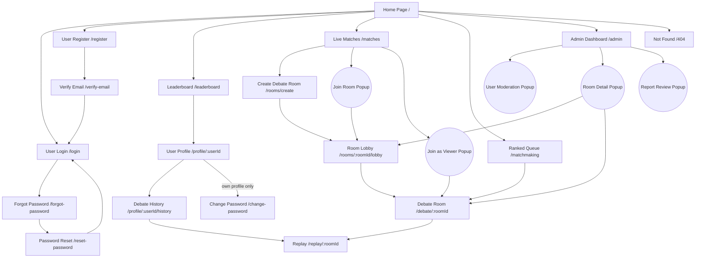
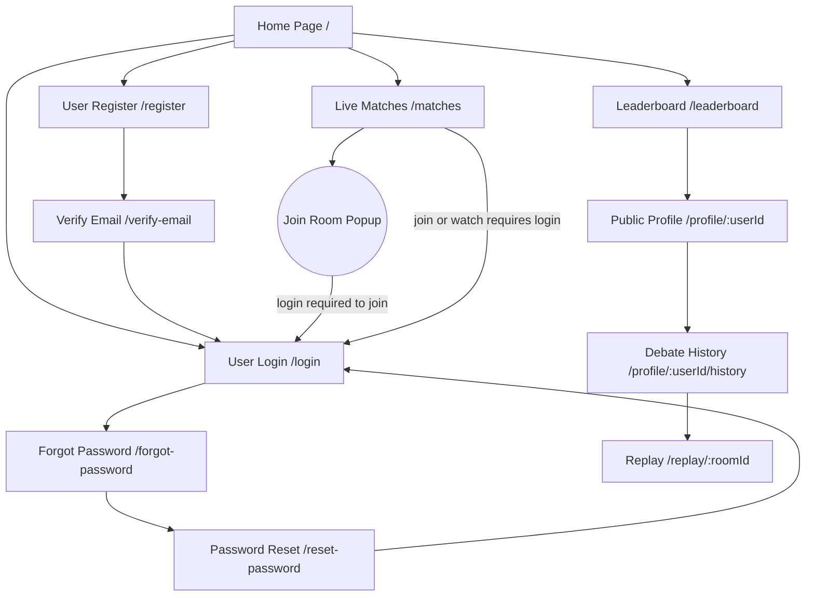
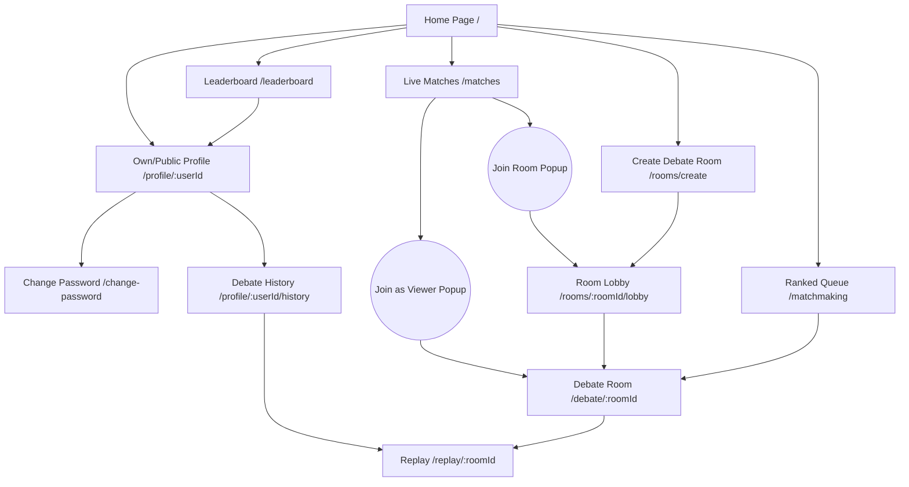
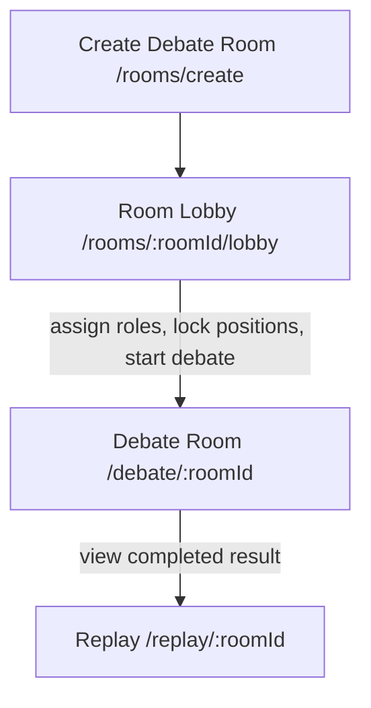
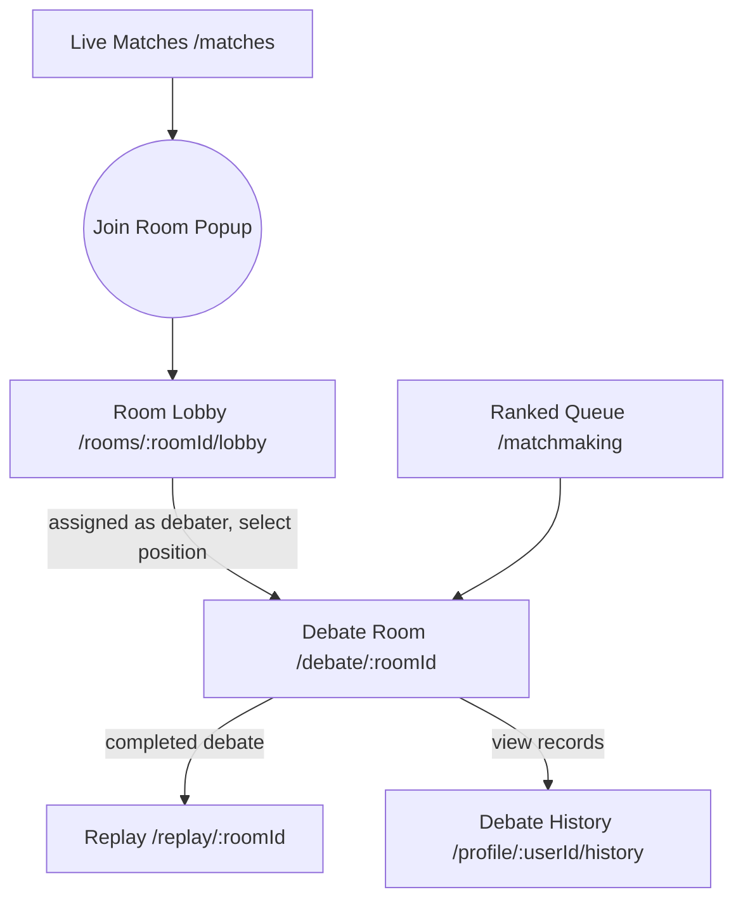
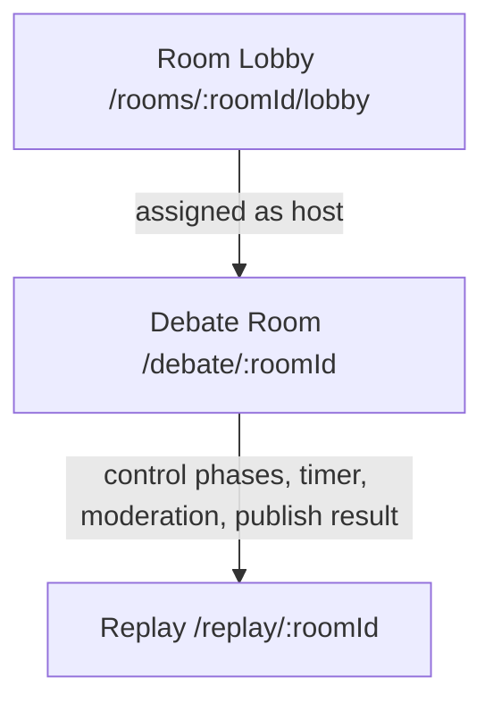
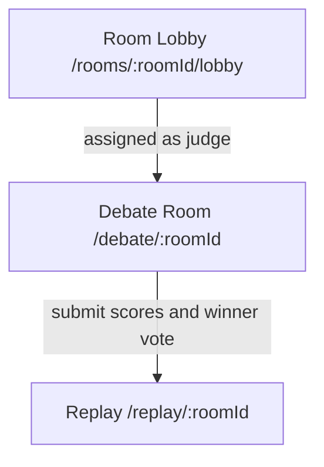
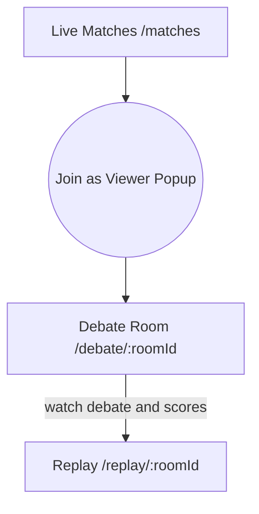
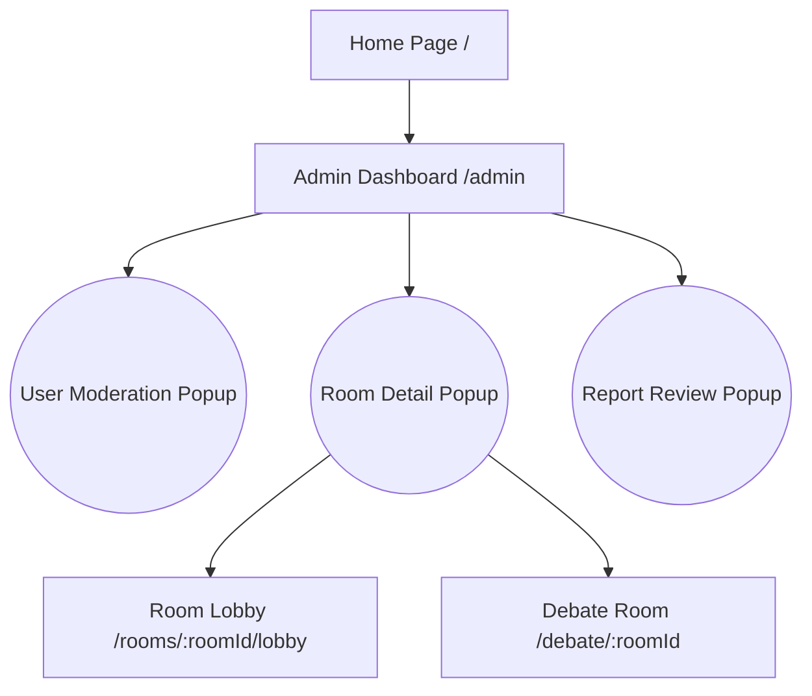

# Screens Flow, Screen Descriptions, Authorization, and Non-UI Functions

**Project:** AI Debate Platform  
**Scope:** Current frontend screens, backend-supported functions, and recommended UX/authorization alignment  
**Primary source:** `frontend/src/routes/index.tsx`, `frontend/src/pages`, `frontend/src/services`, `backend/src/features`, `backend/src/socket`

---

## 2. Overall Functionalities

### 2.1 Screens Flow

**Notation**

| Shape | Meaning |
|---|---|
| Rectangle | Page / route |
| Circle | Popup / modal shown on the current page |

**Flow notes**

| # | Flow | Description |
|---|---|---|
| 1 | Guest discovery flow | Guest can open Home, Live Matches list, Leaderboard, public Profile, public History, Replay, Login, Register, Verify Email, Forgot Password, Reset Password, and 404 pages. |
| 2 | Authentication flow | Register creates an account, Verify Email validates email token, Login stores user and tokens, Forgot Password sends reset link, Reset Password changes password by token. Password recovery is implemented in the current build although the older MVP use case file marked it as Phase 2. |
| 3 | Custom room flow | Authenticated user creates a custom room and becomes Room Owner. Room Owner configures lobby roles, locks debater positions, then Owner or assigned Host starts Debate Room. |
| 4 | Ranked queue flow | Authenticated user joins Ranked Queue. When matchmaking finds enough players, system creates a rank room and redirects to Debate Room. |
| 5 | Spectate flow | Authenticated user selects an active room from Live Matches, confirms viewer entry, becomes a Viewer participant when the room policy allows it, then enters Debate Room in read-only mode. |
| 6 | Debate completion flow | Debate Room stores turns, scores, winner, and history. Users can view Replay from Debate History or direct replay link by room ID. |
| 7 | Admin moderation flow | Admin opens Admin Dashboard, reviews platform metrics, users, rooms, and reports, then performs moderation actions or navigates to a room/debate for oversight. |

#### 2.1.1 Screen Flow by Actor

##### Guest

##### Authenticated User

##### Room Owner

##### Debater

##### Host

##### Judge

##### Viewer

##### Admin

### 2.2 Screen Descriptions

| # | Feature | Screen | Route | Description |
|---|---|---|---|---|
| 1 | Landing & Discovery | Home Page | `/` | Landing screen for platform introduction and entry points to matchmaking, room creation, live matches, leaderboard, login, and register. |
| 2 | Authentication | User Login | `/login` | Allows email/password login and optional Google login; redirects users back to the protected page they originally requested. |
| 3 | Authentication | User Register | `/register` | Allows guest users to create an account with username, email, password, and confirm password. |
| 4 | Authentication | Verify Email | `/verify-email?token=...` | Validates email verification token and shows success or error status. |
| 5 | Authentication | Forgot Password | `/forgot-password` | Collects user email and requests password reset email from the backend. |
| 6 | Authentication | Password Reset | `/reset-password?token=...` | Allows user to set a new password using a reset token. |
| 7 | Authentication | Change Password | `/change-password` | Allows authenticated users to change their current password from inside their account. |
| 8 | User Profile | User Profile | `/profile/:userId` | Shows public profile information, ranking, stats, account status, school/club/bio, and profile actions. The profile owner can edit profile information and upload avatar. |
| 9 | User Profile | Debate History | `/profile/:userId/history` | Shows paginated completed debate history for a user, including result, role, side, motion, and replay entry. |
| 10 | Ranking | Leaderboard | `/leaderboard` | Displays global ELO leaderboard, rank tier, wins/losses, and links to public user profiles. |
| 11 | Room Discovery | Live Matches | `/matches` | Lists waiting, ready, and active rooms by default, with optional filters by format, type, and status. Users can join waiting/ready rooms or request viewer entry before watching active debates. |
| 12 | Room Management | Create Debate Room | `/rooms/create` | Allows authenticated user to create a custom debate room with title, format, host type, judge type/count, privacy, and password. |
| 13 | Room Management | Join Room Popup | Popup on `/matches` | Confirms joining a waiting/ready public room or asks for password before joining a private waiting/ready room. |
| 14 | Room Management | Join as Viewer Popup | Popup on `/matches` | Confirms entering an active room as a Viewer. The system must create or confirm viewer participant membership before opening Debate Room. |
| 15 | Room Management | Room Lobby | `/rooms/:roomId/lobby` | Shows participants and room status. Room Owner assigns room roles, toggles viewer chat before the debate, locks debaters, and starts the debate. Debaters select team and speaker slot before lock. |
| 16 | Matchmaking | Ranked Queue | `/matchmaking` | Lets authenticated user choose 1v1/3v3, join or leave ranked queue, see queue status, and enter a matched debate room. |
| 17 | Debate | Debate Room | `/debate/:roomId` | Main live debate screen with phase, timer, speaker list, discussion room for 3v3 prep, host controls, judge scoring, score breakdown, surrender/draw, viewer read-only mode, and exit after completion. |
| 18 | Debate | Replay | `/replay/:roomId` | Shows final scores, winner, AI summary if available, and timeline of recorded turns/transcripts for a completed room. |
| 19 | Administration | Admin Dashboard | `/admin` | Admin-only dashboard with Overview, Users, Rooms, and Reports tabs for monitoring, search/filtering, role changes, bans, room moderation, and report resolution. |
| 20 | Administration | User Moderation Popup | Popup on `/admin` | Allows admin to review a selected user context and perform moderation actions such as ban/unban or role update. |
| 21 | Administration | Room Detail Popup | Popup on `/admin` | Shows room participants, room/session details, toxic messages, and admin room moderation actions. |
| 22 | Administration | Report Review Popup | Popup on `/admin` | Allows admin to review report details, update status/resolution, add note, and apply mute or ban when needed. |
| 23 | System | Not Found | `/404` | Fallback screen for unknown routes. |

### 2.3 Screen Authorization

**Role definitions used in this table**

| Role | Meaning |
|---|---|
| Guest | Visitor without an authenticated session. |
| User | Authenticated account with role `user` or `admin`. |
| Room Owner | Authenticated user who created the custom room. This is a room-specific role. |
| Host | Participant assigned as host in a room. This is a room-specific role. |
| Debater | Participant assigned as debater in a room. This is a room-specific role. |
| Judge | Participant assigned as judge in a room. This is a room-specific role. |
| Viewer | Participant joined as viewer in a room. This is a room-specific role. |
| Admin | Authenticated account with `user.role === "admin"`. |

| Screen / Activity | Guest | User | Room Owner | Host | Debater | Judge | Viewer | Admin | Notes |
|---|---:|---:|---:|---:|---:|---:|---:|---:|---|
| Home Page - view | X | X | X | X | X | X | X | X | Public route. |
| User Login - submit email/password or Google login | X |  |  |  |  |  |  |  | Intended for unauthenticated users. |
| User Register - create account | X |  |  |  |  |  |  |  | Intended for unauthenticated users. |
| Verify Email - verify token | X | X | X | X | X | X | X | X | Token-based public action. |
| Forgot Password - request reset email | X |  |  |  |  |  |  |  | Public route with rate limiting. |
| Password Reset - set new password by token | X |  |  |  |  |  |  |  | Token-based public action. |
| Change Password - update current password |  | X | X | X | X | X | X | X | Requires authenticated session. |
| Public Profile - view any profile | X | X | X | X | X | X | X | X | Backend profile endpoint is public. |
| Profile - edit own profile |  | X | X | X | X | X | X | X | Backend allows only `req.user.userId === :id`. |
| Profile - upload avatar |  | X | X | X | X | X | X | X | Requires authenticated session; updates current user avatar. |
| Debate History - view user history | X | X | X | X | X | X | X | X | Backend history endpoint is public. |
| Leaderboard - view global ranking | X | X | X | X | X | X | X | X | Public route. |
| Live Matches - list/filter rooms | X | X | X | X | X | X | X | X | Room listing is public. |
| Live Matches - join waiting/ready room |  | X | X | X | X | X | X | X | Requires authentication; private rooms require password. User is added to the room as a participant, usually as Viewer until assigned another room role. |
| Live Matches - request viewer access to active debate |  | X |  |  |  |  |  | X | Requires authentication. System should create or confirm Viewer participant membership before opening `/debate/:roomId`. |
| Create Debate Room - create custom room |  | X | X | X | X | X | X | X | Requires authentication; creator becomes room owner. |
| Room Lobby - view lobby |  | X | X | X | X | X | X | X | Frontend route requires login. Participant-sensitive actions are guarded by backend. |
| Room Lobby - assign participant roles |  |  | X |  |  |  |  |  | Backend allows only room owner. |
| Room Lobby - debater selects team/speaker slot |  |  |  |  | X |  |  |  | Backend allows only assigned debaters and only before lock. |
| Room Lobby - lock debater positions |  |  | X |  |  |  |  |  | Backend allows only room owner. |
| Room Lobby - toggle viewer chat before debate |  |  | X | X |  |  |  |  | Backend allows owner or host; current lobby UI exposes it to owner. |
| Room Lobby - start debate |  |  | X | X |  |  |  |  | Backend debate start requires owner or host and locked required debater slots. |
| Ranked Queue - join/leave/status |  | X | X | X | X | X | X | X | Requires authentication. Rank room uses AI host and AI judge by default. |
| Debate Room - view active room UI |  |  | X | X | X | X | X | X | Requires authenticated access and room participant membership for realtime state. Admin may use this only for moderation/oversight when the system provides an admin viewing path. |
| Debate Room - host phase/timer controls |  |  |  | X |  |  |  |  | Host can pause, resume, next turn, finish phase, end debate, transfer host, issue card, kick, and toggle viewer chat. Room Owner may use these controls only when also assigned as Host. |
| Debate Room - speech transcription input |  |  |  | X |  |  |  |  | Host control panel can record/type transcript before phase change. Room Owner may use this only when also assigned as Host. |
| Debate Room - debater surrender/draw |  |  |  |  | X |  |  |  | Requires assigned debater and debate status `active` or `paused`. |
| Debate Room - 3v3 discussion room |  |  |  |  | X |  |  |  | Available only to 3v3 debaters during preparation phases. |
| Debate Room - cross-exam pass/finish controls |  |  |  | X | X |  |  |  | Asking-team debater can pass or finish Cross Examination. Host can finish or moderate the phase. Other roles can only view CE state. |
| Debate Room - judge scoring |  |  |  |  |  | X |  |  | Backend allows only assigned human judges. |
| Debate Room - aggregate score/determine winner |  |  |  | X |  | X |  |  | Host can publish/aggregate result; assigned Judge can submit or trigger scoring actions. Room Owner may do this only when also assigned as Host. |
| Debate Room - chat message |  |  | X | X | X | X | X |  | Socket requires participant membership in the room. Muted users cannot chat; viewer chat may be disabled. Admin moderation actions are handled separately from room chat. |
| Replay - view replay/result | X | X | X | X | X | X | X | X | Public replay route. Replay URL should use `roomId`, and only completed sessions should be shown as official replay. |
| Admin Dashboard - view overview/users/rooms/reports |  |  |  |  |  |  |  | X | Frontend route and backend routes require admin role. |
| Admin Dashboard - update user role |  |  |  |  |  |  |  | X | Admin cannot change own role. |
| Admin Dashboard - ban/unban user |  |  |  |  |  |  |  | X | Admin cannot ban/unban own account through this action. |
| Admin Dashboard - update room status |  |  |  |  |  |  |  | X | Admin can force room status changes. |
| Admin Dashboard - kick/mute participant |  |  |  |  |  |  |  | X | Admin room moderation action, independent of room owner/host. |
| Admin Dashboard - resolve report |  |  |  |  |  |  |  | X | Admin can mark report status/resolution, mute participant, or ban reported user. |
| Not Found - view | X | X | X | X | X | X | X | X | Public fallback. |

### 2.4 Non-UI Functions

| # | Feature | System Function | Description |
|---|---|---|---|
| 1 | Authentication | JWT access/refresh token service | Issues, verifies, and refreshes access tokens for protected APIs and Socket.IO authentication. |
| 2 | Authentication | Password hashing and credential validation | Registers local accounts, validates login password, changes password, and prevents invalid credentials from receiving tokens. |
| 3 | Authentication | Email verification service | Sends and verifies email verification tokens for newly registered accounts. |
| 4 | Authentication | Password reset service | Generates reset token/email and accepts reset-token based password replacement. |
| 5 | Authentication | Google login service | Validates Google credential, maps account by verified email, creates or logs in Google provider accounts, and returns platform tokens. |
| 6 | Security | Auth rate limiting | Applies `authLimiter` to sensitive auth endpoints such as register, login, verify email, forgot password, and reset password. |
| 7 | Security | Request validation middleware | Validates route bodies and query parameters using feature schemas before controller logic runs. |
| 8 | Matchmaking | Ranked queue matcher | Stores queue entries, groups enough users by 1v1/3v3 format, creates rank room/session, assigns teams/slots, locks positions, and emits `match:found`. |
| 9 | Room Engine | Debate start validation | Checks room status, host requirement, required debater slots, locked positions, and creates the initial debate session. |
| 10 | Debate Engine | Phase and turn progression | Advances debate phases, snapshots turn history, stores transcripts, updates room phase/status, and completes debates. |
| 11 | Debate Engine | Cross-examination state handling | Maintains CE asking/answering team, quota, pass turn, finish CE, and transcript state. |
| 12 | Debate Engine | Surrender and draw resolution | Allows assigned debaters to surrender or request/accept draw, then completes debate with derived winner and ranking application when eligible. |
| 13 | Timer | Server-side timer service | Maintains room timers, broadcasts per-second updates, emits 1-minute warning, pause/resume, and timer completion events. |
| 14 | AI Judge | Turn judging and scoring | Sends transcript/context to Gemini or OpenAI, parses JSON score/verdict, stores AI analysis, and falls back gracefully if AI is unavailable. |
| 15 | AI Judge | Speech analysis, final verdict, and summary | Supports analysis of speech, final verdict generation, and debate summary generation for replay/result experiences. |
| 16 | AI Moderation | Toxic content check | Provides AI-based toxic/offensive/spam detection service for debate chat moderation. Current chat socket has the call marked as TODO and stores `isToxic: false`. |
| 17 | Scoring | Human judge score aggregation | Validates score criteria, stores judge verdicts, weights human/AI verdicts, aggregates team totals, and determines winner. |
| 18 | Ranking | ELO and tier update | Applies result to ranked rooms only once, calculates expected scores, updates ELO, tier, season points, wins/losses, and total debates. |
| 19 | Realtime | Socket.IO authentication and rooms | Authenticates socket connections with JWT, joins `user:{id}` and room channels, restores room state, and emits participant/message/debate updates. |
| 20 | Realtime Chat | Chat message persistence and broadcast | Validates participant membership, muted status, and viewer-chat setting; saves messages and broadcasts chat events to room members. |
| 21 | Upload | Avatar/image storage | Accepts authenticated image upload, validates file constraints, stores in Cloudinary when configured or local fallback, and deletes/replaces previous avatar best-effort. |
| 22 | Reports | Report creation API | Authenticated API creates reports for user/message/room/debate/other targets and enriches reported user, room, and message metadata. |
| 23 | Admin | Platform overview aggregation | Aggregates user counts, room status counts, report counts, toxic message counts, yellow cards, and recent records for dashboard metrics. |
| 24 | Admin | Moderation side effects | Admin report resolution can update report state, ban user, mute participant, emit room moderation events, and record resolver metadata. |
| 25 | API Infrastructure | Standard response and error handling | Centralizes async route handling, success/paginated response shape, not-found handling, and error response formatting. |
| 26 | Replay | Replay data retrieval | Retrieves completed debate room/session data, final scores, AI summary when available, and turn timeline by room ID for read-only replay viewing. |

---

## Implementation Notes

| Topic | Current implementation note |
|---|---|
| Frontend protected routes | `/rooms/create`, `/rooms/:roomId/lobby`, `/matchmaking`, `/change-password`, and `/debate/:roomId` require login through `ProtectedRoute`. `/admin` additionally requires `allowedRoles={["admin"]}`. |
| Replay route alignment | The recommended replay route is `/replay/:roomId` because the replay API currently resolves replay data by room ID. If the frontend route keeps a parameter named `sessionId`, history navigation should still pass `roomId`, or the backend should add a true session-id replay endpoint. |
| Public backend endpoints | Some backend endpoints such as room detail, session, scores, replay, profile, history, leaderboard, and room list are public even when the current frontend may require login for the matching screen. Public replay/history data should be read-only and should only present completed sessions as official results. |
| Password recovery scope | Forgot Password, Reset Password, and Change Password exist in the current implementation even though the older MVP use case summary marked them as Phase 2. This document follows the current implemented screen set. |
| Contextual room roles | Owner, host, debater, judge, and viewer are not global account roles. They are stored per room participant and checked by room/debate backend routes. Room Owner is a lobby/meta role; after a debate starts, Owner should not receive Host controls unless also assigned as Host. |
| Spectator access | Active room watch flow should create or confirm Viewer participant membership before opening `/debate/:roomId`, because realtime socket state restore requires room participant membership. |
| Report submit UI | Backend and frontend service support creating reports, and Admin Dashboard supports report review. No dedicated report submission screen is currently routed in the frontend. |
| Cross-exam controls | Target policy: asking-team debater or Host can pass/finish Cross Examination. Current debate service contains stricter participant/team checks, while the room route version used by the frontend is looser and should be aligned with this policy. |
