# Table of Contents

## 3. Detailed Design

| Section | Detailed Design | Feature | Actor(s) |
|---:|---|---|---|
| 3.1 | Register | Authentication | Guest |
| 3.2 | Login | Authentication | Guest |
| 3.3 | Login by Google | Authentication | Guest |
| 3.4 | Reset Password | Authentication | Guest |
| 3.5 | Change Password | Authentication | User, Admin |
| 3.6 | Logout | Authentication | User, Admin |
| 3.7 | View Public Profile | Profile | Guest |
| 3.8 | View Own Profile | Profile | User, Admin |
| 3.9 | Update Profile | Profile | User, Admin |
| 3.10 | View Platform Information | Platform Information | Guest, User, Admin |
| 3.11 | View Public Matches | Match Discovery | Guest, User, Admin |
| 3.12 | View Leaderboard | Ranking | Guest, User, Admin |
| 3.13 | Create Custom Room | Room Management | User |
| 3.14 | Join Room | Room Management | User |
| 3.15 | Rejoin Room | Room Management | User |
| 3.16 | Leave Room | Room Management | User, Admin |
| 3.17 | Join Ranked Queue | Matchmaking | User |
| 3.18 | Watch Live Match | Match Discovery | User, Admin |
| 3.19 | View Results | Debate Results | User, Admin |
| 3.20 | View Debate History | Debate History | User |
| 3.21 | Receive Notification | Notification | User, Admin |
| 3.22 | View Topic | Community | User |
| 3.23 | Create Topic | Community | User |
| 3.24 | Create Post | Community | User |
| 3.25 | Comment Post | Community | User |
| 3.26 | View User List | Administration | Admin |
| 3.27 | Penalize User | Administration | Admin |

## 3.1 Register

### Sequence Diagram

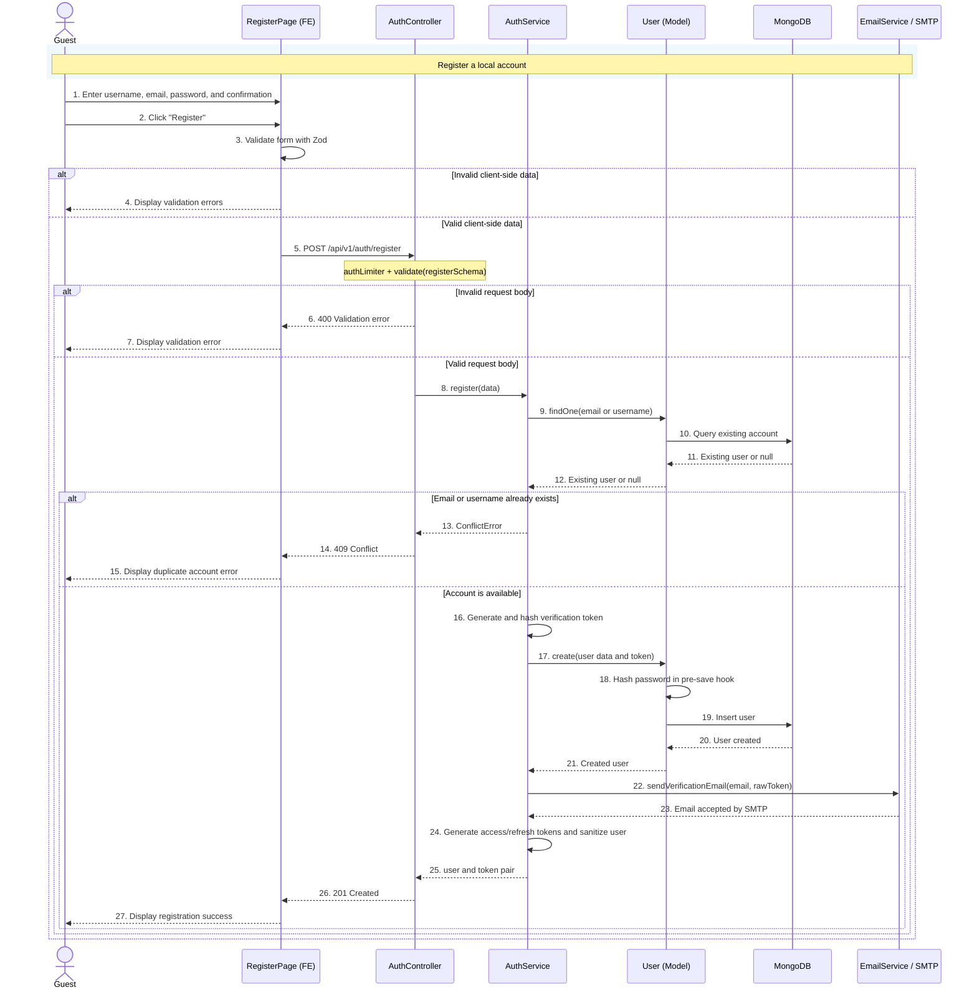

### Class Diagram

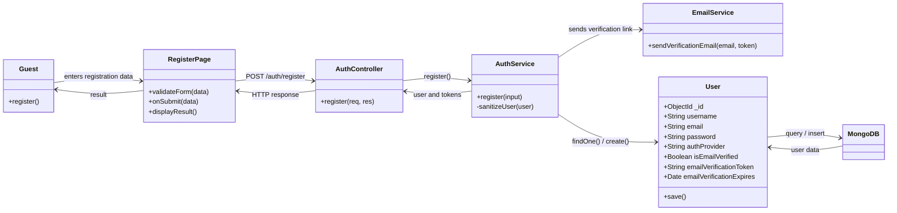

## 3.2 Login

### Sequence Diagram

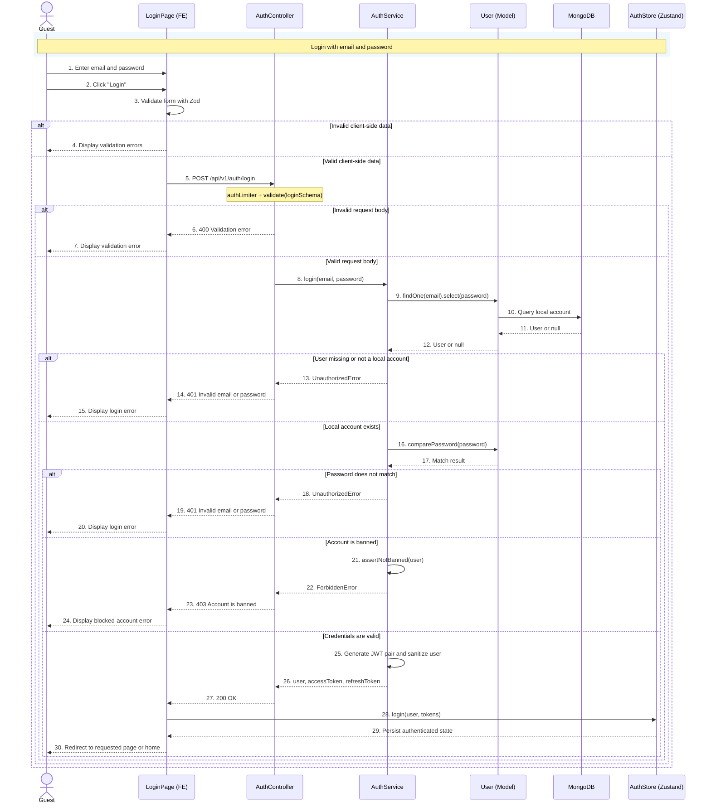

### Class Diagram

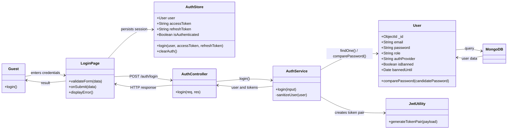

## 3.3 Login by Google

### Sequence Diagram

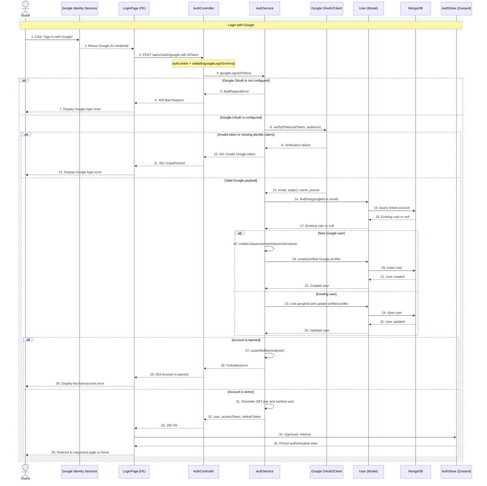

### Class Diagram

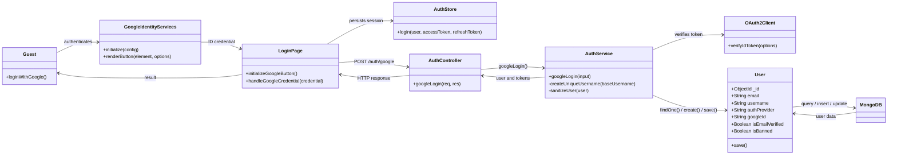

## 3.4 Reset Password

### Sequence Diagram

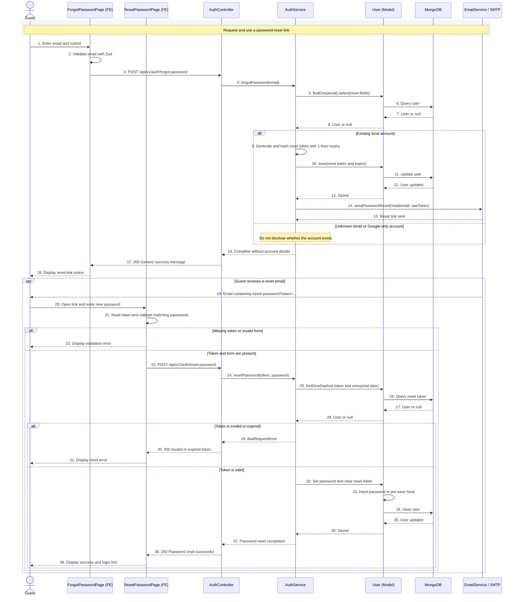

### Class Diagram

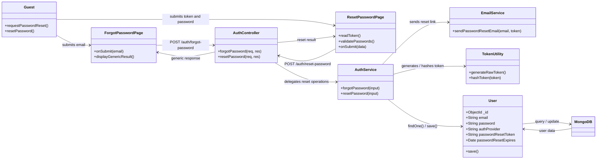

## 3.5 Change Password

### Sequence Diagram

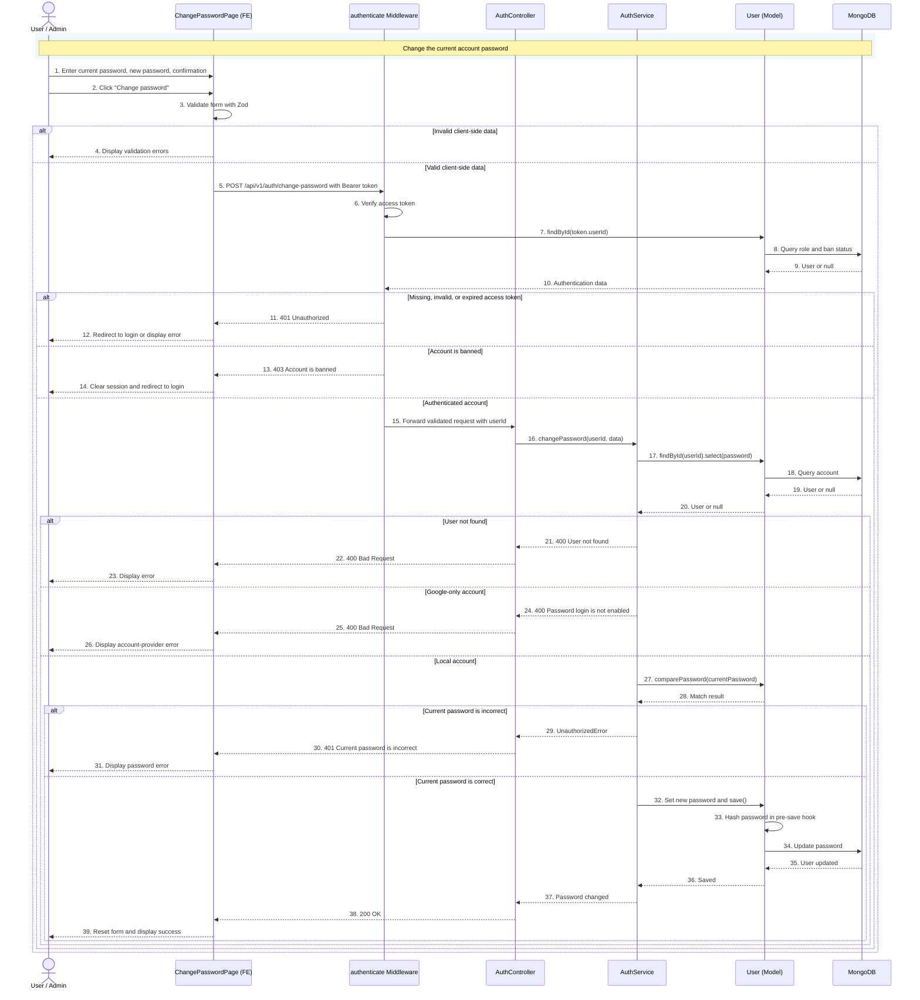

### Class Diagram

```mermaid
classDiagram
direction LR

class Account {
    +String role
    +changePassword()
}

class ChangePasswordPage {
    +validateForm(data)
    +onSubmit(data)
    +resetForm()
}

class AuthenticateMiddleware {
    +authenticate(req, res, next)
}

class AuthController {
    +changePassword(req, res)
}

class AuthService {
    +changePassword(userId, input)
}

class JwtUtility {
    +verifyAccessToken(token)
}

class User {
    +ObjectId _id
    +String password
    +String authProvider
    +String role
    +Boolean isBanned
    +Date bannedUntil
    +comparePassword(candidatePassword)
    +save()
}

class MongoDB

Account --> ChangePasswordPage : submits passwords
ChangePasswordPage --> AuthenticateMiddleware : Bearer token and request
AuthenticateMiddleware --> JwtUtility : verifies access token
AuthenticateMiddleware --> User : checks account status
AuthenticateMiddleware --> AuthController : authenticated request
AuthController --> AuthService : changePassword()
AuthService --> User : findById() / comparePassword() / save()
User --> MongoDB : query / update
MongoDB --> User : user data
AuthController --> ChangePasswordPage : HTTP response
ChangePasswordPage --> Account : result
```

## 3.6 Logout

### Sequence Diagram

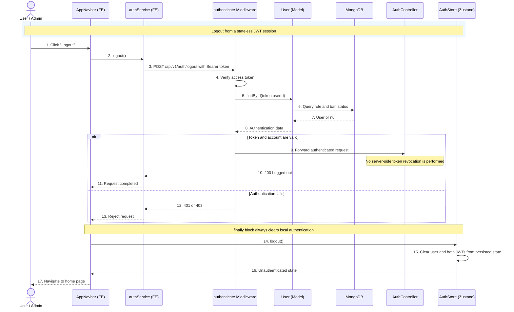

### Class Diagram

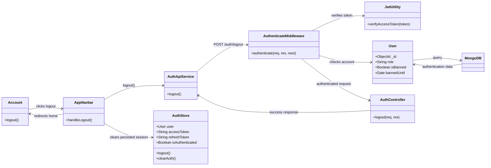

## 3.7 View Public Profile

### Sequence Diagram

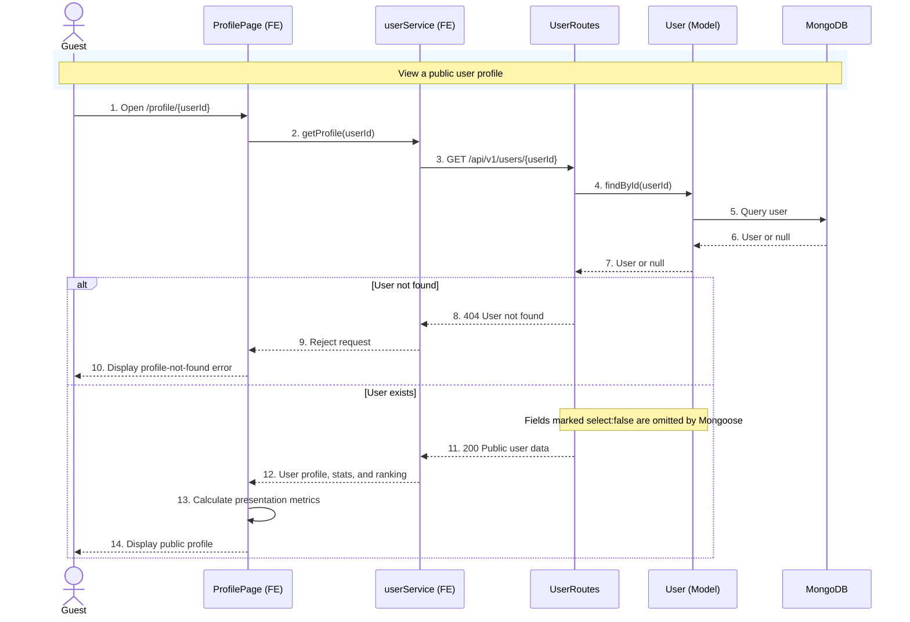

### Class Diagram

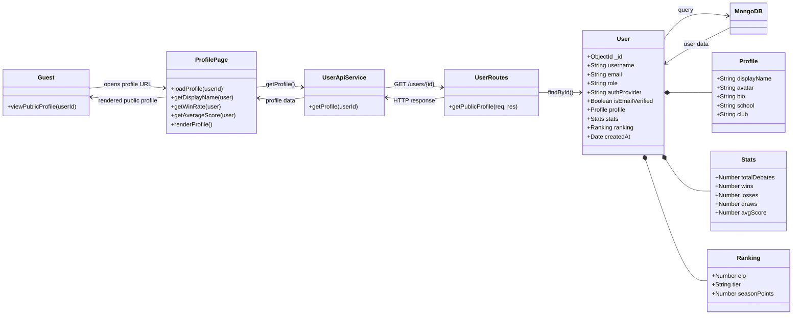

### Notes

- `Login by Google` is listed separately because it extends `Login` in the Guest use case diagram.
- `Create Topic` appears twice in the User use case diagram and is listed once here.
- The standalone `View` oval in the Guest diagram is not connected to an actor and does not identify a specific function, so it is not included as a Detailed Design item.

---

## 3.15 Rejoin Room

The current implementation restores a participant through Socket.IO. The client emits `join-room` again after the socket connects or reconnects, and the server rebuilds the authoritative room state from `DebateRoom`, `DebateSession`, and `Message`.

### Sequence Diagram

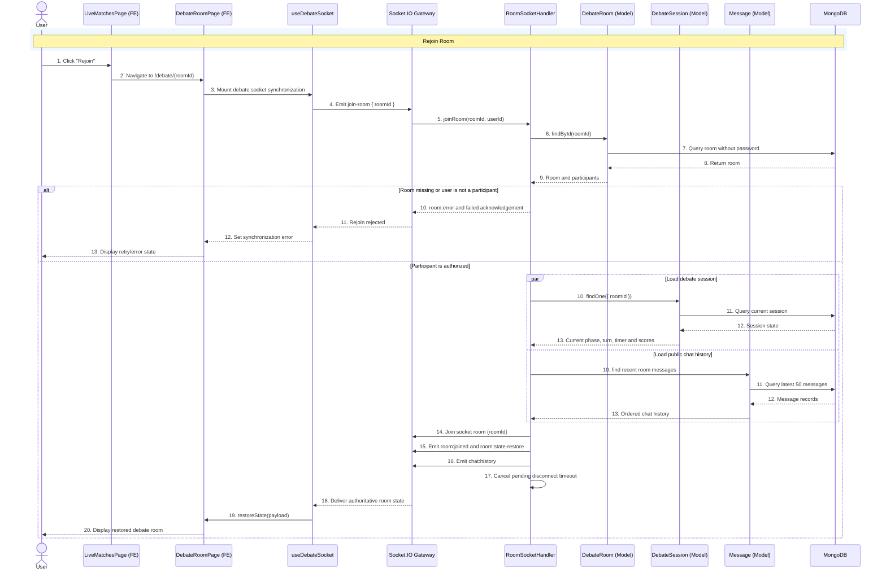

### Class Diagram

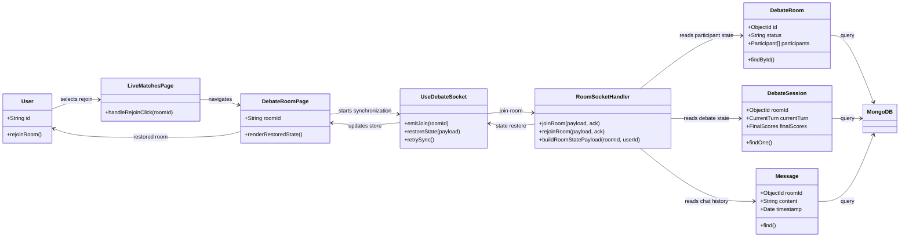

---

## 3.16 Leave Room

Leaving a room is persisted through `POST /api/v1/rooms/{id}/leave`. The route removes the participant, clears host/judge references, transfers ownership when required, and broadcasts the updated room state.

### Sequence Diagram

```mermaid
sequenceDiagram
    actor Actor as User / Admin
    participant FE as LobbyPage or DebateRoomPage (FE)
    participant Guard as RoomParticipantGuard
    participant Ctrl as RoomController
    participant Room as DebateRoom (Model)
    participant Socket as Socket.IO Gateway
    participant DB as MongoDB

    rect rgb(240,248,255)
    Note over Actor,DB: Leave Room
    end

    Actor->>FE: 1. Click "Leave room"
    FE->>Guard: 2. POST /rooms/{id}/leave { newOwnerId? }
    Guard->>Guard: 3. Authenticate access token
    Guard->>Room: 4. Find room and participant
    Room->>DB: 5. Query room
    DB-->>Room: 6. Return room
    Room-->>Guard: 7. Room participant data

    alt User is not an authenticated participant
        Guard-->>FE: 8. 401/403 response
        FE-->>Actor: 9. Return to matches
    else Participant is authorized
        Guard->>Ctrl: 8. Forward room and participant
        Ctrl->>Ctrl: 9. Remove participant
        Ctrl->>Ctrl: 10. Clear host and judge references

        alt Room becomes empty
            Ctrl->>Room: 11. deleteOne()
            Room->>DB: 12. Delete room
            DB-->>Room: 13. Room deleted
            Room-->>Ctrl: 14. Delete confirmed
            Ctrl-->>FE: 15. 200 OK - room deleted
        else Participants remain
            alt Leaving participant is the owner
                Ctrl->>Ctrl: 11. Select requested or first successor
                Ctrl->>Ctrl: 12. Transfer owner and primary role
            else Leaving participant is not the owner
                Ctrl->>Ctrl: 11. Keep current owner
            end

            Ctrl->>Room: 13. save()
            Room->>DB: 14. Update room
            DB-->>Room: 15. Room updated
            Room-->>Ctrl: 16. Updated room
            Ctrl->>Socket: 17. broadcastRoomState(roomId)
            Socket-->>FE: 18. room:state-restore for remaining clients
            Ctrl-->>FE: 19. 200 OK - Left room
        end

        FE->>FE: 20. Clear stored debate room
        FE-->>Actor: 21. Navigate to /matches
    end
```

### Class Diagram

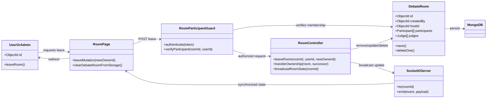

---

## 3.17 Join Ranked Queue

The ranked queue is created through `POST /api/v1/matchmaking/queue`. `MatchmakingService` searches compatible waiting entries by format and ELO tolerance, creates the ranked room and session when enough players are available, then emits `match:found` to each matched user.

### Sequence Diagram

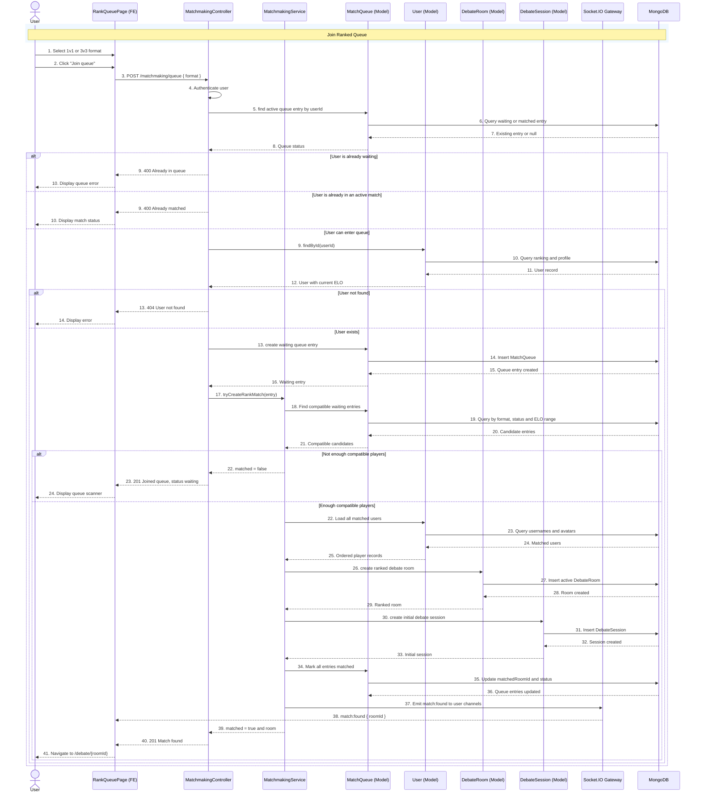

### Class Diagram

```mermaid
classDiagram
direction LR

class UserActor {
    +ObjectId id
    +joinRankedQueue()
}

class RankQueuePage {
    +DebateFormat format
    +joinMutation()
    +handleEnterDebate()
}

class MatchmakingController {
    +joinQueue(userId, format)
    +getStatus(userId)
    +leaveQueue(userId)
}

class MatchmakingService {
    +tryCreateRankMatch(entry)
    +getQueueEloTolerance(entry)
    +getQueueWaitTimeSeconds(entry)
    +emitMatchFound(userIds, roomId)
}

class MatchQueue {
    +ObjectId userId
    +String format
    +Number eloAtQueue
    +String status
    +ObjectId matchedRoomId
    +create()
    +find()
    +updateMany()
}

class UserModel {
    +ObjectId id
    +String username
    +Ranking ranking
    +findById()
}

class DebateRoom {
    +String roomType
    +String format
    +String status
    +Participant[] participants
    +create()
}

class DebateSession {
    +ObjectId roomId
    +CurrentTurn currentTurn
    +create()
}

class SocketIOServer {
    +to(userChannel)
    +emit(matchFound, payload)
}

class MongoDB

UserActor --> RankQueuePage : chooses format
RankQueuePage --> MatchmakingController : POST queue
MatchmakingController --> MatchQueue : checks and creates entry
MatchmakingController --> UserModel : reads ELO
MatchmakingController --> MatchmakingService : attempts match
MatchmakingService --> MatchQueue : finds and updates entries
MatchmakingService --> UserModel : loads players
MatchmakingService --> DebateRoom : creates match room
MatchmakingService --> DebateSession : creates session
MatchmakingService --> SocketIOServer : publishes match found
MatchQueue --> MongoDB : query/update
UserModel --> MongoDB : query
DebateRoom --> MongoDB : insert
DebateSession --> MongoDB : insert
SocketIOServer --> RankQueuePage : match:found
RankQueuePage --> UserActor : enters debate
```

---

## 3.18 Watch Live Match

The Live Matches page loads available rooms, then joins a running room as a viewer when the current user is not already a participant. Private rooms require a valid password before the debate page and socket channel are opened.

### Sequence Diagram

```mermaid
sequenceDiagram
    actor Actor as User / Admin
    participant Matches as LiveMatchesPage (FE)
    participant RoomCtrl as RoomController
    participant UserModel as User (Model)
    participant Room as DebateRoom (Model)
    participant Debate as DebateRoomPage (FE)
    participant Socket as RoomSocketHandler
    participant DB as MongoDB

    rect rgb(240,248,255)
    Note over Actor,DB: Watch Live Match
    end

    Actor->>Matches: 1. Open Live Matches
    Matches->>RoomCtrl: 2. GET /rooms?status=active
    RoomCtrl->>Room: 3. Find visible live rooms
    Room->>DB: 4. Query active/paused rooms
    DB-->>Room: 5. Live room list
    Room-->>RoomCtrl: 6. Rooms without passwords
    RoomCtrl-->>Matches: 7. 200 OK with live matches
    Matches-->>Actor: 8. Display available matches
    Actor->>Matches: 9. Click "Watch Live"

    alt Actor is already a room participant
        Matches->>Debate: 10. Navigate to /debate/{roomId}?mode=viewer
    else Actor is not a participant
        alt Room is private
            Matches-->>Actor: 10. Prompt for room password
            Actor->>Matches: 11. Submit password
            Matches->>RoomCtrl: 12. POST /rooms/{id}/join { password }
        else Room is public
            Matches->>RoomCtrl: 10. POST /rooms/{id}/join
        end

        RoomCtrl->>Room: 13. findById(roomId) with password
        Room->>DB: 14. Query room
        DB-->>Room: 15. Room record
        Room-->>RoomCtrl: 16. Room state

        alt Room closed or password invalid
            RoomCtrl-->>Matches: 17. 400/403 response
            Matches-->>Actor: 18. Display connection error
        else Room accepts the viewer
            RoomCtrl->>UserModel: 17. findById(actorId)
            UserModel->>DB: 18. Query profile
            DB-->>UserModel: 19. User record
            UserModel-->>RoomCtrl: 20. Username and avatar
            RoomCtrl->>Room: 21. Add participant with viewer role
            Room->>DB: 22. Save room participants
            DB-->>Room: 23. Room updated
            Room-->>RoomCtrl: 24. Updated room
            RoomCtrl-->>Matches: 25. 200 Joined room
            Matches->>Debate: 26. Navigate to debate viewer mode
        end
    end

    Debate->>Socket: 27. Emit join-room { roomId }
    Socket->>Room: 28. Verify participant and load room state
    Room->>DB: 29. Query authoritative state
    DB-->>Room: 30. Current room
    Room-->>Socket: 31. Participant authorized
    Socket-->>Debate: 32. room:state-restore
    Debate-->>Actor: 33. Display live debate stream and state
```

### Class Diagram

```mermaid
classDiagram
direction LR

class UserOrAdmin {
    +ObjectId id
    +watchLiveMatch()
}

class LiveMatchesPage {
    +getLiveRooms(filters)
    +handleWatchClick(room)
    +submitPrivatePassword(password)
}

class RoomController {
    +listRooms(filters)
    +joinRoom(roomId, userId, password)
    +broadcastRoomState(roomId)
}

class UserModel {
    +ObjectId id
    +String username
    +Profile profile
    +findById()
}

class DebateRoom {
    +ObjectId id
    +String status
    +Boolean isPrivate
    +String password
    +Participant[] participants
    +find()
    +findById()
    +save()
}

class DebateRoomPage {
    +String roomId
    +renderViewerMode()
}

class RoomSocketHandler {
    +joinRoom(payload, ack)
    +buildRoomStatePayload(roomId, userId)
}

class MongoDB

UserOrAdmin --> LiveMatchesPage : selects live match
LiveMatchesPage --> RoomController : lists/joins room
RoomController --> DebateRoom : validates and adds viewer
RoomController --> UserModel : loads viewer profile
DebateRoom --> MongoDB : query/update
UserModel --> MongoDB : query
LiveMatchesPage --> DebateRoomPage : opens viewer mode
DebateRoomPage --> RoomSocketHandler : joins socket channel
RoomSocketHandler --> DebateRoom : verifies participant
RoomSocketHandler --> DebateRoomPage : restores live state
DebateRoomPage --> UserOrAdmin : displays match
```

---

## 3.19 View Results

The result page calls `GET /api/v1/debate/{roomId}/replay`. The backend loads the final `DebateSession` and selected `DebateRoom` data, and the frontend calculates the per-round presentation from stored judge verdicts.

### Sequence Diagram

```mermaid
sequenceDiagram
    actor Actor as User / Admin
    participant FE as ResultPage (FE)
    participant Ctrl as DebateController
    participant Session as DebateSession (Model)
    participant Room as DebateRoom (Model)
    participant DB as MongoDB

    rect rgb(240,248,255)
    Note over Actor,DB: View Results
    end

    Actor->>FE: 1. Select "View Result"
    FE->>Ctrl: 2. GET /debate/{roomId}/replay
    Ctrl->>Session: 3. findOne({ roomId })
    Session->>DB: 4. Query debate session
    DB-->>Session: 5. Session or null
    Session-->>Ctrl: 6. Replay session

    alt Session not found
        Ctrl-->>FE: 7. 404 Session not found
        FE-->>Actor: 8. Display match not found
    else Session exists
        Ctrl->>Room: 7. findById(roomId)
        Room->>DB: 8. Query title, motion, format and participants
        DB-->>Room: 9. Room data
        Room-->>Ctrl: 10. Result room summary
        Ctrl-->>FE: 11. 200 OK { room, session }
        FE->>FE: 12. Group judge verdicts by round and team
        FE->>FE: 13. Calculate display totals and winner label
        FE-->>Actor: 14. Display scoreboard, feedback and participants
    end

    opt Score changes while page is open
        Ctrl-->>FE: 15. score:updated or score:winner-determined
        FE->>Ctrl: 16. Refetch replay data
        Ctrl-->>FE: 17. Return latest result
        FE-->>Actor: 18. Refresh result view
    end
```

### Class Diagram

```mermaid
classDiagram
direction LR

class UserOrAdmin {
    +viewResults(roomId)
}

class ResultPage {
    +String roomId
    +loadReplay()
    +groupVerdictsByRound()
    +calculateDisplayTotals()
    +renderResult()
}

class DebateController {
    +getReplay(roomId)
    +getScores(roomId)
}

class DebateSession {
    +ObjectId roomId
    +TurnHistory[] turnHistory
    +FinalScores finalScores
    +String aiSummary
    +findOne()
}

class DebateRoom {
    +ObjectId id
    +String title
    +String motion
    +String format
    +Participant[] participants
    +findById()
}

class MongoDB

UserOrAdmin --> ResultPage : opens result
ResultPage --> DebateController : GET replay
DebateController --> DebateSession : loads final scores
DebateController --> DebateRoom : loads match context
DebateSession --> MongoDB : query
DebateRoom --> MongoDB : query
DebateController --> ResultPage : room and session
ResultPage --> UserOrAdmin : rendered result
```

---

## 3.20 View Debate History

The history page calls `GET /api/v1/users/{id}/history`. The backend verifies the user, loads completed rooms containing that user, joins them with debate sessions, and derives win/loss/draw for each history item.

### Sequence Diagram

```mermaid
sequenceDiagram
    actor User
    participant FE as HistoryPage (FE)
    participant Ctrl as UserController
    participant UserModel as User (Model)
    participant Room as DebateRoom (Model)
    participant Session as DebateSession (Model)
    participant DB as MongoDB

    rect rgb(240,248,255)
    Note over User,DB: View Debate History
    end

    User->>FE: 1. Open debate history
    FE->>Ctrl: 2. GET /users/{id}/history?page&limit
    Ctrl->>Ctrl: 3. Normalize pagination values
    Ctrl->>UserModel: 4. findById(userId)
    UserModel->>DB: 5. Query user identifier
    DB-->>UserModel: 6. User or null
    UserModel-->>Ctrl: 7. User lookup result

    alt User not found
        Ctrl-->>FE: 8. 404 User not found
        FE-->>User: 9. Display history error
    else User exists
        par Load completed rooms
            Ctrl->>Room: 8. find completed rooms containing user
            Room->>DB: 9. Query, sort and paginate rooms
            DB-->>Room: 10. Completed room records
            Room-->>Ctrl: 11. Paginated rooms
        and Count completed rooms
            Ctrl->>Room: 8. countDocuments(filter)
            Room->>DB: 9. Count matching rooms
            DB-->>Room: 10. Total count
            Room-->>Ctrl: 11. Total history items
        end

        Ctrl->>Session: 12. find sessions by roomIds
        Session->>DB: 13. Query final scores
        DB-->>Session: 14. Debate sessions
        Session-->>Ctrl: 15. Session map by roomId
        Ctrl->>Ctrl: 16. Derive role, side and win/loss/draw
        Ctrl-->>FE: 17. 200 paginated history
        FE->>FE: 18. Render history cards and pagination
        FE-->>User: 19. Display debate history
    end
```

### Class Diagram

```mermaid
classDiagram
direction LR

class UserActor {
    +ObjectId id
    +viewDebateHistory()
}

class HistoryPage {
    +Number page
    +loadHistory(userId, page)
    +openReplay(sessionId)
}

class UserController {
    +getHistory(userId, page, limit)
    +deriveResult(participant, winner)
}

class UserModel {
    +ObjectId id
    +String username
    +findById()
}

class DebateRoom {
    +ObjectId id
    +String title
    +String motion
    +String format
    +String status
    +Date endedAt
    +Participant[] participants
    +find()
    +countDocuments()
}

class DebateSession {
    +ObjectId id
    +ObjectId roomId
    +FinalScores finalScores
    +find()
}

class DebateHistoryItem {
    +String sessionId
    +String roomId
    +String userRole
    +String userSide
    +String result
}

class MongoDB

UserActor --> HistoryPage : opens history
HistoryPage --> UserController : GET history
UserController --> UserModel : validates user
UserController --> DebateRoom : loads completed matches
UserController --> DebateSession : loads winners
UserController --> DebateHistoryItem : maps response
UserModel --> MongoDB : query
DebateRoom --> MongoDB : query/count
DebateSession --> MongoDB : query
UserController --> HistoryPage : paginated items
HistoryPage --> UserActor : displays history
```

---

## 3.21 Receive Notification

Notifications are currently realtime and transient rather than stored in a standalone `Notification` collection. Personalized events such as `match:found` are sent to `user:{userId}` Socket.IO channels. Debate notifications are derived from persisted judge verdicts and system messages, then rendered by `DebateMotionStage`.

### Sequence Diagram

```mermaid
sequenceDiagram
    actor Actor as User / Admin
    participant FE as Notification UI (FE)
    participant Hook as Socket Hooks
    participant Socket as Socket.IO Gateway
    participant Publisher as Matchmaking or Debate Service
    participant Queue as MatchQueue (Model)
    participant Session as DebateSession (Model)
    participant Message as Message (Model)
    participant DB as MongoDB

    rect rgb(240,248,255)
    Note over Actor,DB: Receive Notification
    end

    Actor->>FE: 1. Open authenticated application
    FE->>Hook: 2. Initialize socket listeners
    Hook->>Socket: 3. Connect with access token
    Socket->>Socket: 4. Verify JWT

    alt Token is invalid
        Socket-->>Hook: 5. Authentication error
        Hook-->>FE: 6. Connection unavailable
        FE-->>Actor: 7. Display authentication state
    else Token is valid
        Socket->>Socket: 5. Join user:{userId} channel

        alt Ranked match is found
            Publisher->>Queue: 6. Mark queue entries matched
            Queue->>DB: 7. Save matchedRoomId and status
            DB-->>Queue: 8. Queue records updated
            Queue-->>Publisher: 9. Match persisted
            Publisher->>Socket: 10. Emit match:found to user channel
            Socket-->>Hook: 11. match:found { roomId }
            Hook-->>FE: 12. Notify match found
            FE-->>Actor: 13. Show toast and open debate room
        else Judge score or system update is produced
            alt Judge score update
                Publisher->>Session: 6. Save judge verdict/final score
                Session->>DB: 7. Update DebateSession
                DB-->>Session: 8. Session updated
                Session-->>Publisher: 9. Updated score state
                Publisher->>Socket: 10. Emit score update to room channel
            else System message update
                Publisher->>Message: 6. Save system message
                Message->>DB: 7. Insert Message
                DB-->>Message: 8. Message created
                Message-->>Publisher: 9. Persisted system update
                Publisher->>Socket: 10. Emit room/message update
            end

            Socket-->>Hook: 11. Deliver realtime room event
            Hook-->>FE: 12. Refresh session/store data
            FE->>FE: 13. Build notification from verdicts/messages
            FE-->>Actor: 14. Display notification in Motion Announcement
        end
    end
```

### Class Diagram

```mermaid
classDiagram
direction LR

class UserOrAdmin {
    +ObjectId id
    +receiveNotification()
}

class NotificationUI {
    +showToast(message)
    +renderDebateNotifications(items)
}

class SocketHooks {
    +useSocket()
    +useMatchSocket()
    +useDebateSocket()
    +subscribe(event, handler)
}

class SocketIOServer {
    +authenticate(token)
    +join(userChannel)
    +to(channel)
    +emit(event, payload)
}

class EventPublisher {
    +emitMatchFound(userIds, roomId)
    +publishScoreUpdate(roomId, scores)
    +publishSystemMessage(roomId, message)
}

class MatchQueue {
    +ObjectId userId
    +String status
    +ObjectId matchedRoomId
    +updateMany()
}

class DebateSession {
    +ObjectId roomId
    +FinalScores finalScores
    +save()
}

class Message {
    +ObjectId roomId
    +String type
    +String content
    +Date timestamp
    +create()
}

class DebateMotionStage {
    +Notification[] notifications
    +renderNotifications()
}

class MongoDB

UserOrAdmin --> NotificationUI : views notifications
NotificationUI --> SocketHooks : registers listeners
SocketHooks --> SocketIOServer : authenticated connection
EventPublisher --> MatchQueue : persists match state
EventPublisher --> DebateSession : persists score state
EventPublisher --> Message : persists system update
MatchQueue --> MongoDB : update
DebateSession --> MongoDB : update
Message --> MongoDB : insert
EventPublisher --> SocketIOServer : emits realtime event
SocketIOServer --> SocketHooks : pushes event
SocketHooks --> NotificationUI : updates UI
NotificationUI --> DebateMotionStage : renders debate feed
NotificationUI --> UserOrAdmin : toast/feed
```
