# 3. Detailed Design

## Document Purpose

This document defines the implementation-level class relationships and runtime interactions for authentication, user profiles, leaderboard, match discovery, room management, and ranked matchmaking. The diagrams are aligned with the current React, Express, Socket.IO, Mongoose, and MongoDB codebase.

### Diagram Conventions

- `*Page`, UI components, client services, and stores run in the React frontend.
- `*Controller`, `*RouteHandler`, middleware, domain services, and socket gateways run in the Express backend.
- Mongoose models represent persistence-facing classes; `MongoDB` is the datastore.
- HTTP error paths are shown where they materially change the use-case outcome.
- Passwords and verification/reset tokens are stored only as hashes. Room passwords are omitted from read responses.

## Table of Contents

- 3.1 Authentication
  - 3.1.1 Registration
    - 3.1.1.1 Class Diagram For Registration
    - 3.1.1.2 Sequence Diagram For Registration
  - 3.1.2 Login
    - 3.1.2.1 Class Diagram For Login
    - 3.1.2.2 Sequence Diagram For Login
  - 3.1.3 Login by Google
    - 3.1.3.1 Class Diagram For Login by Google
    - 3.1.3.2 Sequence Diagram For Login by Google
  - 3.1.4 Verify Email
    - 3.1.4.1 Class Diagram For Verify Email
    - 3.1.4.2 Sequence Diagram For Verify Email
  - 3.1.5 Resend Verification Email
    - 3.1.5.1 Class Diagram For Resend Verification Email
    - 3.1.5.2 Sequence Diagram For Resend Verification Email
  - 3.1.6 Forgot Password
    - 3.1.6.1 Class Diagram For Forgot Password
    - 3.1.6.2 Sequence Diagram For Forgot Password
  - 3.1.7 Change Password
    - 3.1.7.1 Class Diagram For Change Password
    - 3.1.7.2 Sequence Diagram For Change Password
  - 3.1.8 Logout
    - 3.1.8.1 Class Diagram For Logout
    - 3.1.8.2 Sequence Diagram For Logout
- 3.2 User Profile and Account
  - 3.2.1 View Public Profile
    - 3.2.1.1 Class Diagram For View Public Profile
    - 3.2.1.2 Sequence Diagram For View Public Profile
  - 3.2.2 View Own Profile
    - 3.2.2.1 Class Diagram For View Own Profile
    - 3.2.2.2 Sequence Diagram For View Own Profile
  - 3.2.3 Update Profile
    - 3.2.3.1 Class Diagram For Update Profile
    - 3.2.3.2 Sequence Diagram For Update Profile
  - 3.2.4 View Debate History
    - 3.2.4.1 Class Diagram For View Debate History
    - 3.2.4.2 Sequence Diagram For View Debate History
- 3.3 Leaderboard
  - 3.3.1 View Global Leaderboard
    - 3.3.1.1 Class Diagram For View Global Leaderboard
    - 3.3.1.2 Sequence Diagram For View Global Leaderboard
- 3.4 Match Discovery
  - 3.4.1 View Live Match List
    - 3.4.1.1 Class Diagram For View Live Match List
    - 3.4.1.2 Sequence Diagram For View Live Match List
  - 3.4.2 View Room Detail
    - 3.4.2.1 Class Diagram For View Room Detail
    - 3.4.2.2 Sequence Diagram For View Room Detail
  - 3.4.3 Join Waiting or Ready Room
    - 3.4.3.1 Class Diagram For Join Waiting or Ready Room
    - 3.4.3.2 Sequence Diagram For Join Waiting or Ready Room
  - 3.4.4 Filter matches by format, type, status
    - 3.4.4.1 Class Diagram For Filter matches by format, type, status
    - 3.4.4.2 Sequence Diagram For Filter matches by format, type, status
  - 3.4.5 Join active room as viewer
    - 3.4.5.1 Class Diagram For Join active room as viewer
    - 3.4.5.2 Sequence Diagram For Join active room as viewer
- 3.5 Room Management
  - 3.5.1 Create custom room
    - 3.5.1.1 Class Diagram For Create custom room
    - 3.5.1.2 Sequence Diagram For Create custom room
  - 3.5.2 Configure room
    - 3.5.2.1 Class Diagram For Configure room
    - 3.5.2.2 Sequence Diagram For Configure room
  - 3.5.3 Update room
    - 3.5.3.1 Class Diagram For Update room
    - 3.5.3.2 Sequence Diagram For Update room
  - 3.5.4 Join room
    - 3.5.4.1 Class Diagram For Join room
    - 3.5.4.2 Sequence Diagram For Join room
  - 3.5.5 Leave room
    - 3.5.5.1 Class Diagram For Leave room
    - 3.5.5.2 Sequence Diagram For Leave room
  - 3.5.6 Select team and speaker position
    - 3.5.6.1 Class Diagram For Select team and speaker position
    - 3.5.6.2 Sequence Diagram For Select team and speaker position
  - 3.5.7 Assign participant role
    - 3.5.7.1 Class Diagram For Assign participant role
    - 3.5.7.2 Sequence Diagram For Assign participant role
  - 3.5.8 Lock positions
    - 3.5.8.1 Class Diagram For Lock positions
    - 3.5.8.2 Sequence Diagram For Lock positions
  - 3.5.9 Toggle viewer chat
    - 3.5.9.1 Class Diagram For Toggle viewer chat
    - 3.5.9.2 Sequence Diagram For Toggle viewer chat
  - 3.5.10 Start debate
    - 3.5.10.1 Class Diagram For Start debate
    - 3.5.10.2 Sequence Diagram For Start debate
- 3.6 Ranked Matchmaking
  - 3.6.1 Join ranked queue
    - 3.6.1.1 Class Diagram For Join ranked queue
    - 3.6.1.2 Sequence Diagram For Join ranked queue
  - 3.6.2 Leave ranked queue
    - 3.6.2.1 Class Diagram For Leave ranked queue
    - 3.6.2.2 Sequence Diagram For Leave ranked queue

## 3.1 Authentication

### 3.1.1 Registration

**Design scope:** Create a local account, issue a 24-hour email-verification token, send the verification email, and return a sanitized user with an access/refresh token pair.

**Primary endpoint:** `POST /api/v1/auth/register`

#### 3.1.1.1 Class Diagram For Registration

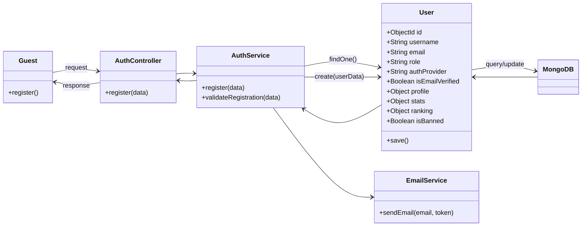
```mermaid
classDiagram
direction LR

class Guest {
    +register()
}

class AuthController {
    +register(data)
}

class AuthService {
    +register(data)
    +validateRegistration(data)
}

class User {
    +ObjectId id
    +String username
    +String email
    +String role
    +String authProvider
    +Boolean isEmailVerified
    +Object profile
    +Object stats
    +Object ranking
    +Boolean isBanned
    +save()
}

class EmailService {
    +sendEmail(email, token)
}

class MongoDB

Guest --> AuthController : request
AuthController --> AuthService
AuthService --> User : findOne()
AuthService --> User : create(userData)
User --> MongoDB : query/update
MongoDB --> User
User --> AuthService
AuthService --> EmailService
AuthService --> AuthController
AuthController --> Guest : response
```

#### 3.1.1.2 Sequence Diagram For Registration

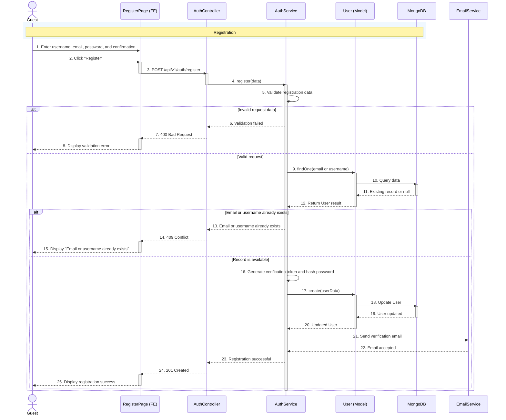
```mermaid
sequenceDiagram
    actor A as Guest
    participant FE as RegisterPage (FE)
    participant Ctrl as AuthController
    participant Svc as AuthService
    participant Model as User (Model)
    participant DB as MongoDB
    participant EmailService as EmailService

    rect rgb(240,248,255)
        Note over A,DB: Registration
    end

    A->>FE: 1. Enter username, email, password, and confirmation
    A->>FE: 2. Click "Register"

    activate FE
    FE->>Ctrl: 3. POST /api/v1/auth/register
    deactivate FE

    activate Ctrl
    Ctrl->>Svc: 4. register(data)
    deactivate Ctrl

    activate Svc
    Svc->>Svc: 5. Validate registration data

    alt Invalid request data
        Svc-->>Ctrl: 6. Validation failed
        Ctrl-->>FE: 7. 400 Bad Request
        activate FE
        FE-->>A: 8. Display validation error
        deactivate FE

    else Valid request
        Svc->>Model: 9. findOne(email or username)
        activate Model
        Model->>DB: 10. Query data
        activate DB
        DB-->>Model: 11. Existing record or null
        deactivate DB
        Model-->>Svc: 12. Return User result
        deactivate Model

        alt Email or username already exists
            Svc-->>Ctrl: 13. Email or username already exists
            Ctrl-->>FE: 14. 409 Conflict
            activate FE
            FE-->>A: 15. Display "Email or username already exists"
            deactivate FE

        else Record is available
            Svc->>Svc: 16. Generate verification token and hash password
            Svc->>Model: 17. create(userData)
            activate Model
            Model->>DB: 18. Update User
            activate DB
            DB-->>Model: 19. User updated
            deactivate DB
            Model-->>Svc: 20. Updated User
            deactivate Model
            Svc->>EmailService: 21. Send verification email
            EmailService-->>Svc: 22. Email accepted
            Svc-->>Ctrl: 23. Registration successful
            Ctrl-->>FE: 24. 201 Created
            activate FE
            FE-->>A: 25. Display registration success
            deactivate FE
        end
    end

    deactivate Svc
```

### 3.1.2 Login

**Design scope:** Authenticate a local account, reject invalid or banned users, persist the authenticated state in Zustand, and redirect to the requested route.

**Primary endpoint:** `POST /api/v1/auth/login`

#### 3.1.2.1 Class Diagram For Login

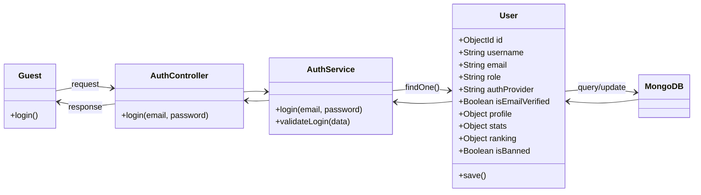
```mermaid
classDiagram
direction LR

class Guest {
    +login()
}

class AuthController {
    +login(email, password)
}

class AuthService {
    +login(email, password)
    +validateLogin(data)
}

class User {
    +ObjectId id
    +String username
    +String email
    +String role
    +String authProvider
    +Boolean isEmailVerified
    +Object profile
    +Object stats
    +Object ranking
    +Boolean isBanned
    +save()
}

class MongoDB

Guest --> AuthController : request
AuthController --> AuthService
AuthService --> User : findOne()
User --> MongoDB : query/update
MongoDB --> User
User --> AuthService
AuthService --> AuthController
AuthController --> Guest : response
```

#### 3.1.2.2 Sequence Diagram For Login

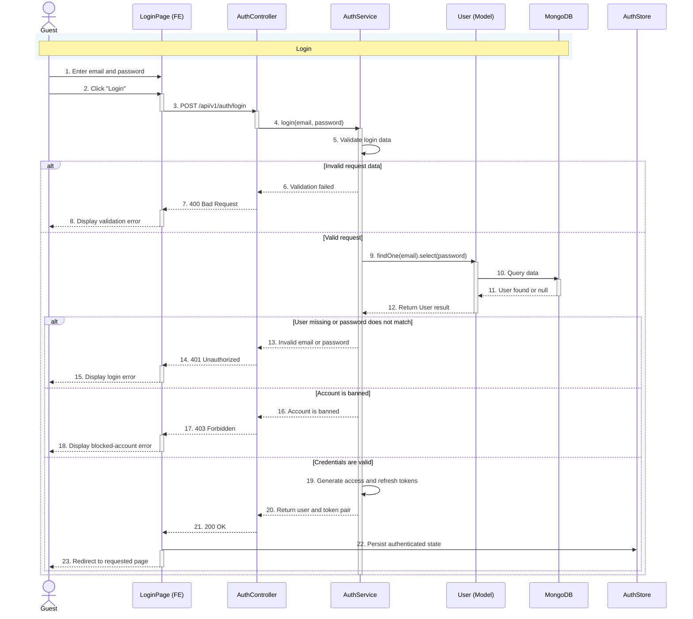
```mermaid
sequenceDiagram
    actor A as Guest
    participant FE as LoginPage (FE)
    participant Ctrl as AuthController
    participant Svc as AuthService
    participant Model as User (Model)
    participant DB as MongoDB
    participant Store as AuthStore

    rect rgb(240,248,255)
        Note over A,DB: Login
    end

    A->>FE: 1. Enter email and password
    A->>FE: 2. Click "Login"

    activate FE
    FE->>Ctrl: 3. POST /api/v1/auth/login
    deactivate FE

    activate Ctrl
    Ctrl->>Svc: 4. login(email, password)
    deactivate Ctrl

    activate Svc
    Svc->>Svc: 5. Validate login data

    alt Invalid request data
        Svc-->>Ctrl: 6. Validation failed
        Ctrl-->>FE: 7. 400 Bad Request
        activate FE
        FE-->>A: 8. Display validation error
        deactivate FE

    else Valid request
        Svc->>Model: 9. findOne(email).select(password)
        activate Model
        Model->>DB: 10. Query data
        activate DB
        DB-->>Model: 11. User found or null
        deactivate DB
        Model-->>Svc: 12. Return User result
        deactivate Model

        alt User missing or password does not match
            Svc-->>Ctrl: 13. Invalid email or password
            Ctrl-->>FE: 14. 401 Unauthorized
            activate FE
            FE-->>A: 15. Display login error
            deactivate FE

        else Account is banned
            Svc-->>Ctrl: 16. Account is banned
            Ctrl-->>FE: 17. 403 Forbidden
            activate FE
            FE-->>A: 18. Display blocked-account error
            deactivate FE

        else Credentials are valid
            Svc->>Svc: 19. Generate access and refresh tokens
            Svc-->>Ctrl: 20. Return user and token pair
            Ctrl-->>FE: 21. 200 OK
            FE->>Store: 22. Persist authenticated state
            activate FE
            FE-->>A: 23. Redirect to requested page
            deactivate FE
        end
    end

    deactivate Svc
```

### 3.1.3 Login by Google

**Design scope:** Verify a Google ID token, create or link the platform account, enforce ban status, and establish the local JWT session.

**Primary endpoint:** `POST /api/v1/auth/google`

#### 3.1.3.1 Class Diagram For Login by Google

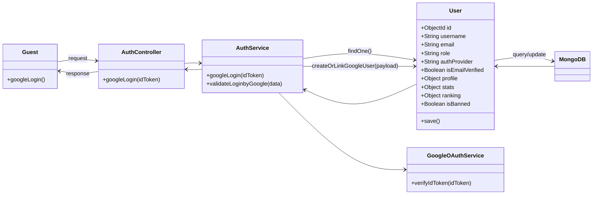
```mermaid
classDiagram
direction LR

class Guest {
    +googleLogin()
}

class AuthController {
    +googleLogin(idToken)
}

class AuthService {
    +googleLogin(idToken)
    +validateLoginbyGoogle(data)
}

class User {
    +ObjectId id
    +String username
    +String email
    +String role
    +String authProvider
    +Boolean isEmailVerified
    +Object profile
    +Object stats
    +Object ranking
    +Boolean isBanned
    +save()
}

class GoogleOAuthService {
    +verifyIdToken(idToken)
}

class MongoDB

Guest --> AuthController : request
AuthController --> AuthService
AuthService --> User : findOne()
AuthService --> User : createOrLinkGoogleUser(payload)
User --> MongoDB : query/update
MongoDB --> User
User --> AuthService
AuthService --> GoogleOAuthService
AuthService --> AuthController
AuthController --> Guest : response
```

#### 3.1.3.2 Sequence Diagram For Login by Google

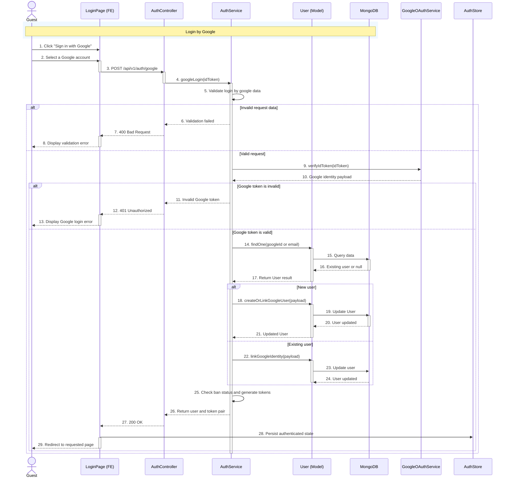
```mermaid
sequenceDiagram
    actor A as Guest
    participant FE as LoginPage (FE)
    participant Ctrl as AuthController
    participant Svc as AuthService
    participant Model as User (Model)
    participant DB as MongoDB
    participant GoogleOAuthService as GoogleOAuthService
    participant Store as AuthStore

    rect rgb(240,248,255)
        Note over A,DB: Login by Google
    end

    A->>FE: 1. Click "Sign in with Google"
    A->>FE: 2. Select a Google account

    activate FE
    FE->>Ctrl: 3. POST /api/v1/auth/google
    deactivate FE

    activate Ctrl
    Ctrl->>Svc: 4. googleLogin(idToken)
    deactivate Ctrl

    activate Svc
    Svc->>Svc: 5. Validate login by google data

    alt Invalid request data
        Svc-->>Ctrl: 6. Validation failed
        Ctrl-->>FE: 7. 400 Bad Request
        activate FE
        FE-->>A: 8. Display validation error
        deactivate FE

    else Valid request
        Svc->>GoogleOAuthService: 9. verifyIdToken(idToken)
        GoogleOAuthService-->>Svc: 10. Google identity payload

        alt Google token is invalid
            Svc-->>Ctrl: 11. Invalid Google token
            Ctrl-->>FE: 12. 401 Unauthorized
            activate FE
            FE-->>A: 13. Display Google login error
            deactivate FE

        else Google token is valid
            Svc->>Model: 14. findOne(googleId or email)
            activate Model
            Model->>DB: 15. Query data
            activate DB
            DB-->>Model: 16. Existing user or null
            deactivate DB
            Model-->>Svc: 17. Return User result
            deactivate Model
            alt New user
                Svc->>Model: 18. createOrLinkGoogleUser(payload)
                activate Model
                Model->>DB: 19. Update User
                activate DB
                DB-->>Model: 20. User updated
                deactivate DB
                Model-->>Svc: 21. Updated User
                deactivate Model
            else Existing user
                Svc->>Model: 22. linkGoogleIdentity(payload)
                activate Model
                Model->>DB: 23. Update user
                DB-->>Model: 24. User updated
                deactivate Model
            end
            Svc->>Svc: 25. Check ban status and generate tokens
            Svc-->>Ctrl: 26. Return user and token pair
            Ctrl-->>FE: 27. 200 OK
            FE->>Store: 28. Persist authenticated state
            activate FE
            FE-->>A: 29. Redirect to requested page
            deactivate FE
        end
    end

    deactivate Svc
```

### 3.1.4 Verify Email

**Design scope:** Consume the raw token from the email link, find its unexpired hash, mark the account verified, and remove verification secrets.

**Primary endpoint:** `POST /api/v1/auth/verify-email`

#### 3.1.4.1 Class Diagram For Verify Email

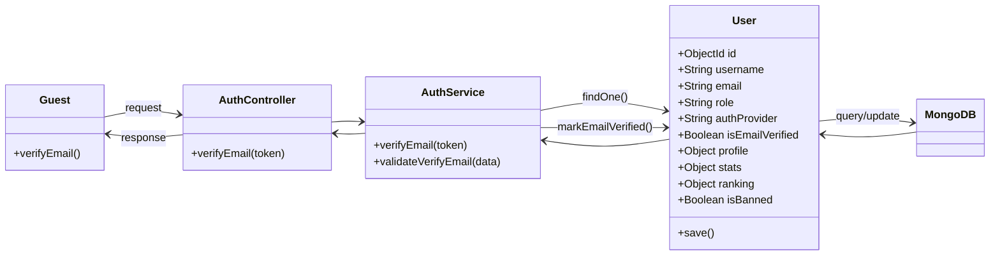
```mermaid
classDiagram
direction LR

class Guest {
    +verifyEmail()
}

class AuthController {
    +verifyEmail(token)
}

class AuthService {
    +verifyEmail(token)
    +validateVerifyEmail(data)
}

class User {
    +ObjectId id
    +String username
    +String email
    +String role
    +String authProvider
    +Boolean isEmailVerified
    +Object profile
    +Object stats
    +Object ranking
    +Boolean isBanned
    +save()
}

class MongoDB

Guest --> AuthController : request
AuthController --> AuthService
AuthService --> User : findOne()
AuthService --> User : markEmailVerified()
User --> MongoDB : query/update
MongoDB --> User
User --> AuthService
AuthService --> AuthController
AuthController --> Guest : response
```

#### 3.1.4.2 Sequence Diagram For Verify Email

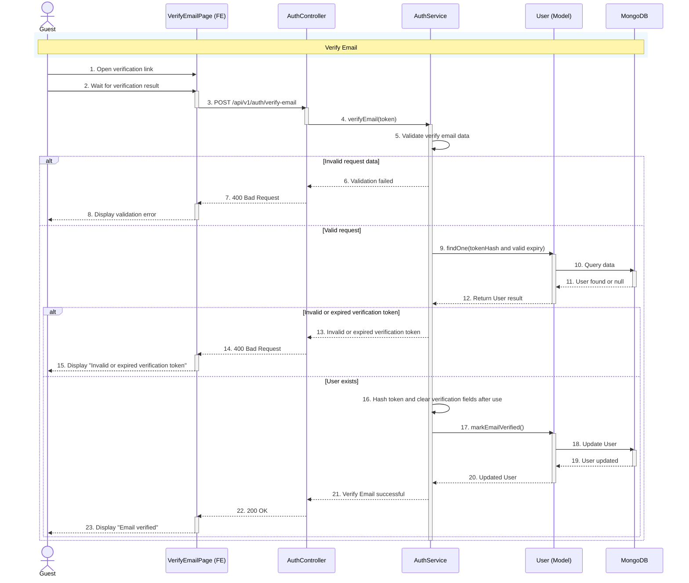
```mermaid
sequenceDiagram
    actor A as Guest
    participant FE as VerifyEmailPage (FE)
    participant Ctrl as AuthController
    participant Svc as AuthService
    participant Model as User (Model)
    participant DB as MongoDB

    rect rgb(240,248,255)
        Note over A,DB: Verify Email
    end

    A->>FE: 1. Open verification link
    A->>FE: 2. Wait for verification result

    activate FE
    FE->>Ctrl: 3. POST /api/v1/auth/verify-email
    deactivate FE

    activate Ctrl
    Ctrl->>Svc: 4. verifyEmail(token)
    deactivate Ctrl

    activate Svc
    Svc->>Svc: 5. Validate verify email data

    alt Invalid request data
        Svc-->>Ctrl: 6. Validation failed
        Ctrl-->>FE: 7. 400 Bad Request
        activate FE
        FE-->>A: 8. Display validation error
        deactivate FE

    else Valid request
        Svc->>Model: 9. findOne(tokenHash and valid expiry)
        activate Model
        Model->>DB: 10. Query data
        activate DB
        DB-->>Model: 11. User found or null
        deactivate DB
        Model-->>Svc: 12. Return User result
        deactivate Model

        alt Invalid or expired verification token
            Svc-->>Ctrl: 13. Invalid or expired verification token
            Ctrl-->>FE: 14. 400 Bad Request
            activate FE
            FE-->>A: 15. Display "Invalid or expired verification token"
            deactivate FE

        else User exists
            Svc->>Svc: 16. Hash token and clear verification fields after use
            Svc->>Model: 17. markEmailVerified()
            activate Model
            Model->>DB: 18. Update User
            activate DB
            DB-->>Model: 19. User updated
            deactivate DB
            Model-->>Svc: 20. Updated User
            deactivate Model
            Svc-->>Ctrl: 21. Verify Email successful
            Ctrl-->>FE: 22. 200 OK
            activate FE
            FE-->>A: 23. Display "Email verified"
            deactivate FE
        end
    end

    deactivate Svc
```

### 3.1.5 Resend Verification Email

**Design scope:** For an authenticated, unverified user, rotate the verification token, extend the expiry by 24 hours, and send a new email.

**Primary endpoint:** `POST /api/v1/auth/resend-verification`

#### 3.1.5.1 Class Diagram For Resend Verification Email

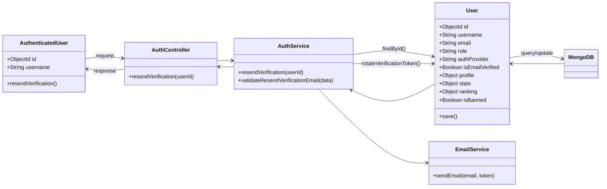
```mermaid
classDiagram
direction LR

class AuthenticatedUser {
    +ObjectId id
    +String username
    +resendVerification()
}

class AuthController {
    +resendVerification(userId)
}

class AuthService {
    +resendVerification(userId)
    +validateResendVerificationEmail(data)
}

class User {
    +ObjectId id
    +String username
    +String email
    +String role
    +String authProvider
    +Boolean isEmailVerified
    +Object profile
    +Object stats
    +Object ranking
    +Boolean isBanned
    +save()
}

class EmailService {
    +sendEmail(email, token)
}

class MongoDB

AuthenticatedUser --> AuthController : request
AuthController --> AuthService
AuthService --> User : findById()
AuthService --> User : rotateVerificationToken()
User --> MongoDB : query/update
MongoDB --> User
User --> AuthService
AuthService --> EmailService
AuthService --> AuthController
AuthController --> AuthenticatedUser : response
```

#### 3.1.5.2 Sequence Diagram For Resend Verification Email

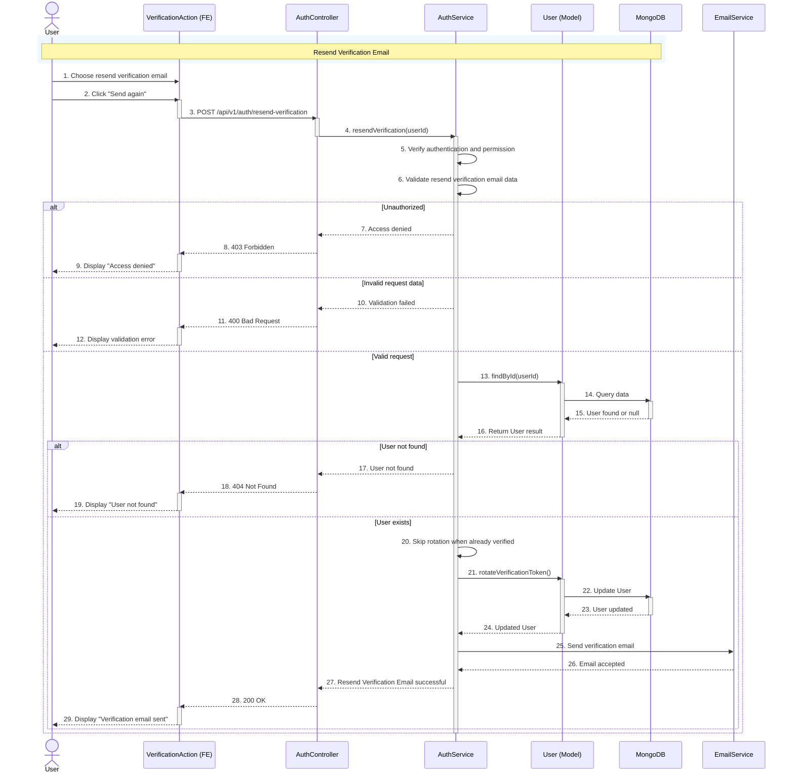
```mermaid
sequenceDiagram
    actor A as User
    participant FE as VerificationAction (FE)
    participant Ctrl as AuthController
    participant Svc as AuthService
    participant Model as User (Model)
    participant DB as MongoDB
    participant EmailService as EmailService

    rect rgb(240,248,255)
        Note over A,DB: Resend Verification Email
    end

    A->>FE: 1. Choose resend verification email
    A->>FE: 2. Click "Send again"

    activate FE
    FE->>Ctrl: 3. POST /api/v1/auth/resend-verification
    deactivate FE

    activate Ctrl
    Ctrl->>Svc: 4. resendVerification(userId)
    deactivate Ctrl

    activate Svc
    Svc->>Svc: 5. Verify authentication and permission
    Svc->>Svc: 6. Validate resend verification email data

    alt Unauthorized
        Svc-->>Ctrl: 7. Access denied
        Ctrl-->>FE: 8. 403 Forbidden
        activate FE
        FE-->>A: 9. Display "Access denied"
        deactivate FE

    else Invalid request data
        Svc-->>Ctrl: 10. Validation failed
        Ctrl-->>FE: 11. 400 Bad Request
        activate FE
        FE-->>A: 12. Display validation error
        deactivate FE

    else Valid request
        Svc->>Model: 13. findById(userId)
        activate Model
        Model->>DB: 14. Query data
        activate DB
        DB-->>Model: 15. User found or null
        deactivate DB
        Model-->>Svc: 16. Return User result
        deactivate Model

        alt User not found
            Svc-->>Ctrl: 17. User not found
            Ctrl-->>FE: 18. 404 Not Found
            activate FE
            FE-->>A: 19. Display "User not found"
            deactivate FE

        else User exists
            Svc->>Svc: 20. Skip rotation when already verified
            Svc->>Model: 21. rotateVerificationToken()
            activate Model
            Model->>DB: 22. Update User
            activate DB
            DB-->>Model: 23. User updated
            deactivate DB
            Model-->>Svc: 24. Updated User
            deactivate Model
            Svc->>EmailService: 25. Send verification email
            EmailService-->>Svc: 26. Email accepted
            Svc-->>Ctrl: 27. Resend Verification Email successful
            Ctrl-->>FE: 28. 200 OK
            activate FE
            FE-->>A: 29. Display "Verification email sent"
            deactivate FE
        end
    end

    deactivate Svc
```

### 3.1.6 Forgot Password

**Design scope:** Issue a one-hour password-reset token without disclosing whether an email exists; the linked reset page later consumes the token to set a new password.

**Primary endpoint:** `POST /api/v1/auth/forgot-password`

#### 3.1.6.1 Class Diagram For Forgot Password

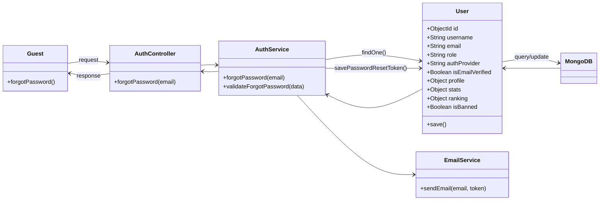
```mermaid
classDiagram
direction LR

class Guest {
    +forgotPassword()
}

class AuthController {
    +forgotPassword(email)
}

class AuthService {
    +forgotPassword(email)
    +validateForgotPassword(data)
}

class User {
    +ObjectId id
    +String username
    +String email
    +String role
    +String authProvider
    +Boolean isEmailVerified
    +Object profile
    +Object stats
    +Object ranking
    +Boolean isBanned
    +save()
}

class EmailService {
    +sendEmail(email, token)
}

class MongoDB

Guest --> AuthController : request
AuthController --> AuthService
AuthService --> User : findOne()
AuthService --> User : savePasswordResetToken()
User --> MongoDB : query/update
MongoDB --> User
User --> AuthService
AuthService --> EmailService
AuthService --> AuthController
AuthController --> Guest : response
```

#### 3.1.6.2 Sequence Diagram For Forgot Password

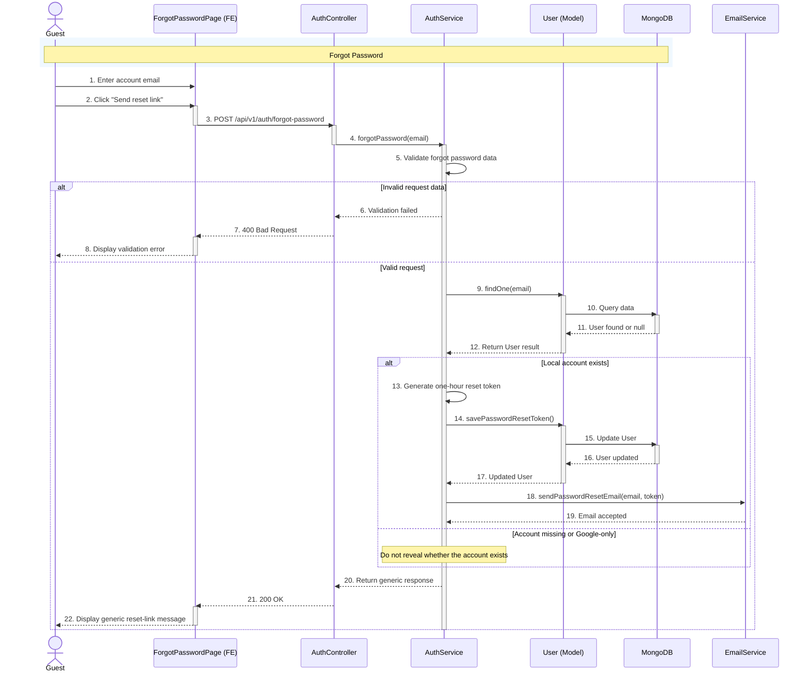
```mermaid
sequenceDiagram
    actor A as Guest
    participant FE as ForgotPasswordPage (FE)
    participant Ctrl as AuthController
    participant Svc as AuthService
    participant Model as User (Model)
    participant DB as MongoDB
    participant EmailService as EmailService

    rect rgb(240,248,255)
        Note over A,DB: Forgot Password
    end

    A->>FE: 1. Enter account email
    A->>FE: 2. Click "Send reset link"

    activate FE
    FE->>Ctrl: 3. POST /api/v1/auth/forgot-password
    deactivate FE

    activate Ctrl
    Ctrl->>Svc: 4. forgotPassword(email)
    deactivate Ctrl

    activate Svc
    Svc->>Svc: 5. Validate forgot password data

    alt Invalid request data
        Svc-->>Ctrl: 6. Validation failed
        Ctrl-->>FE: 7. 400 Bad Request
        activate FE
        FE-->>A: 8. Display validation error
        deactivate FE

    else Valid request
        Svc->>Model: 9. findOne(email)
        activate Model
        Model->>DB: 10. Query data
        activate DB
        DB-->>Model: 11. User found or null
        deactivate DB
        Model-->>Svc: 12. Return User result
        deactivate Model

        alt Local account exists
            Svc->>Svc: 13. Generate one-hour reset token
            Svc->>Model: 14. savePasswordResetToken()
            activate Model
            Model->>DB: 15. Update User
            activate DB
            DB-->>Model: 16. User updated
            deactivate DB
            Model-->>Svc: 17. Updated User
            deactivate Model
            Svc->>EmailService: 18. sendPasswordResetEmail(email, token)
            EmailService-->>Svc: 19. Email accepted
        else Account missing or Google-only
            Note over Svc: Do not reveal whether the account exists
        end
        Svc-->>Ctrl: 20. Return generic response
        Ctrl-->>FE: 21. 200 OK
        activate FE
        FE-->>A: 22. Display generic reset-link message
        deactivate FE
    end

    deactivate Svc
```

### 3.1.7 Change Password

**Design scope:** Allow an authenticated local account to replace its password after confirming the current password.

**Primary endpoint:** `POST /api/v1/auth/change-password`

#### 3.1.7.1 Class Diagram For Change Password

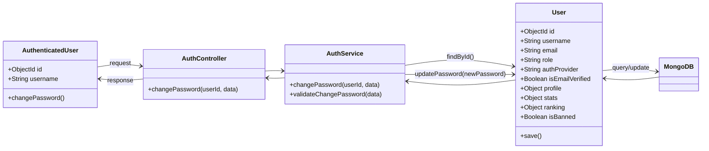
```mermaid
classDiagram
direction LR

class AuthenticatedUser {
    +ObjectId id
    +String username
    +changePassword()
}

class AuthController {
    +changePassword(userId, data)
}

class AuthService {
    +changePassword(userId, data)
    +validateChangePassword(data)
}

class User {
    +ObjectId id
    +String username
    +String email
    +String role
    +String authProvider
    +Boolean isEmailVerified
    +Object profile
    +Object stats
    +Object ranking
    +Boolean isBanned
    +save()
}

class MongoDB

AuthenticatedUser --> AuthController : request
AuthController --> AuthService
AuthService --> User : findById()
AuthService --> User : updatePassword(newPassword)
User --> MongoDB : query/update
MongoDB --> User
User --> AuthService
AuthService --> AuthController
AuthController --> AuthenticatedUser : response
```

#### 3.1.7.2 Sequence Diagram For Change Password

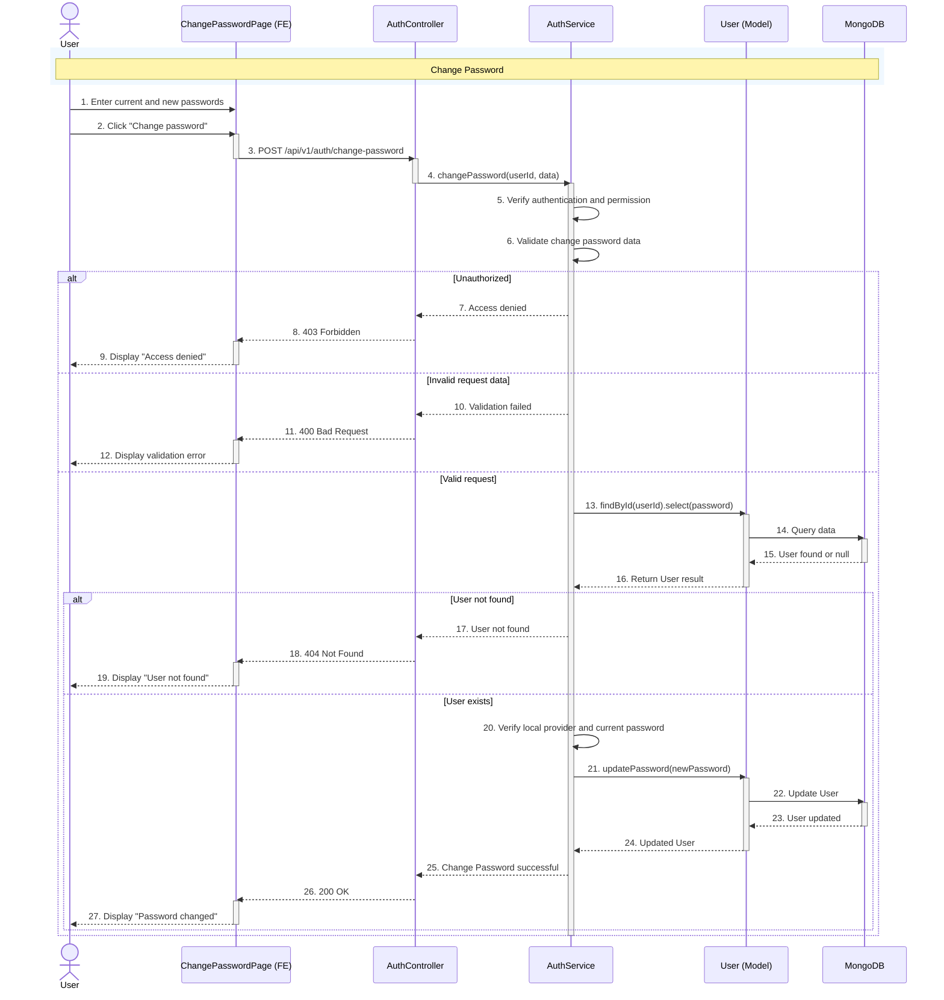
```mermaid
sequenceDiagram
    actor A as User
    participant FE as ChangePasswordPage (FE)
    participant Ctrl as AuthController
    participant Svc as AuthService
    participant Model as User (Model)
    participant DB as MongoDB

    rect rgb(240,248,255)
        Note over A,DB: Change Password
    end

    A->>FE: 1. Enter current and new passwords
    A->>FE: 2. Click "Change password"

    activate FE
    FE->>Ctrl: 3. POST /api/v1/auth/change-password
    deactivate FE

    activate Ctrl
    Ctrl->>Svc: 4. changePassword(userId, data)
    deactivate Ctrl

    activate Svc
    Svc->>Svc: 5. Verify authentication and permission
    Svc->>Svc: 6. Validate change password data

    alt Unauthorized
        Svc-->>Ctrl: 7. Access denied
        Ctrl-->>FE: 8. 403 Forbidden
        activate FE
        FE-->>A: 9. Display "Access denied"
        deactivate FE

    else Invalid request data
        Svc-->>Ctrl: 10. Validation failed
        Ctrl-->>FE: 11. 400 Bad Request
        activate FE
        FE-->>A: 12. Display validation error
        deactivate FE

    else Valid request
        Svc->>Model: 13. findById(userId).select(password)
        activate Model
        Model->>DB: 14. Query data
        activate DB
        DB-->>Model: 15. User found or null
        deactivate DB
        Model-->>Svc: 16. Return User result
        deactivate Model

        alt User not found
            Svc-->>Ctrl: 17. User not found
            Ctrl-->>FE: 18. 404 Not Found
            activate FE
            FE-->>A: 19. Display "User not found"
            deactivate FE

        else User exists
            Svc->>Svc: 20. Verify local provider and current password
            Svc->>Model: 21. updatePassword(newPassword)
            activate Model
            Model->>DB: 22. Update User
            activate DB
            DB-->>Model: 23. User updated
            deactivate DB
            Model-->>Svc: 24. Updated User
            deactivate Model
            Svc-->>Ctrl: 25. Change Password successful
            Ctrl-->>FE: 26. 200 OK
            activate FE
            FE-->>A: 27. Display "Password changed"
            deactivate FE
        end
    end

    deactivate Svc
```

### 3.1.8 Logout

**Design scope:** End the client session by clearing persisted Zustand credentials after the authenticated logout endpoint responds. The backend is stateless and does not maintain a token blacklist.

**Primary endpoint:** `POST /api/v1/auth/logout`

#### 3.1.8.1 Class Diagram For Logout

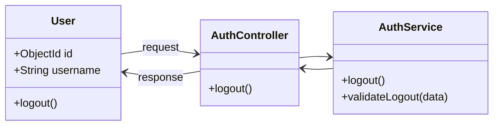
```mermaid
classDiagram
direction LR

class User {
    +ObjectId id
    +String username
    +logout()
}

class AuthController {
    +logout()
}

class AuthService {
    +logout()
    +validateLogout(data)
}

User --> AuthController : request
AuthController --> AuthService
AuthService --> AuthController
AuthController --> User : response
```

#### 3.1.8.2 Sequence Diagram For Logout

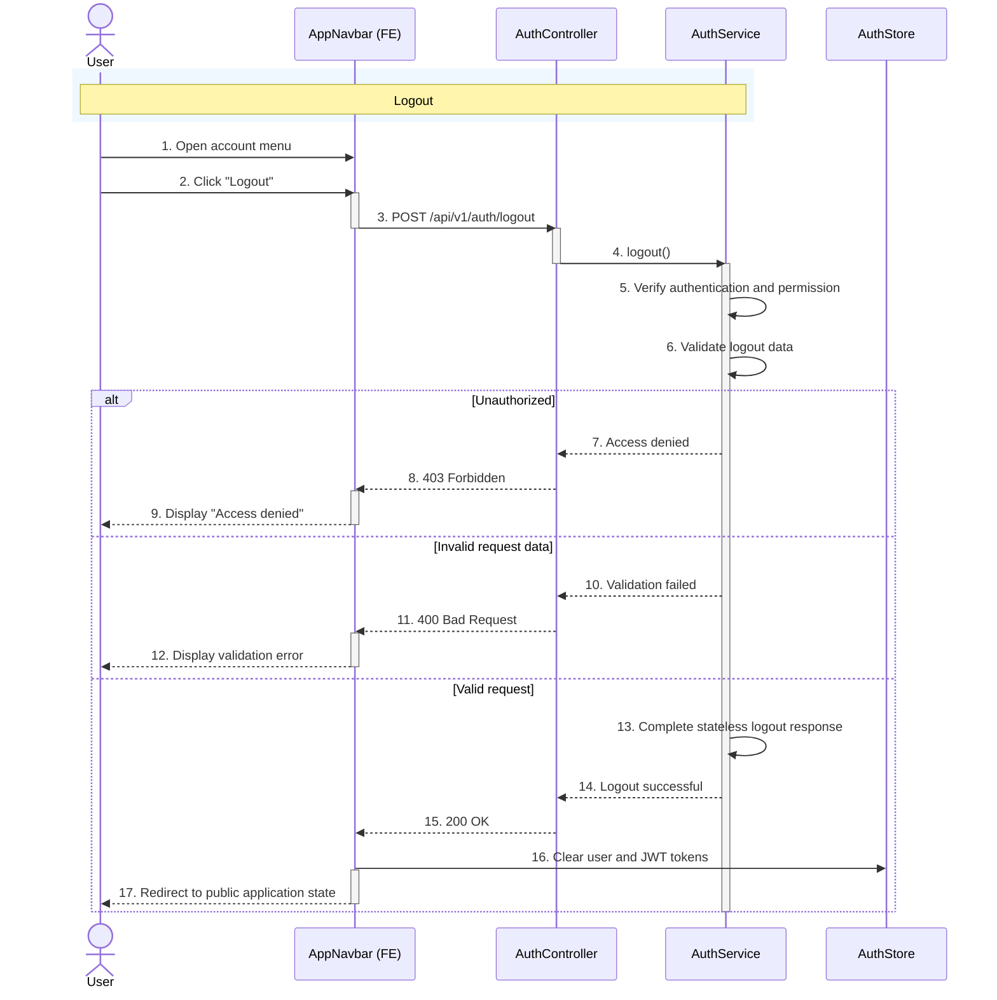
```mermaid
sequenceDiagram
    actor A as User
    participant FE as AppNavbar (FE)
    participant Ctrl as AuthController
    participant Svc as AuthService
    participant Store as AuthStore

    rect rgb(240,248,255)
        Note over A,Svc: Logout
    end

    A->>FE: 1. Open account menu
    A->>FE: 2. Click "Logout"

    activate FE
    FE->>Ctrl: 3. POST /api/v1/auth/logout
    deactivate FE

    activate Ctrl
    Ctrl->>Svc: 4. logout()
    deactivate Ctrl

    activate Svc
    Svc->>Svc: 5. Verify authentication and permission
    Svc->>Svc: 6. Validate logout data

    alt Unauthorized
        Svc-->>Ctrl: 7. Access denied
        Ctrl-->>FE: 8. 403 Forbidden
        activate FE
        FE-->>A: 9. Display "Access denied"
        deactivate FE

    else Invalid request data
        Svc-->>Ctrl: 10. Validation failed
        Ctrl-->>FE: 11. 400 Bad Request
        activate FE
        FE-->>A: 12. Display validation error
        deactivate FE

    else Valid request
        Svc->>Svc: 13. Complete stateless logout response
        Svc-->>Ctrl: 14. Logout successful
        Ctrl-->>FE: 15. 200 OK
        FE->>Store: 16. Clear user and JWT tokens
        activate FE
        FE-->>A: 17. Redirect to public application state
        deactivate FE
    end

    deactivate Svc
```

## 3.2 User Profile and Account

### 3.2.1 View Public Profile

**Design scope:** Load a profile by route parameter for any visitor and render identity, profile, statistics, and ranking information.

**Primary endpoint:** `GET /api/v1/users/:id`

#### 3.2.1.1 Class Diagram For View Public Profile

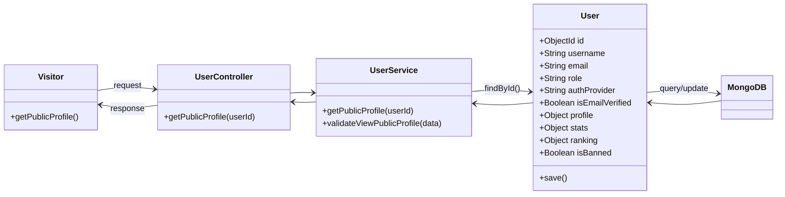
```mermaid
classDiagram
direction LR

class Visitor {
    +getPublicProfile()
}

class UserController {
    +getPublicProfile(userId)
}

class UserService {
    +getPublicProfile(userId)
    +validateViewPublicProfile(data)
}

class User {
    +ObjectId id
    +String username
    +String email
    +String role
    +String authProvider
    +Boolean isEmailVerified
    +Object profile
    +Object stats
    +Object ranking
    +Boolean isBanned
    +save()
}

class MongoDB

Visitor --> UserController : request
UserController --> UserService
UserService --> User : findById()
User --> MongoDB : query/update
MongoDB --> User
User --> UserService
UserService --> UserController
UserController --> Visitor : response
```

#### 3.2.1.2 Sequence Diagram For View Public Profile

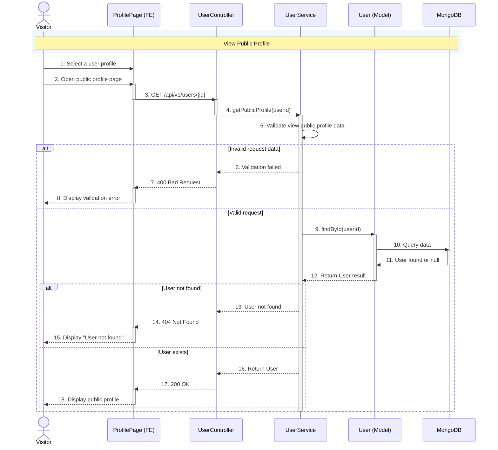
```mermaid
sequenceDiagram
    actor A as Visitor
    participant FE as ProfilePage (FE)
    participant Ctrl as UserController
    participant Svc as UserService
    participant Model as User (Model)
    participant DB as MongoDB

    rect rgb(240,248,255)
        Note over A,DB: View Public Profile
    end

    A->>FE: 1. Select a user profile
    A->>FE: 2. Open public profile page

    activate FE
    FE->>Ctrl: 3. GET /api/v1/users/{id}
    deactivate FE

    activate Ctrl
    Ctrl->>Svc: 4. getPublicProfile(userId)
    deactivate Ctrl

    activate Svc
    Svc->>Svc: 5. Validate view public profile data

    alt Invalid request data
        Svc-->>Ctrl: 6. Validation failed
        Ctrl-->>FE: 7. 400 Bad Request
        activate FE
        FE-->>A: 8. Display validation error
        deactivate FE

    else Valid request
        Svc->>Model: 9. findById(userId)
        activate Model
        Model->>DB: 10. Query data
        activate DB
        DB-->>Model: 11. User found or null
        deactivate DB
        Model-->>Svc: 12. Return User result
        deactivate Model

        alt User not found
            Svc-->>Ctrl: 13. User not found
            Ctrl-->>FE: 14. 404 Not Found
            activate FE
            FE-->>A: 15. Display "User not found"
            deactivate FE

        else User exists
            Svc-->>Ctrl: 16. Return User
            Ctrl-->>FE: 17. 200 OK
            activate FE
            FE-->>A: 18. Display public profile
            deactivate FE
        end
    end

    deactivate Svc
```

### 3.2.2 View Own Profile

**Design scope:** Resolve the current user ID from AuthStore, load the profile, and enable owner-only controls when the route ID matches the authenticated user.

**Primary endpoint:** `GET /api/v1/users/:id`

#### 3.2.2.1 Class Diagram For View Own Profile

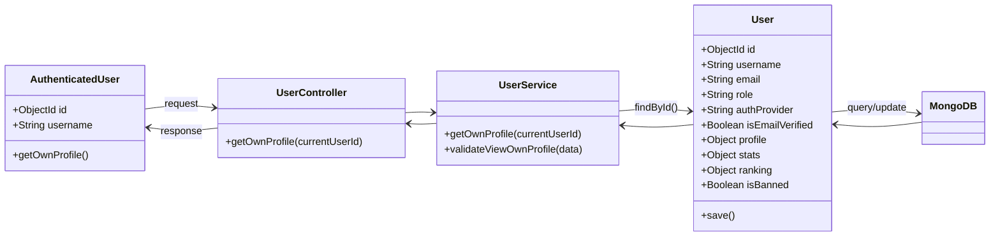
```mermaid
classDiagram
direction LR

class AuthenticatedUser {
    +ObjectId id
    +String username
    +getOwnProfile()
}

class UserController {
    +getOwnProfile(currentUserId)
}

class UserService {
    +getOwnProfile(currentUserId)
    +validateViewOwnProfile(data)
}

class User {
    +ObjectId id
    +String username
    +String email
    +String role
    +String authProvider
    +Boolean isEmailVerified
    +Object profile
    +Object stats
    +Object ranking
    +Boolean isBanned
    +save()
}

class MongoDB

AuthenticatedUser --> UserController : request
UserController --> UserService
UserService --> User : findById()
User --> MongoDB : query/update
MongoDB --> User
User --> UserService
UserService --> UserController
UserController --> AuthenticatedUser : response
```

#### 3.2.2.2 Sequence Diagram For View Own Profile

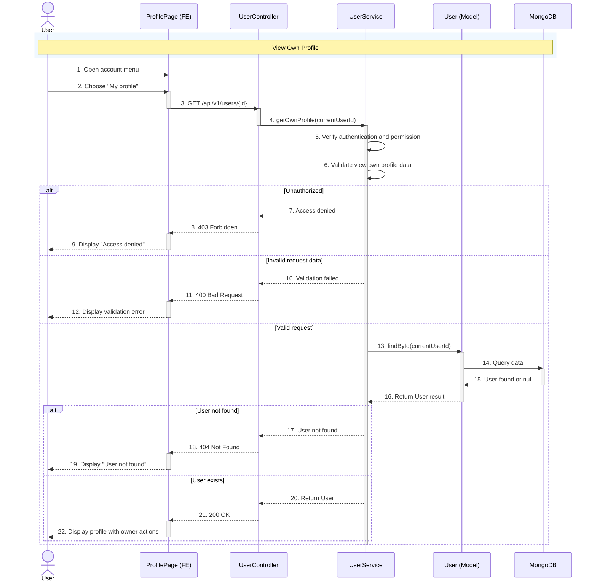
```mermaid
sequenceDiagram
    actor A as User
    participant FE as ProfilePage (FE)
    participant Ctrl as UserController
    participant Svc as UserService
    participant Model as User (Model)
    participant DB as MongoDB

    rect rgb(240,248,255)
        Note over A,DB: View Own Profile
    end

    A->>FE: 1. Open account menu
    A->>FE: 2. Choose "My profile"

    activate FE
    FE->>Ctrl: 3. GET /api/v1/users/{id}
    deactivate FE

    activate Ctrl
    Ctrl->>Svc: 4. getOwnProfile(currentUserId)
    deactivate Ctrl

    activate Svc
    Svc->>Svc: 5. Verify authentication and permission
    Svc->>Svc: 6. Validate view own profile data

    alt Unauthorized
        Svc-->>Ctrl: 7. Access denied
        Ctrl-->>FE: 8. 403 Forbidden
        activate FE
        FE-->>A: 9. Display "Access denied"
        deactivate FE

    else Invalid request data
        Svc-->>Ctrl: 10. Validation failed
        Ctrl-->>FE: 11. 400 Bad Request
        activate FE
        FE-->>A: 12. Display validation error
        deactivate FE

    else Valid request
        Svc->>Model: 13. findById(currentUserId)
        activate Model
        Model->>DB: 14. Query data
        activate DB
        DB-->>Model: 15. User found or null
        deactivate DB
        Model-->>Svc: 16. Return User result
        deactivate Model

        alt User not found
            Svc-->>Ctrl: 17. User not found
            Ctrl-->>FE: 18. 404 Not Found
            activate FE
            FE-->>A: 19. Display "User not found"
            deactivate FE

        else User exists
            Svc-->>Ctrl: 20. Return User
            Ctrl-->>FE: 21. 200 OK
            activate FE
            FE-->>A: 22. Display profile with owner actions
            deactivate FE
        end
    end

    deactivate Svc
```

### 3.2.3 Update Profile

**Design scope:** Update only displayName, bio, avatar, school, and club for the authenticated owner; avatar upload is completed before the profile update request.

**Primary endpoint:** `PUT /api/v1/users/:id/profile`

#### 3.2.3.1 Class Diagram For Update Profile

```mermaid
classDiagram
direction LR

class AuthenticatedUser {
    +ObjectId id
    +String username
    +updateProfile()
}

class UserController {
    +updateProfile(userId, data)
}

class UserService {
    +updateProfile(userId, data)
    +validateUpdateProfile(data)
}

class User {
    +ObjectId id
    +String username
    +String email
    +String role
    +String authProvider
    +Boolean isEmailVerified
    +Object profile
    +Object stats
    +Object ranking
    +Boolean isBanned
    +save()
}

class MongoDB

AuthenticatedUser --> UserController : request
UserController --> UserService
UserService --> User : findById()
UserService --> User : updateProfileFields(data)
User --> MongoDB : query/update
MongoDB --> User
User --> UserService
UserService --> UserController
UserController --> AuthenticatedUser : response
```

#### 3.2.3.2 Sequence Diagram For Update Profile

```mermaid
sequenceDiagram
    actor A as User
    participant FE as ProfilePage (FE)
    participant Ctrl as UserController
    participant Svc as UserService
    participant Model as User (Model)
    participant DB as MongoDB

    rect rgb(240,248,255)
        Note over A,DB: Update Profile
    end

    A->>FE: 1. Edit display name, bio, school, club, or avatar
    A->>FE: 2. Click "Save"

    activate FE
    FE->>Ctrl: 3. PUT /api/v1/users/{id}/profile
    deactivate FE

    activate Ctrl
    Ctrl->>Svc: 4. updateProfile(userId, data)
    deactivate Ctrl

    activate Svc
    Svc->>Svc: 5. Verify authentication and permission
    Svc->>Svc: 6. Validate update profile data

    alt Unauthorized
        Svc-->>Ctrl: 7. Access denied
        Ctrl-->>FE: 8. 403 Forbidden
        activate FE
        FE-->>A: 9. Display "Access denied"
        deactivate FE

    else Invalid request data
        Svc-->>Ctrl: 10. Validation failed
        Ctrl-->>FE: 11. 400 Bad Request
        activate FE
        FE-->>A: 12. Display validation error
        deactivate FE

    else Valid request
        Svc->>Model: 13. findById(userId)
        activate Model
        Model->>DB: 14. Query data
        activate DB
        DB-->>Model: 15. User found or null
        deactivate DB
        Model-->>Svc: 16. Return User result
        deactivate Model

        alt User not found
            Svc-->>Ctrl: 17. User not found
            Ctrl-->>FE: 18. 404 Not Found
            activate FE
            FE-->>A: 19. Display "User not found"
            deactivate FE

        else User exists
            Svc->>Svc: 20. Require route userId to equal token userId
            Svc->>Model: 21. updateProfileFields(data)
            activate Model
            Model->>DB: 22. Update User
            activate DB
            DB-->>Model: 23. User updated
            deactivate DB
            Model-->>Svc: 24. Updated User
            deactivate Model
            Svc-->>Ctrl: 25. Update Profile successful
            Ctrl-->>FE: 26. 200 OK
            activate FE
            FE-->>A: 27. Display updated profile
            deactivate FE
        end
    end

    deactivate Svc
```

### 3.2.4 View Debate History

**Design scope:** Return paginated completed rooms for a user, join final scores from debate sessions, and derive win/loss/draw from the participant team.

**Primary endpoint:** `GET /api/v1/users/:id/history`

#### 3.2.4.1 Class Diagram For View Debate History

```mermaid
classDiagram
direction LR

class Visitor {
    +getDebateHistory()
}

class UserController {
    +getDebateHistory(userId, page, limit)
}

class UserService {
    +getDebateHistory(userId, page, limit)
    +validateViewDebateHistory(data)
}

class User {
    +ObjectId id
    +String username
    +String email
    +String role
    +String authProvider
    +Boolean isEmailVerified
    +Object profile
    +Object stats
    +Object ranking
    +Boolean isBanned
    +save()
}

class DebateRoom {
    +ObjectId id
    +String title
    +String roomType
    +String format
    +String status
    +String motion
    +Boolean isPrivate
    +Boolean viewerChatEnabled
    +Participant[] participants
    +save()
}

class DebateSession {
    +ObjectId id
    +ObjectId roomId
    +Object currentTurn
    +Object finalScores
    +save()
}

class MongoDB

Visitor --> UserController : request
UserController --> UserService
UserService --> User : findById()
User --> MongoDB : query/update
MongoDB --> User
User --> UserService
UserService --> DebateRoom : findCompletedByParticipant()
DebateRoom --> MongoDB : query/update
MongoDB --> DebateRoom
DebateRoom --> UserService
UserService --> DebateSession : findFinalScoresByRoomIds()
DebateSession --> MongoDB : query/update
MongoDB --> DebateSession
DebateSession --> UserService
UserService --> UserController
UserController --> Visitor : response
```

#### 3.2.4.2 Sequence Diagram For View Debate History

```mermaid
sequenceDiagram
    actor A as Visitor
    participant FE as HistoryPage (FE)
    participant Ctrl as UserController
    participant Svc as UserService
    participant M1 as User (Model)
    participant M2 as DebateRoom (Model)
    participant M3 as DebateSession (Model)
    participant DB as MongoDB

    rect rgb(240,248,255)
        Note over A,DB: View Debate History
    end

    A->>FE: 1. Open a user profile
    A->>FE: 2. Choose debate history

    activate FE
    FE->>Ctrl: 3. GET /api/v1/users/{id}/history
    deactivate FE

    activate Ctrl
    Ctrl->>Svc: 4. getDebateHistory(userId, page, limit)
    deactivate Ctrl

    activate Svc
    Svc->>Svc: 5. Validate view debate history data

    alt Invalid request data
        Svc-->>Ctrl: 6. Validation failed
        Ctrl-->>FE: 7. 400 Bad Request
        activate FE
        FE-->>A: 8. Display validation error
        deactivate FE

    else Valid request
        Svc->>M1: 9. findById(userId)
        activate M1
        M1->>DB: 10. Query data
        activate DB
        DB-->>M1: 11. User found or null
        deactivate DB
        M1-->>Svc: 12. Return User result
        deactivate M1
        alt User not found
            Svc-->>Ctrl: 13. User not found
            Ctrl-->>FE: 14. 404 Not Found
            activate FE
            FE-->>A: 15. Display "User not found"
            deactivate FE
        else User exists
            Svc->>M2: 16. find completed rooms and countDocuments()
            activate M2
            M2->>DB: 17. Query data
            activate DB
            DB-->>M2: 18. Rooms and total
            deactivate DB
            M2-->>Svc: 19. Return DebateRoom result
            deactivate M2
            Svc->>M3: 20. find sessions by room IDs
            activate M3
            M3->>DB: 21. Query data
            activate DB
            DB-->>M3: 22. Final scores
            deactivate DB
            M3-->>Svc: 23. Return DebateSession result
            deactivate M3
            Svc->>Svc: 24. Derive win, loss, or draw for each room
            Svc-->>Ctrl: 25. Return paginated history
            Ctrl-->>FE: 26. 200 OK
            activate FE
            FE-->>A: 27. Display paginated debate history
            deactivate FE
        end
    end

    deactivate Svc
```

## 3.3 Leaderboard

### 3.3.1 View Global Leaderboard

**Design scope:** Read users ordered by descending ELO, project public ranking fields, and calculate the absolute rank from pagination offset.

**Primary endpoint:** `GET /api/v1/rankings/leaderboard`

#### 3.3.1.1 Class Diagram For View Global Leaderboard

```mermaid
classDiagram
direction LR

class Visitor {
    +getLeaderboard()
}

class RankingController {
    +getLeaderboard(page, limit)
}

class RankingService {
    +getLeaderboard(page, limit)
    +validateViewGlobalLeaderboard(data)
}

class User {
    +ObjectId id
    +String username
    +String email
    +String role
    +String authProvider
    +Boolean isEmailVerified
    +Object profile
    +Object stats
    +Object ranking
    +Boolean isBanned
    +save()
}

class MongoDB

Visitor --> RankingController : request
RankingController --> RankingService
RankingService --> User : find()
User --> MongoDB : query/update
MongoDB --> User
User --> RankingService
RankingService --> RankingController
RankingController --> Visitor : response
```

#### 3.3.1.2 Sequence Diagram For View Global Leaderboard

```mermaid
sequenceDiagram
    actor A as Visitor
    participant FE as LeaderboardPage (FE)
    participant Ctrl as RankingController
    participant Svc as RankingService
    participant Model as User (Model)
    participant DB as MongoDB

    rect rgb(240,248,255)
        Note over A,DB: View Global Leaderboard
    end

    A->>FE: 1. Open leaderboard
    A->>FE: 2. Select a page

    activate FE
    FE->>Ctrl: 3. GET /api/v1/rankings/leaderboard
    deactivate FE

    activate Ctrl
    Ctrl->>Svc: 4. getLeaderboard(page, limit)
    deactivate Ctrl

    activate Svc
    Svc->>Svc: 5. Validate view global leaderboard data

    alt Invalid request data
        Svc-->>Ctrl: 6. Validation failed
        Ctrl-->>FE: 7. 400 Bad Request
        activate FE
        FE-->>A: 8. Display validation error
        deactivate FE

    else Valid request
        Svc->>Model: 9. find().sort(ranking.elo descending)
        activate Model
        Model->>DB: 10. Query data
        activate DB
        DB-->>Model: 11. User list
        deactivate DB
        Model-->>Svc: 12. Return User result
        deactivate Model
        Svc-->>Ctrl: 13. Return User list
        Ctrl-->>FE: 14. 200 OK
        activate FE
        FE-->>A: 15. Display ranked users
        deactivate FE
    end

    deactivate Svc
```

## 3.4 Match Discovery

### 3.4.1 View Live Match List

**Design scope:** Display a paginated room list, refresh every 15 seconds, and invalidate cached results when room or debate socket events arrive.

**Primary endpoint:** `GET /api/v1/rooms`

#### 3.4.1.1 Class Diagram For View Live Match List

```mermaid
classDiagram
direction LR

class Visitor {
    +getLiveMatches()
}

class RoomController {
    +getLiveMatches(filters, page, limit)
}

class RoomService {
    +getLiveMatches(filters, page, limit)
    +validateViewLiveMatchList(data)
}

class DebateRoom {
    +ObjectId id
    +String title
    +String roomType
    +String format
    +String status
    +String motion
    +Boolean isPrivate
    +Boolean viewerChatEnabled
    +Participant[] participants
    +save()
}

class SocketGateway {
    +broadcast(event, data)
}

class MongoDB

Visitor --> RoomController : request
RoomController --> RoomService
RoomService --> DebateRoom : find()
DebateRoom --> MongoDB : query/update
MongoDB --> DebateRoom
DebateRoom --> RoomService
RoomService --> SocketGateway
RoomService --> RoomController
RoomController --> Visitor : response
```

#### 3.4.1.2 Sequence Diagram For View Live Match List

```mermaid
sequenceDiagram
    actor A as Visitor
    participant FE as LiveMatchesPage (FE)
    participant Ctrl as RoomController
    participant Svc as RoomService
    participant Model as DebateRoom (Model)
    participant DB as MongoDB
    participant SocketGateway as SocketGateway

    rect rgb(240,248,255)
        Note over A,DB: View Live Match List
    end

    A->>FE: 1. Open Live Matches
    A->>FE: 2. Wait for room list

    activate FE
    FE->>Ctrl: 3. GET /api/v1/rooms
    deactivate FE

    activate Ctrl
    Ctrl->>Svc: 4. getLiveMatches(filters, page, limit)
    deactivate Ctrl

    activate Svc
    Svc->>Svc: 5. Validate view live match list data

    alt Invalid request data
        Svc-->>Ctrl: 6. Validation failed
        Ctrl-->>FE: 7. 400 Bad Request
        activate FE
        FE-->>A: 8. Display validation error
        deactivate FE

    else Valid request
        Svc->>Model: 9. find(filters).sort(createdAt descending)
        activate Model
        Model->>DB: 10. Query data
        activate DB
        DB-->>Model: 11. DebateRoom list
        deactivate DB
        Model-->>Svc: 12. Return DebateRoom result
        deactivate Model
        SocketGateway-->>FE: 13. Notify list-changing event
        Svc-->>Ctrl: 14. Return DebateRoom list
        Ctrl-->>FE: 15. 200 OK
        activate FE
        FE-->>A: 16. Display live match cards
        deactivate FE
    end

    deactivate Svc
```

### 3.4.2 View Room Detail

**Design scope:** Load a password-free room snapshot and enrich participant references for lobby rendering.

**Primary endpoint:** `GET /api/v1/rooms/:id`

#### 3.4.2.1 Class Diagram For View Room Detail

```mermaid
classDiagram
direction LR

class Visitor {
    +getRoomDetail()
}

class RoomController {
    +getRoomDetail(roomId)
}

class RoomService {
    +getRoomDetail(roomId)
    +validateViewRoomDetail(data)
}

class DebateRoom {
    +ObjectId id
    +String title
    +String roomType
    +String format
    +String status
    +String motion
    +Boolean isPrivate
    +Boolean viewerChatEnabled
    +Participant[] participants
    +save()
}

class MongoDB

Visitor --> RoomController : request
RoomController --> RoomService
RoomService --> DebateRoom : findById()
DebateRoom --> MongoDB : query/update
MongoDB --> DebateRoom
DebateRoom --> RoomService
RoomService --> RoomController
RoomController --> Visitor : response
```

#### 3.4.2.2 Sequence Diagram For View Room Detail

```mermaid
sequenceDiagram
    actor A as Visitor
    participant FE as LobbyPage (FE)
    participant Ctrl as RoomController
    participant Svc as RoomService
    participant Model as DebateRoom (Model)
    participant DB as MongoDB

    rect rgb(240,248,255)
        Note over A,DB: View Room Detail
    end

    A->>FE: 1. Select a room
    A->>FE: 2. Open room detail

    activate FE
    FE->>Ctrl: 3. GET /api/v1/rooms/{id}
    deactivate FE

    activate Ctrl
    Ctrl->>Svc: 4. getRoomDetail(roomId)
    deactivate Ctrl

    activate Svc
    Svc->>Svc: 5. Validate view room detail data

    alt Invalid request data
        Svc-->>Ctrl: 6. Validation failed
        Ctrl-->>FE: 7. 400 Bad Request
        activate FE
        FE-->>A: 8. Display validation error
        deactivate FE

    else Valid request
        Svc->>Model: 9. findById(roomId).select(-password)
        activate Model
        Model->>DB: 10. Query data
        activate DB
        DB-->>Model: 11. DebateRoom found or null
        deactivate DB
        Model-->>Svc: 12. Return DebateRoom result
        deactivate Model

        alt DebateRoom not found
            Svc-->>Ctrl: 13. DebateRoom not found
            Ctrl-->>FE: 14. 404 Not Found
            activate FE
            FE-->>A: 15. Display "DebateRoom not found"
            deactivate FE

        else DebateRoom exists
            Svc-->>Ctrl: 16. Return DebateRoom
            Ctrl-->>FE: 17. 200 OK
            activate FE
            FE-->>A: 18. Display room configuration and participants
            deactivate FE
        end
    end

    deactivate Svc
```

### 3.4.3 Join Waiting or Ready Room

**Design scope:** From match discovery, authenticate the user, satisfy private-room access, add the user as viewer, then navigate a waiting/ready room to its lobby.

**Primary endpoint:** `POST /api/v1/rooms/:id/join`

#### 3.4.3.1 Class Diagram For Join Waiting or Ready Room

```mermaid
classDiagram
direction LR

class User {
    +ObjectId id
    +String username
    +joinWaitingRoom()
}

class RoomController {
    +joinWaitingRoom(roomId, password)
}

class RoomService {
    +joinWaitingRoom(roomId, password)
    +validateJoinWaitingorReadyRoom(data)
}

class DebateRoom {
    +ObjectId id
    +String title
    +String roomType
    +String format
    +String status
    +String motion
    +Boolean isPrivate
    +Boolean viewerChatEnabled
    +Participant[] participants
    +save()
}

class SocketGateway {
    +broadcast(event, data)
}

class MongoDB

User --> RoomController : request
RoomController --> RoomService
RoomService --> DebateRoom : findById()
RoomService --> DebateRoom : addViewerParticipant(userId)
DebateRoom --> MongoDB : query/update
MongoDB --> DebateRoom
DebateRoom --> RoomService
RoomService --> SocketGateway
RoomService --> RoomController
RoomController --> User : response
```

#### 3.4.3.2 Sequence Diagram For Join Waiting or Ready Room

```mermaid
sequenceDiagram
    actor A as User
    participant FE as LiveMatchesPage (FE)
    participant Ctrl as RoomController
    participant Svc as RoomService
    participant Model as DebateRoom (Model)
    participant DB as MongoDB
    participant SocketGateway as SocketGateway

    rect rgb(240,248,255)
        Note over A,DB: Join Waiting or Ready Room
    end

    A->>FE: 1. Select a waiting or ready room
    A->>FE: 2. Confirm join

    activate FE
    FE->>Ctrl: 3. POST /api/v1/rooms/{id}/join
    deactivate FE

    activate Ctrl
    Ctrl->>Svc: 4. joinWaitingRoom(roomId, password)
    deactivate Ctrl

    activate Svc
    Svc->>Svc: 5. Verify authentication and permission
    Svc->>Svc: 6. Validate join waiting or ready room data

    alt Unauthorized
        Svc-->>Ctrl: 7. Access denied
        Ctrl-->>FE: 8. 403 Forbidden
        activate FE
        FE-->>A: 9. Display "Access denied"
        deactivate FE

    else Invalid request data
        Svc-->>Ctrl: 10. Validation failed
        Ctrl-->>FE: 11. 400 Bad Request
        activate FE
        FE-->>A: 12. Display validation error
        deactivate FE

    else Valid request
        Svc->>Model: 13. findById(roomId).select(password)
        activate Model
        Model->>DB: 14. Query data
        activate DB
        DB-->>Model: 15. DebateRoom found or null
        deactivate DB
        Model-->>Svc: 16. Return DebateRoom result
        deactivate Model

        alt DebateRoom not found
            Svc-->>Ctrl: 17. DebateRoom not found
            Ctrl-->>FE: 18. 404 Not Found
            activate FE
            FE-->>A: 19. Display "DebateRoom not found"
            deactivate FE

        else DebateRoom exists
            Svc->>Svc: 20. Check accepted status, password, and duplicate membership
            Svc->>Model: 21. addViewerParticipant(userId)
            activate Model
            Model->>DB: 22. Update DebateRoom
            activate DB
            DB-->>Model: 23. DebateRoom updated
            deactivate DB
            Model-->>Svc: 24. Updated DebateRoom
            deactivate Model
            Svc->>SocketGateway: 25. Broadcast updated state
            Svc-->>Ctrl: 26. Join Waiting or Ready Room successful
            Ctrl-->>FE: 27. 200 OK
            activate FE
            FE-->>A: 28. Navigate to room lobby
            deactivate FE
        end
    end

    deactivate Svc
```

### 3.4.4 Filter matches by format, type, status

**Design scope:** Translate format, room type, and status controls into query parameters and use the same values in the React Query cache key.

**Primary endpoint:** `GET /api/v1/rooms?format&roomType&status`

#### 3.4.4.1 Class Diagram For Filter matches by format, type, status

```mermaid
classDiagram
direction LR

class Visitor {
    +filterMatches()
}

class RoomController {
    +filterMatches(format, roomType, status)
}

class RoomService {
    +filterMatches(format, roomType, status)
    +validateFiltermatchesbyformattypestatus(data)
}

class DebateRoom {
    +ObjectId id
    +String title
    +String roomType
    +String format
    +String status
    +String motion
    +Boolean isPrivate
    +Boolean viewerChatEnabled
    +Participant[] participants
    +save()
}

class MongoDB

Visitor --> RoomController : request
RoomController --> RoomService
RoomService --> DebateRoom : find()
DebateRoom --> MongoDB : query/update
MongoDB --> DebateRoom
DebateRoom --> RoomService
RoomService --> RoomController
RoomController --> Visitor : response
```

#### 3.4.4.2 Sequence Diagram For Filter matches by format, type, status

```mermaid
sequenceDiagram
    actor A as Visitor
    participant FE as LiveMatchesPage (FE)
    participant Ctrl as RoomController
    participant Svc as RoomService
    participant Model as DebateRoom (Model)
    participant DB as MongoDB

    rect rgb(240,248,255)
        Note over A,DB: Filter matches by format, type, status
    end

    A->>FE: 1. Select format, type, or status
    A->>FE: 2. Apply filters

    activate FE
    FE->>Ctrl: 3. GET /api/v1/rooms?format&type&status
    deactivate FE

    activate Ctrl
    Ctrl->>Svc: 4. filterMatches(format, roomType, status)
    deactivate Ctrl

    activate Svc
    Svc->>Svc: 5. Validate filter matches by format, type, status data

    alt Invalid request data
        Svc-->>Ctrl: 6. Validation failed
        Ctrl-->>FE: 7. 400 Bad Request
        activate FE
        FE-->>A: 8. Display validation error
        deactivate FE

    else Valid request
        Svc->>Model: 9. find(format, roomType, status)
        activate Model
        Model->>DB: 10. Query data
        activate DB
        DB-->>Model: 11. DebateRoom list
        deactivate DB
        Model-->>Svc: 12. Return DebateRoom result
        deactivate Model
        Svc-->>Ctrl: 13. Return DebateRoom list
        Ctrl-->>FE: 14. 200 OK
        activate FE
        FE-->>A: 15. Display filtered matches
        deactivate FE
    end

    deactivate Svc
```

### 3.4.5 Join active room as viewer

**Design scope:** Add a non-member to an active or paused room with viewer role and open the protected debate route in viewer mode.

**Primary endpoint:** `POST /api/v1/rooms/:id/join`

#### 3.4.5.1 Class Diagram For Join active room as viewer

```mermaid
classDiagram
direction LR

class User {
    +ObjectId id
    +String username
    +joinAsViewer()
}

class RoomController {
    +joinAsViewer(roomId, password)
}

class RoomService {
    +joinAsViewer(roomId, password)
    +validateJoinactiveroomasviewer(data)
}

class DebateRoom {
    +ObjectId id
    +String title
    +String roomType
    +String format
    +String status
    +String motion
    +Boolean isPrivate
    +Boolean viewerChatEnabled
    +Participant[] participants
    +save()
}

class SocketGateway {
    +broadcast(event, data)
}

class MongoDB

User --> RoomController : request
RoomController --> RoomService
RoomService --> DebateRoom : findById()
RoomService --> DebateRoom : addViewerParticipant(userId)
DebateRoom --> MongoDB : query/update
MongoDB --> DebateRoom
DebateRoom --> RoomService
RoomService --> SocketGateway
RoomService --> RoomController
RoomController --> User : response
```

#### 3.4.5.2 Sequence Diagram For Join active room as viewer

```mermaid
sequenceDiagram
    actor A as User
    participant FE as LiveMatchesPage (FE)
    participant Ctrl as RoomController
    participant Svc as RoomService
    participant Model as DebateRoom (Model)
    participant DB as MongoDB
    participant SocketGateway as SocketGateway

    rect rgb(240,248,255)
        Note over A,DB: Join active room as viewer
    end

    A->>FE: 1. Select an active match
    A->>FE: 2. Click "Watch"

    activate FE
    FE->>Ctrl: 3. POST /api/v1/rooms/{id}/join
    deactivate FE

    activate Ctrl
    Ctrl->>Svc: 4. joinAsViewer(roomId, password)
    deactivate Ctrl

    activate Svc
    Svc->>Svc: 5. Verify authentication and permission
    Svc->>Svc: 6. Validate join active room as viewer data

    alt Unauthorized
        Svc-->>Ctrl: 7. Access denied
        Ctrl-->>FE: 8. 403 Forbidden
        activate FE
        FE-->>A: 9. Display "Access denied"
        deactivate FE

    else Invalid request data
        Svc-->>Ctrl: 10. Validation failed
        Ctrl-->>FE: 11. 400 Bad Request
        activate FE
        FE-->>A: 12. Display validation error
        deactivate FE

    else Valid request
        Svc->>Model: 13. findById(roomId).select(password)
        activate Model
        Model->>DB: 14. Query data
        activate DB
        DB-->>Model: 15. DebateRoom found or null
        deactivate DB
        Model-->>Svc: 16. Return DebateRoom result
        deactivate Model

        alt DebateRoom not found
            Svc-->>Ctrl: 17. DebateRoom not found
            Ctrl-->>FE: 18. 404 Not Found
            activate FE
            FE-->>A: 19. Display "DebateRoom not found"
            deactivate FE

        else DebateRoom exists
            Svc->>Svc: 20. Allow active or paused room and verify private password
            Svc->>Model: 21. addViewerParticipant(userId)
            activate Model
            Model->>DB: 22. Update DebateRoom
            activate DB
            DB-->>Model: 23. DebateRoom updated
            deactivate DB
            Model-->>Svc: 24. Updated DebateRoom
            deactivate Model
            Svc->>SocketGateway: 25. Broadcast updated state
            Svc-->>Ctrl: 26. Join active room as viewer successful
            Ctrl-->>FE: 27. 200 OK
            activate FE
            FE-->>A: 28. Navigate to debate in viewer mode
            deactivate FE
        end
    end

    deactivate Svc
```

## 3.5 Room Management

### 3.5.1 Create custom room

**Design scope:** Create a custom room with the creator as owner/viewer, normalize the motion, enforce AI-judge count, and announce the room globally.

**Primary endpoint:** `POST /api/v1/rooms/create`

#### 3.5.1.1 Class Diagram For Create custom room

```mermaid
classDiagram
direction LR

class AuthenticatedUser {
    +ObjectId id
    +String username
    +createCustomRoom()
}

class RoomController {
    +createCustomRoom(data)
}

class RoomService {
    +createCustomRoom(data)
    +validateCreatecustomroom(data)
}

class User {
    +ObjectId id
    +String username
    +String email
    +String role
    +String authProvider
    +Boolean isEmailVerified
    +Object profile
    +Object stats
    +Object ranking
    +Boolean isBanned
    +save()
}

class DebateRoom {
    +ObjectId id
    +String title
    +String roomType
    +String format
    +String status
    +String motion
    +Boolean isPrivate
    +Boolean viewerChatEnabled
    +Participant[] participants
    +save()
}

class SocketGateway {
    +broadcast(event, data)
}

class MongoDB

AuthenticatedUser --> RoomController : request
RoomController --> RoomService
RoomService --> User : findById()
User --> MongoDB : query/update
MongoDB --> User
User --> RoomService
RoomService --> DebateRoom : create(customRoomData)
DebateRoom --> MongoDB : query/update
MongoDB --> DebateRoom
DebateRoom --> RoomService
RoomService --> SocketGateway
RoomService --> RoomController
RoomController --> AuthenticatedUser : response
```

#### 3.5.1.2 Sequence Diagram For Create custom room

```mermaid
sequenceDiagram
    actor A as User
    participant FE as CreateRoomPage (FE)
    participant Ctrl as RoomController
    participant Svc as RoomService
    participant M1 as User (Model)
    participant M2 as DebateRoom (Model)
    participant DB as MongoDB
    participant SocketGateway as SocketGateway

    rect rgb(240,248,255)
        Note over A,DB: Create custom room
    end

    A->>FE: 1. Configure room and debate topic
    A->>FE: 2. Click "Create room"

    activate FE
    FE->>Ctrl: 3. POST /api/v1/rooms/create
    deactivate FE

    activate Ctrl
    Ctrl->>Svc: 4. createCustomRoom(data)
    deactivate Ctrl

    activate Svc
    Svc->>Svc: 5. Verify authentication and permission
    Svc->>Svc: 6. Validate create custom room data

    alt Unauthorized
        Svc-->>Ctrl: 7. Access denied
        Ctrl-->>FE: 8. 403 Forbidden
        activate FE
        FE-->>A: 9. Display "Access denied"
        deactivate FE

    else Invalid request data
        Svc-->>Ctrl: 10. Validation failed
        Ctrl-->>FE: 11. 400 Bad Request
        activate FE
        FE-->>A: 12. Display validation error
        deactivate FE

    else Valid request
        Svc->>M1: 13. findById(userId)
        activate M1
        M1->>DB: 14. Query data
        activate DB
        DB-->>M1: 15. Creator found or null
        deactivate DB
        M1-->>Svc: 16. Return User result
        deactivate M1
        alt Creator not found
            Svc-->>Ctrl: 17. User not found
            Ctrl-->>FE: 18. 404 Not Found
            activate FE
            FE-->>A: 19. Display "User not found"
            deactivate FE
        else Creator exists
            Svc->>Svc: 20. Normalize motion, judge count, privacy, and owner participant
            Svc->>M2: 21. create(customRoomData)
            activate M2
            M2->>DB: 22. Insert room
            activate DB
            DB-->>M2: 23. Room created
            deactivate DB
            M2-->>Svc: 24. Created room
            deactivate M2
            Svc->>SocketGateway: 25. Broadcast room created
            Svc-->>Ctrl: 26. Return created room
            Ctrl-->>FE: 27. 201 Created
            activate FE
            FE-->>A: 28. Navigate to the new room lobby
            deactivate FE
        end
    end

    deactivate Svc
```

### 3.5.2 Configure room

**Design scope:** Collect title, 1v1/3v3 format, host mode, judge mode/count, privacy/password, and topic in frontend state before the create-room transaction.

**Primary endpoint:** `No standalone endpoint; included in POST /api/v1/rooms/create`

#### 3.5.2.1 Class Diagram For Configure room

```mermaid
classDiagram
direction LR

class User {
    +ObjectId id
    +String username
    +configureRoom()
}

class RoomConfigurationController {
    +configureRoom(data)
}

class RoomConfigurationService {
    +configureRoom(data)
    +validateConfigureroom(data)
}

class CreateRoomRequest {
    +String title
    +String format
    +String hostType
    +String judgeType
    +Integer judgeCount
    +Boolean isPrivate
    +String password
    +String motion
}

User --> RoomConfigurationController : request
RoomConfigurationController --> RoomConfigurationService
RoomConfigurationService --> CreateRoomRequest : build()
CreateRoomRequest --> RoomConfigurationService
RoomConfigurationService --> RoomConfigurationController
RoomConfigurationController --> User : response
```

#### 3.5.2.2 Sequence Diagram For Configure room

```mermaid
sequenceDiagram
    actor A as User
    participant FE as CreateRoomPage (FE)
    participant Ctrl as RoomConfigurationController
    participant Svc as RoomConfigurationService
    participant Model as CreateRoomRequest (Model)

    rect rgb(240,248,255)
        Note over A,Svc: Configure room
    end

    A->>FE: 1. Choose format, host, judge, privacy, and topic
    A->>FE: 2. Apply configuration

    activate FE
    FE->>Ctrl: 3. prepareCreateRoom(data)
    deactivate FE

    activate Ctrl
    Ctrl->>Svc: 4. configureRoom(data)
    deactivate Ctrl

    activate Svc
    Svc->>Svc: 5. Validate configure room data

    alt Invalid request data
        Svc-->>Ctrl: 6. Validation failed
        Ctrl-->>FE: 7. 400 Bad Request
        activate FE
        FE-->>A: 8. Display validation error
        deactivate FE

    else Valid request
        Svc->>Model: 9. buildValidatedConfiguration(data)
        activate Model
        Model-->>Svc: 10. CreateRoomRequest
        deactivate Model
        Svc-->>Ctrl: 11. Return configured request
        Ctrl-->>FE: 12. Configuration ready
        activate FE
        FE-->>A: 13. Display configuration ready for creation
        deactivate FE
    end

    deactivate Svc
```

### 3.5.3 Update room

**Design scope:** Allow only the owner to edit a room before it becomes active; validate allowed settings, persist changes, and synchronize lobby/list clients.

**Primary endpoint:** `PUT /api/v1/rooms/:id`

#### 3.5.3.1 Class Diagram For Update room

```mermaid
classDiagram
direction LR

class Owner {
    +ObjectId id
    +String username
    +updateRoom()
}

class RoomController {
    +updateRoom(roomId, data)
}

class RoomService {
    +updateRoom(roomId, data)
    +validateUpdateroom(data)
}

class DebateRoom {
    +ObjectId id
    +String title
    +String roomType
    +String format
    +String status
    +String motion
    +Boolean isPrivate
    +Boolean viewerChatEnabled
    +Participant[] participants
    +save()
}

class SocketGateway {
    +broadcast(event, data)
}

class MongoDB

Owner --> RoomController : request
RoomController --> RoomService
RoomService --> DebateRoom : findById()
RoomService --> DebateRoom : updateAllowedSettings(data)
DebateRoom --> MongoDB : query/update
MongoDB --> DebateRoom
DebateRoom --> RoomService
RoomService --> SocketGateway
RoomService --> RoomController
RoomController --> Owner : response
```

#### 3.5.3.2 Sequence Diagram For Update room

```mermaid
sequenceDiagram
    actor A as Owner
    participant FE as RoomSettings (FE)
    participant Ctrl as RoomController
    participant Svc as RoomService
    participant Model as DebateRoom (Model)
    participant DB as MongoDB
    participant SocketGateway as SocketGateway

    rect rgb(240,248,255)
        Note over A,DB: Update room
    end

    A->>FE: 1. Edit room settings
    A->>FE: 2. Click "Save changes"

    activate FE
    FE->>Ctrl: 3. PUT /api/v1/rooms/{id}
    deactivate FE

    activate Ctrl
    Ctrl->>Svc: 4. updateRoom(roomId, data)
    deactivate Ctrl

    activate Svc
    Svc->>Svc: 5. Verify authentication and permission
    Svc->>Svc: 6. Validate update room data

    alt Unauthorized
        Svc-->>Ctrl: 7. Access denied
        Ctrl-->>FE: 8. 403 Forbidden
        activate FE
        FE-->>A: 9. Display "Access denied"
        deactivate FE

    else Invalid request data
        Svc-->>Ctrl: 10. Validation failed
        Ctrl-->>FE: 11. 400 Bad Request
        activate FE
        FE-->>A: 12. Display validation error
        deactivate FE

    else Valid request
        Svc->>Model: 13. findById(roomId)
        activate Model
        Model->>DB: 14. Query data
        activate DB
        DB-->>Model: 15. DebateRoom found or null
        deactivate DB
        Model-->>Svc: 16. Return DebateRoom result
        deactivate Model

        alt DebateRoom not found
            Svc-->>Ctrl: 17. DebateRoom not found
            Ctrl-->>FE: 18. 404 Not Found
            activate FE
            FE-->>A: 19. Display "DebateRoom not found"
            deactivate FE

        else DebateRoom exists
            Svc->>Svc: 20. Require owner and reject active, paused, or completed room
            Svc->>Model: 21. updateAllowedSettings(data)
            activate Model
            Model->>DB: 22. Update DebateRoom
            activate DB
            DB-->>Model: 23. DebateRoom updated
            deactivate DB
            Model-->>Svc: 24. Updated DebateRoom
            deactivate Model
            Svc->>SocketGateway: 25. Broadcast updated state
            Svc-->>Ctrl: 26. Update room successful
            Ctrl-->>FE: 27. 200 OK
            activate FE
            FE-->>A: 28. Display updated room
            deactivate FE
        end
    end

    deactivate Svc
```

### 3.5.4 Join room

**Design scope:** Perform the server-side membership transaction for waiting, ready, active, or paused rooms and initialize the member as an unlocked viewer.

**Primary endpoint:** `POST /api/v1/rooms/:id/join`

#### 3.5.4.1 Class Diagram For Join room

```mermaid
classDiagram
direction LR

class User {
    +ObjectId id
    +String username
    +joinRoom()
}

class RoomController {
    +joinRoom(roomId, password)
}

class RoomService {
    +joinRoom(roomId, password)
    +validateJoinroom(data)
}

class DebateRoom {
    +ObjectId id
    +String title
    +String roomType
    +String format
    +String status
    +String motion
    +Boolean isPrivate
    +Boolean viewerChatEnabled
    +Participant[] participants
    +save()
}

class SocketGateway {
    +broadcast(event, data)
}

class MongoDB

User --> RoomController : request
RoomController --> RoomService
RoomService --> DebateRoom : findById()
RoomService --> DebateRoom : addViewerParticipant(userId)
DebateRoom --> MongoDB : query/update
MongoDB --> DebateRoom
DebateRoom --> RoomService
RoomService --> SocketGateway
RoomService --> RoomController
RoomController --> User : response
```

#### 3.5.4.2 Sequence Diagram For Join room

```mermaid
sequenceDiagram
    actor A as User
    participant FE as LobbyEntry (FE)
    participant Ctrl as RoomController
    participant Svc as RoomService
    participant Model as DebateRoom (Model)
    participant DB as MongoDB
    participant SocketGateway as SocketGateway

    rect rgb(240,248,255)
        Note over A,DB: Join room
    end

    A->>FE: 1. Choose a room
    A->>FE: 2. Confirm room access

    activate FE
    FE->>Ctrl: 3. POST /api/v1/rooms/{id}/join
    deactivate FE

    activate Ctrl
    Ctrl->>Svc: 4. joinRoom(roomId, password)
    deactivate Ctrl

    activate Svc
    Svc->>Svc: 5. Verify authentication and permission
    Svc->>Svc: 6. Validate join room data

    alt Unauthorized
        Svc-->>Ctrl: 7. Access denied
        Ctrl-->>FE: 8. 403 Forbidden
        activate FE
        FE-->>A: 9. Display "Access denied"
        deactivate FE

    else Invalid request data
        Svc-->>Ctrl: 10. Validation failed
        Ctrl-->>FE: 11. 400 Bad Request
        activate FE
        FE-->>A: 12. Display validation error
        deactivate FE

    else Valid request
        Svc->>Model: 13. findById(roomId).select(password)
        activate Model
        Model->>DB: 14. Query data
        activate DB
        DB-->>Model: 15. DebateRoom found or null
        deactivate DB
        Model-->>Svc: 16. Return DebateRoom result
        deactivate Model

        alt DebateRoom not found
            Svc-->>Ctrl: 17. DebateRoom not found
            Ctrl-->>FE: 18. 404 Not Found
            activate FE
            FE-->>A: 19. Display "DebateRoom not found"
            deactivate FE

        else DebateRoom exists
            Svc->>Svc: 20. Validate room status, private password, and membership uniqueness
            Svc->>Model: 21. addViewerParticipant(userId)
            activate Model
            Model->>DB: 22. Update DebateRoom
            activate DB
            DB-->>Model: 23. DebateRoom updated
            deactivate DB
            Model-->>Svc: 24. Updated DebateRoom
            deactivate Model
            Svc->>SocketGateway: 25. Broadcast updated state
            Svc-->>Ctrl: 26. Join room successful
            Ctrl-->>FE: 27. 200 OK
            activate FE
            FE-->>A: 28. Display joined room
            deactivate FE
        end
    end

    deactivate Svc
```

### 3.5.5 Leave room

**Design scope:** Remove a participant, repair host/judge references, transfer ownership when required, or delete the room when the last participant leaves.

**Primary endpoint:** `POST /api/v1/rooms/:id/leave`

#### 3.5.5.1 Class Diagram For Leave room

```mermaid
classDiagram
direction LR

class Participant {
    +ObjectId id
    +String username
    +leaveRoom()
}

class RoomController {
    +leaveRoom(roomId, newOwnerId)
}

class RoomService {
    +leaveRoom(roomId, newOwnerId)
    +validateLeaveroom(data)
}

class DebateRoom {
    +ObjectId id
    +String title
    +String roomType
    +String format
    +String status
    +String motion
    +Boolean isPrivate
    +Boolean viewerChatEnabled
    +Participant[] participants
    +save()
}

class SocketGateway {
    +broadcast(event, data)
}

class MongoDB

Participant --> RoomController : request
RoomController --> RoomService
RoomService --> DebateRoom : findById()
RoomService --> DebateRoom : removeParticipant(userId)
DebateRoom --> MongoDB : query/update
MongoDB --> DebateRoom
DebateRoom --> RoomService
RoomService --> SocketGateway
RoomService --> RoomController
RoomController --> Participant : response
```

#### 3.5.5.2 Sequence Diagram For Leave room

```mermaid
sequenceDiagram
    actor P as Participant
    participant FE as LobbyPage (FE)
    participant Ctrl as RoomController
    participant Svc as RoomService
    participant Model as DebateRoom (Model)
    participant DB as MongoDB
    participant SocketGateway as SocketGateway

    rect rgb(240,248,255)
        Note over P,DB: Leave room
    end

    P->>FE: 1. Click "Leave room"
    P->>FE: 2. Confirm leave

    activate FE
    FE->>Ctrl: 3. POST /api/v1/rooms/{id}/leave
    deactivate FE

    activate Ctrl
    Ctrl->>Svc: 4. leaveRoom(roomId, newOwnerId)
    deactivate Ctrl

    activate Svc
    Svc->>Svc: 5. Verify authentication and permission
    Svc->>Svc: 6. Validate leave room data

    alt Unauthorized
        Svc-->>Ctrl: 7. Access denied
        Ctrl-->>FE: 8. 403 Forbidden
        activate FE
        FE-->>P: 9. Display "Access denied"
        deactivate FE

    else Invalid request data
        Svc-->>Ctrl: 10. Validation failed
        Ctrl-->>FE: 11. 400 Bad Request
        activate FE
        FE-->>P: 12. Display validation error
        deactivate FE

    else Valid request
        Svc->>Model: 13. findById(roomId)
        activate Model
        Model->>DB: 14. Query data
        activate DB
        DB-->>Model: 15. Room found or null
        deactivate DB
        Model-->>Svc: 16. Return DebateRoom result
        deactivate Model
        alt Room or participant not found
            Svc-->>Ctrl: 17. Room or participant not found
            Ctrl-->>FE: 18. 404 Not Found
            activate FE
            FE-->>P: 19. Display leave-room error
            deactivate FE
        else Participant exists
            Svc->>Svc: 20. Remove participant and repair host/judge references
            alt Room becomes empty
                Svc->>Model: 21. deleteOne()
                activate Model
                Model->>DB: 22. Delete room
                DB-->>Model: 23. Room deleted
                deactivate Model
            else Room remains
                Svc->>Svc: 24. Transfer owner when required
                Svc->>Model: 25. removeParticipant(userId)
                activate Model
                Model->>DB: 26. Update DebateRoom
                activate DB
                DB-->>Model: 27. DebateRoom updated
                deactivate DB
                Model-->>Svc: 28. Updated DebateRoom
                deactivate Model
            end
            Svc->>SocketGateway: 29. Broadcast room state
            Svc-->>Ctrl: 30. Leave room successful
            Ctrl-->>FE: 31. 200 OK
            activate FE
            FE-->>P: 32. Navigate to match list
            deactivate FE
        end
    end

    deactivate Svc
```

### 3.5.6 Select team and speaker position

**Design scope:** Let an assigned debater choose proposition/opposition and an available S1/S2/S3 slot while the position is unlocked.

**Primary endpoint:** `POST /api/v1/rooms/:id/position`

#### 3.5.6.1 Class Diagram For Select team and speaker position

```mermaid
classDiagram
direction LR

class Debater {
    +ObjectId id
    +String username
    +selectPosition()
}

class RoomController {
    +selectPosition(roomId, team, speakerSlot)
}

class RoomService {
    +selectPosition(roomId, team, speakerSlot)
    +validateSelectteamandspeakerposition(data)
}

class DebateRoom {
    +ObjectId id
    +String title
    +String roomType
    +String format
    +String status
    +String motion
    +Boolean isPrivate
    +Boolean viewerChatEnabled
    +Participant[] participants
    +save()
}

class SocketGateway {
    +broadcast(event, data)
}

class MongoDB

Debater --> RoomController : request
RoomController --> RoomService
RoomService --> DebateRoom : findById()
RoomService --> DebateRoom : updateParticipantPosition(team, speakerSlot)
DebateRoom --> MongoDB : query/update
MongoDB --> DebateRoom
DebateRoom --> RoomService
RoomService --> SocketGateway
RoomService --> RoomController
RoomController --> Debater : response
```

#### 3.5.6.2 Sequence Diagram For Select team and speaker position

```mermaid
sequenceDiagram
    actor A as Debater
    participant FE as LobbyPage (FE)
    participant Ctrl as RoomController
    participant Svc as RoomService
    participant Model as DebateRoom (Model)
    participant DB as MongoDB
    participant SocketGateway as SocketGateway

    rect rgb(240,248,255)
        Note over A,DB: Select team and speaker position
    end

    A->>FE: 1. Choose proposition or opposition and speaker slot
    A->>FE: 2. Click "Confirm position"

    activate FE
    FE->>Ctrl: 3. POST /api/v1/rooms/{id}/position
    deactivate FE

    activate Ctrl
    Ctrl->>Svc: 4. selectPosition(roomId, team, speakerSlot)
    deactivate Ctrl

    activate Svc
    Svc->>Svc: 5. Verify authentication and permission
    Svc->>Svc: 6. Validate select team and speaker position data

    alt Unauthorized
        Svc-->>Ctrl: 7. Access denied
        Ctrl-->>FE: 8. 403 Forbidden
        activate FE
        FE-->>A: 9. Display "Access denied"
        deactivate FE

    else Invalid request data
        Svc-->>Ctrl: 10. Validation failed
        Ctrl-->>FE: 11. 400 Bad Request
        activate FE
        FE-->>A: 12. Display validation error
        deactivate FE

    else Valid request
        Svc->>Model: 13. findById(roomId)
        activate Model
        Model->>DB: 14. Query data
        activate DB
        DB-->>Model: 15. DebateRoom found or null
        deactivate DB
        Model-->>Svc: 16. Return DebateRoom result
        deactivate Model

        alt DebateRoom not found
            Svc-->>Ctrl: 17. DebateRoom not found
            Ctrl-->>FE: 18. 404 Not Found
            activate FE
            FE-->>A: 19. Display "DebateRoom not found"
            deactivate FE

        else DebateRoom exists
            Svc->>Svc: 20. Require assigned debater, unlocked position, and available slot
            Svc->>Model: 21. updateParticipantPosition(team, speakerSlot)
            activate Model
            Model->>DB: 22. Update DebateRoom
            activate DB
            DB-->>Model: 23. DebateRoom updated
            deactivate DB
            Model-->>Svc: 24. Updated DebateRoom
            deactivate Model
            Svc->>SocketGateway: 25. Broadcast updated state
            Svc-->>Ctrl: 26. Select team and speaker position successful
            Ctrl-->>FE: 27. 200 OK
            activate FE
            FE-->>A: 28. Display selected position
            deactivate FE
        end
    end

    deactivate Svc
```

### 3.5.7 Assign participant role

**Design scope:** Assign debater, host, judge, or viewer while preserving the creator’s owner role through primaryRole and enforcing room configuration.

**Primary endpoint:** `POST /api/v1/rooms/:id/assign-role`

#### 3.5.7.1 Class Diagram For Assign participant role

```mermaid
classDiagram
direction LR

class RoomManager {
    +ObjectId id
    +String username
    +assignParticipantRole()
}

class RoomController {
    +assignParticipantRole(roomId, assignment)
}

class RoomService {
    +assignParticipantRole(roomId, assignment)
    +validateAssignparticipantrole(data)
}

class DebateRoom {
    +ObjectId id
    +String title
    +String roomType
    +String format
    +String status
    +String motion
    +Boolean isPrivate
    +Boolean viewerChatEnabled
    +Participant[] participants
    +save()
}

class SocketGateway {
    +broadcast(event, data)
}

class MongoDB

RoomManager --> RoomController : request
RoomController --> RoomService
RoomService --> DebateRoom : findById()
RoomService --> DebateRoom : updateParticipantRole(assignment)
DebateRoom --> MongoDB : query/update
MongoDB --> DebateRoom
DebateRoom --> RoomService
RoomService --> SocketGateway
RoomService --> RoomController
RoomController --> RoomManager : response
```

#### 3.5.7.2 Sequence Diagram For Assign participant role

```mermaid
sequenceDiagram
    actor A as Controller
    participant FE as LobbyPage (FE)
    participant Ctrl as RoomController
    participant Svc as RoomService
    participant Model as DebateRoom (Model)
    participant DB as MongoDB
    participant SocketGateway as SocketGateway

    rect rgb(240,248,255)
        Note over A,DB: Assign participant role
    end

    A->>FE: 1. Select a participant and role
    A->>FE: 2. Click "Assign"

    activate FE
    FE->>Ctrl: 3. POST /api/v1/rooms/{id}/assign-role
    deactivate FE

    activate Ctrl
    Ctrl->>Svc: 4. assignParticipantRole(roomId, assignment)
    deactivate Ctrl

    activate Svc
    Svc->>Svc: 5. Verify authentication and permission
    Svc->>Svc: 6. Validate assign participant role data

    alt Unauthorized
        Svc-->>Ctrl: 7. Access denied
        Ctrl-->>FE: 8. 403 Forbidden
        activate FE
        FE-->>A: 9. Display "Access denied"
        deactivate FE

    else Invalid request data
        Svc-->>Ctrl: 10. Validation failed
        Ctrl-->>FE: 11. 400 Bad Request
        activate FE
        FE-->>A: 12. Display validation error
        deactivate FE

    else Valid request
        Svc->>Model: 13. findById(roomId)
        activate Model
        Model->>DB: 14. Query data
        activate DB
        DB-->>Model: 15. DebateRoom found or null
        deactivate DB
        Model-->>Svc: 16. Return DebateRoom result
        deactivate Model

        alt DebateRoom not found
            Svc-->>Ctrl: 17. DebateRoom not found
            Ctrl-->>FE: 18. 404 Not Found
            activate FE
            FE-->>A: 19. Display "DebateRoom not found"
            deactivate FE

        else DebateRoom exists
            Svc->>Svc: 20. Require owner or host and enforce host/judge configuration
            Svc->>Model: 21. updateParticipantRole(assignment)
            activate Model
            Model->>DB: 22. Update DebateRoom
            activate DB
            DB-->>Model: 23. DebateRoom updated
            deactivate DB
            Model-->>Svc: 24. Updated DebateRoom
            deactivate Model
            Svc->>SocketGateway: 25. Broadcast updated state
            Svc-->>Ctrl: 26. Assign participant role successful
            Ctrl-->>FE: 27. 200 OK
            activate FE
            FE-->>A: 28. Display updated participant role
            deactivate FE
        end
    end

    deactivate Svc
```

### 3.5.8 Lock positions

**Design scope:** Lock assigned debaters, human host, and judges; ignore viewers/incomplete debaters and advance a waiting room to ready.

**Primary endpoint:** `POST /api/v1/rooms/:id/position/lock`

#### 3.5.8.1 Class Diagram For Lock positions

```mermaid
classDiagram
direction LR

class RoomManager {
    +ObjectId id
    +String username
    +lockPositions()
}

class RoomController {
    +lockPositions(roomId)
}

class RoomService {
    +lockPositions(roomId)
    +validateLockpositions(data)
}

class DebateRoom {
    +ObjectId id
    +String title
    +String roomType
    +String format
    +String status
    +String motion
    +Boolean isPrivate
    +Boolean viewerChatEnabled
    +Participant[] participants
    +save()
}

class SocketGateway {
    +broadcast(event, data)
}

class MongoDB

RoomManager --> RoomController : request
RoomController --> RoomService
RoomService --> DebateRoom : findById()
RoomService --> DebateRoom : lockEligibleParticipants()
DebateRoom --> MongoDB : query/update
MongoDB --> DebateRoom
DebateRoom --> RoomService
RoomService --> SocketGateway
RoomService --> RoomController
RoomController --> RoomManager : response
```

#### 3.5.8.2 Sequence Diagram For Lock positions

```mermaid
sequenceDiagram
    actor A as Controller
    participant FE as LobbyPage (FE)
    participant Ctrl as RoomController
    participant Svc as RoomService
    participant Model as DebateRoom (Model)
    participant DB as MongoDB
    participant SocketGateway as SocketGateway

    rect rgb(240,248,255)
        Note over A,DB: Lock positions
    end

    A->>FE: 1. Review all assigned positions
    A->>FE: 2. Click "Lock positions"

    activate FE
    FE->>Ctrl: 3. POST /api/v1/rooms/{id}/position/lock
    deactivate FE

    activate Ctrl
    Ctrl->>Svc: 4. lockPositions(roomId)
    deactivate Ctrl

    activate Svc
    Svc->>Svc: 5. Verify authentication and permission
    Svc->>Svc: 6. Validate lock positions data

    alt Unauthorized
        Svc-->>Ctrl: 7. Access denied
        Ctrl-->>FE: 8. 403 Forbidden
        activate FE
        FE-->>A: 9. Display "Access denied"
        deactivate FE

    else Invalid request data
        Svc-->>Ctrl: 10. Validation failed
        Ctrl-->>FE: 11. 400 Bad Request
        activate FE
        FE-->>A: 12. Display validation error
        deactivate FE

    else Valid request
        Svc->>Model: 13. findById(roomId)
        activate Model
        Model->>DB: 14. Query data
        activate DB
        DB-->>Model: 15. DebateRoom found or null
        deactivate DB
        Model-->>Svc: 16. Return DebateRoom result
        deactivate Model

        alt DebateRoom not found
            Svc-->>Ctrl: 17. DebateRoom not found
            Ctrl-->>FE: 18. 404 Not Found
            activate FE
            FE-->>A: 19. Display "DebateRoom not found"
            deactivate FE

        else DebateRoom exists
            Svc->>Svc: 20. Lock complete debater, host, and judge assignments, set room ready
            Svc->>Model: 21. lockEligibleParticipants()
            activate Model
            Model->>DB: 22. Update DebateRoom
            activate DB
            DB-->>Model: 23. DebateRoom updated
            deactivate DB
            Model-->>Svc: 24. Updated DebateRoom
            deactivate Model
            Svc->>SocketGateway: 25. Broadcast updated state
            Svc-->>Ctrl: 26. Lock positions successful
            Ctrl-->>FE: 27. 200 OK
            activate FE
            FE-->>A: 28. Display locked positions
            deactivate FE
        end
    end

    deactivate Svc
```

### 3.5.9 Toggle viewer chat

**Design scope:** Allow the current room controller to enable or disable viewer chat and notify all connected room clients immediately.

**Primary endpoint:** `POST /api/v1/rooms/:id/host/viewer-chat`

#### 3.5.9.1 Class Diagram For Toggle viewer chat

```mermaid
classDiagram
direction LR

class RoomManager {
    +ObjectId id
    +String username
    +toggleViewerChat()
}

class RoomController {
    +toggleViewerChat(roomId, enabled)
}

class RoomService {
    +toggleViewerChat(roomId, enabled)
    +validateToggleviewerchat(data)
}

class DebateRoom {
    +ObjectId id
    +String title
    +String roomType
    +String format
    +String status
    +String motion
    +Boolean isPrivate
    +Boolean viewerChatEnabled
    +Participant[] participants
    +save()
}

class SocketGateway {
    +broadcast(event, data)
}

class MongoDB

RoomManager --> RoomController : request
RoomController --> RoomService
RoomService --> DebateRoom : findById()
RoomService --> DebateRoom : setViewerChatEnabled(enabled)
DebateRoom --> MongoDB : query/update
MongoDB --> DebateRoom
DebateRoom --> RoomService
RoomService --> SocketGateway
RoomService --> RoomController
RoomController --> RoomManager : response
```

#### 3.5.9.2 Sequence Diagram For Toggle viewer chat

```mermaid
sequenceDiagram
    actor A as Controller
    participant FE as LobbyPage (FE)
    participant Ctrl as RoomController
    participant Svc as RoomService
    participant Model as DebateRoom (Model)
    participant DB as MongoDB
    participant SocketGateway as SocketGateway

    rect rgb(240,248,255)
        Note over A,DB: Toggle viewer chat
    end

    A->>FE: 1. Choose viewer chat state
    A->>FE: 2. Toggle viewer chat

    activate FE
    FE->>Ctrl: 3. POST /api/v1/rooms/{id}/host/viewer-chat
    deactivate FE

    activate Ctrl
    Ctrl->>Svc: 4. toggleViewerChat(roomId, enabled)
    deactivate Ctrl

    activate Svc
    Svc->>Svc: 5. Verify authentication and permission
    Svc->>Svc: 6. Validate toggle viewer chat data

    alt Unauthorized
        Svc-->>Ctrl: 7. Access denied
        Ctrl-->>FE: 8. 403 Forbidden
        activate FE
        FE-->>A: 9. Display "Access denied"
        deactivate FE

    else Invalid request data
        Svc-->>Ctrl: 10. Validation failed
        Ctrl-->>FE: 11. 400 Bad Request
        activate FE
        FE-->>A: 12. Display validation error
        deactivate FE

    else Valid request
        Svc->>Model: 13. findById(roomId)
        activate Model
        Model->>DB: 14. Query data
        activate DB
        DB-->>Model: 15. DebateRoom found or null
        deactivate DB
        Model-->>Svc: 16. Return DebateRoom result
        deactivate Model

        alt DebateRoom not found
            Svc-->>Ctrl: 17. DebateRoom not found
            Ctrl-->>FE: 18. 404 Not Found
            activate FE
            FE-->>A: 19. Display "DebateRoom not found"
            deactivate FE

        else DebateRoom exists
            Svc->>Svc: 20. Require room controller and boolean enabled value
            Svc->>Model: 21. setViewerChatEnabled(enabled)
            activate Model
            Model->>DB: 22. Update DebateRoom
            activate DB
            DB-->>Model: 23. DebateRoom updated
            deactivate DB
            Model-->>Svc: 24. Updated DebateRoom
            deactivate Model
            Svc->>SocketGateway: 25. Broadcast updated state
            Svc-->>Ctrl: 26. Toggle viewer chat successful
            Ctrl-->>FE: 27. 200 OK
            activate FE
            FE-->>A: 28. Display updated viewer chat state
            deactivate FE
        end
    end

    deactivate Svc
```

### 3.5.10 Start debate

**Design scope:** Validate starter authority, participant readiness and locked positions, support no-host S1 consensus, create the debate session, and move the room to active.

**Primary endpoint:** `POST /api/v1/rooms/:id/start`

#### 3.5.10.1 Class Diagram For Start debate

```mermaid
classDiagram
direction LR

class Starter {
    +ObjectId id
    +String username
    +startDebate()
}

class RoomController {
    +startDebate(roomId, userId)
}

class RoomService {
    +startDebate(roomId, userId)
    +validateStartdebate(data)
}

class DebateRoom {
    +ObjectId id
    +String title
    +String roomType
    +String format
    +String status
    +String motion
    +Boolean isPrivate
    +Boolean viewerChatEnabled
    +Participant[] participants
    +save()
}

class DebateSession {
    +ObjectId id
    +ObjectId roomId
    +Object currentTurn
    +Object finalScores
    +save()
}

class SocketGateway {
    +broadcast(event, data)
}

class MongoDB

Starter --> RoomController : request
RoomController --> RoomService
RoomService --> DebateRoom : findById()
RoomService --> DebateRoom : setStatusActive()
DebateRoom --> MongoDB : query/update
MongoDB --> DebateRoom
DebateRoom --> RoomService
RoomService --> DebateSession : create(initialTurn)
DebateSession --> MongoDB : query/update
MongoDB --> DebateSession
DebateSession --> RoomService
RoomService --> SocketGateway
RoomService --> RoomController
RoomController --> Starter : response
```

#### 3.5.10.2 Sequence Diagram For Start debate

```mermaid
sequenceDiagram
    actor A as Starter
    participant FE as LobbyPage (FE)
    participant Ctrl as RoomController
    participant Svc as RoomService
    participant M1 as DebateRoom (Model)
    participant M2 as DebateSession (Model)
    participant DB as MongoDB
    participant SocketGateway as SocketGateway

    rect rgb(240,248,255)
        Note over A,DB: Start debate
    end

    A->>FE: 1. Review room readiness
    A->>FE: 2. Click "Start debate"

    activate FE
    FE->>Ctrl: 3. POST /api/v1/rooms/{id}/start
    deactivate FE

    activate Ctrl
    Ctrl->>Svc: 4. startDebate(roomId, userId)
    deactivate Ctrl

    activate Svc
    Svc->>Svc: 5. Verify authentication and permission
    Svc->>Svc: 6. Validate start debate data

    alt Unauthorized
        Svc-->>Ctrl: 7. Access denied
        Ctrl-->>FE: 8. 403 Forbidden
        activate FE
        FE-->>A: 9. Display "Access denied"
        deactivate FE

    else Invalid request data
        Svc-->>Ctrl: 10. Validation failed
        Ctrl-->>FE: 11. 400 Bad Request
        activate FE
        FE-->>A: 12. Display validation error
        deactivate FE

    else Valid request
        Svc->>M1: 13. findById(roomId)
        activate M1
        M1->>DB: 14. Query data
        activate DB
        DB-->>M1: 15. Room found or null
        deactivate DB
        M1-->>Svc: 16. Return DebateRoom result
        deactivate M1
        alt Room is not ready
            Svc-->>Ctrl: 17. Readiness or permission rule failed
            Ctrl-->>FE: 18. 400 or 403
            activate FE
            FE-->>A: 19. Display start-readiness error
            deactivate FE
        else Waiting for S1 consensus
            Svc->>SocketGateway: 20. Broadcast consensus update
            Svc-->>Ctrl: 21. Return pendingStart
            Ctrl-->>FE: 22. 200 OK
            activate FE
            FE-->>A: 23. Display waiting-for-consensus state
            deactivate FE
        else Room is ready
            Svc->>M2: 24. create(initialTurn)
            activate M2
            M2->>DB: 25. Insert debate session
            DB-->>M2: 26. Session created
            deactivate M2
            Svc->>M1: 27. setStatus(active)
            activate M1
            M1->>DB: 28. Update room
            DB-->>M1: 29. Room updated
            deactivate M1
            Svc->>SocketGateway: 30. Broadcast debate started
            Svc-->>Ctrl: 31. Return room and session
            Ctrl-->>FE: 32. 200 OK
            activate FE
            FE-->>A: 33. Navigate to live debate
            deactivate FE
        end
    end

    deactivate Svc
```

## 3.6 Ranked Matchmaking

### 3.6.1 Join ranked queue

**Design scope:** Queue by format and current ELO, widen tolerance from ±20 to ±50 over time, then atomically form a ranked room when 2 or 6 compatible players are available.

**Primary endpoint:** `POST /api/v1/matchmaking/queue`

#### 3.6.1.1 Class Diagram For Join ranked queue

```mermaid
classDiagram
direction LR

class AuthenticatedUser {
    +ObjectId id
    +String username
    +joinRankedQueue()
}

class MatchmakingController {
    +joinRankedQueue(userId, format)
}

class MatchmakingService {
    +joinRankedQueue(userId, format)
    +validateJoinrankedqueue(data)
}

class MatchQueue {
    +ObjectId id
    +ObjectId userId
    +String format
    +Number eloAtQueue
    +String status
    +ObjectId matchedRoomId
    +save()
}

class User {
    +ObjectId id
    +String username
    +String email
    +String role
    +String authProvider
    +Boolean isEmailVerified
    +Object profile
    +Object stats
    +Object ranking
    +Boolean isBanned
    +save()
}

class DebateRoom {
    +ObjectId id
    +String title
    +String roomType
    +String format
    +String status
    +String motion
    +Boolean isPrivate
    +Boolean viewerChatEnabled
    +Participant[] participants
    +save()
}

class DebateSession {
    +ObjectId id
    +ObjectId roomId
    +Object currentTurn
    +Object finalScores
    +save()
}

class SocketGateway {
    +broadcast(event, data)
}

class MongoDB

AuthenticatedUser --> MatchmakingController : request
MatchmakingController --> MatchmakingService
MatchmakingService --> MatchQueue : findWaitingByFormatAndElo()
MatchmakingService --> MatchQueue : create(queueEntry)
MatchQueue --> MongoDB : query/update
MongoDB --> MatchQueue
MatchQueue --> MatchmakingService
MatchmakingService --> User : findByIds()
User --> MongoDB : query/update
MongoDB --> User
User --> MatchmakingService
MatchmakingService --> DebateRoom : createRankedRoom()
DebateRoom --> MongoDB : query/update
MongoDB --> DebateRoom
DebateRoom --> MatchmakingService
MatchmakingService --> DebateSession : createInitialSession()
DebateSession --> MongoDB : query/update
MongoDB --> DebateSession
DebateSession --> MatchmakingService
MatchmakingService --> SocketGateway
MatchmakingService --> MatchmakingController
MatchmakingController --> AuthenticatedUser : response
```

#### 3.6.1.2 Sequence Diagram For Join ranked queue

```mermaid
sequenceDiagram
    actor A as User
    participant FE as RankQueuePage (FE)
    participant Ctrl as MatchmakingController
    participant Svc as MatchmakingService
    participant M1 as MatchQueue (Model)
    participant M2 as User (Model)
    participant M3 as DebateRoom (Model)
    participant M4 as DebateSession (Model)
    participant DB as MongoDB
    participant SocketGateway as SocketGateway

    rect rgb(240,248,255)
        Note over A,DB: Join ranked queue
    end

    A->>FE: 1. Choose 1v1 or 3v3 format
    A->>FE: 2. Click "Join queue"

    activate FE
    FE->>Ctrl: 3. POST /api/v1/matchmaking/queue
    deactivate FE

    activate Ctrl
    Ctrl->>Svc: 4. joinRankedQueue(userId, format)
    deactivate Ctrl

    activate Svc
    Svc->>Svc: 5. Verify authentication and permission
    Svc->>Svc: 6. Validate join ranked queue data

    alt Unauthorized
        Svc-->>Ctrl: 7. Access denied
        Ctrl-->>FE: 8. 403 Forbidden
        activate FE
        FE-->>A: 9. Display "Access denied"
        deactivate FE

    else Invalid request data
        Svc-->>Ctrl: 10. Validation failed
        Ctrl-->>FE: 11. 400 Bad Request
        activate FE
        FE-->>A: 12. Display validation error
        deactivate FE

    else Valid request
        Svc->>M1: 13. find active queue entry
        activate M1
        M1->>DB: 14. Query data
        activate DB
        DB-->>M1: 15. Existing entry or null
        deactivate DB
        M1-->>Svc: 16. Return MatchQueue result
        deactivate M1
        alt User is already queued or matched
            Svc-->>Ctrl: 17. Already in queue or matched
            Ctrl-->>FE: 18. 400 Bad Request
            activate FE
            FE-->>A: 19. Display queue error
            deactivate FE
        else User is eligible
            Svc->>M2: 20. findById(userId)
            activate M2
            M2->>DB: 21. Query data
            activate DB
            DB-->>M2: 22. User and current ELO
            deactivate DB
            M2-->>Svc: 23. Return User result
            deactivate M2
            Svc->>M1: 24. create waiting queue entry
            M1->>DB: 25. Insert queue entry
            DB-->>M1: 26. Queue entry created
            Svc->>Svc: 27. Match equal format within time-based ELO tolerance
            alt Not enough compatible players
                Svc-->>Ctrl: 28. Return waiting status and ELO range
                Ctrl-->>FE: 29. 201 Created
                activate FE
                FE-->>A: 30. Display queue waiting state
                deactivate FE
            else Match found
                Svc->>M3: 31. create ranked room
                M3->>DB: 32. Insert ranked room
                Svc->>M4: 33. create initial session
                M4->>DB: 34. Insert debate session
                Svc->>M1: 35. mark entries matched
                M1->>DB: 36. Update queue entries
                Svc->>SocketGateway: 37. Broadcast match found
                Svc-->>Ctrl: 38. Return matched room
                Ctrl-->>FE: 39. 201 Created
                activate FE
                FE-->>A: 40. Display waiting status or enter matched room
                deactivate FE
            end
        end
    end

    deactivate Svc
```

### 3.6.2 Leave ranked queue

**Design scope:** Cancel the user’s latest waiting or matched queue entry and refresh the queue-status UI.

**Primary endpoint:** `DELETE /api/v1/matchmaking/queue`

#### 3.6.2.1 Class Diagram For Leave ranked queue

```mermaid
classDiagram
direction LR

class User {
    +ObjectId id
    +String username
    +leaveRankedQueue()
}

class MatchmakingController {
    +leaveRankedQueue(userId)
}

class MatchmakingService {
    +leaveRankedQueue(userId)
    +validateLeaverankedqueue(data)
}

class MatchQueue {
    +ObjectId id
    +ObjectId userId
    +String format
    +Number eloAtQueue
    +String status
    +ObjectId matchedRoomId
    +save()
}

class MongoDB

User --> MatchmakingController : request
MatchmakingController --> MatchmakingService
MatchmakingService --> MatchQueue : findOne()
MatchmakingService --> MatchQueue : setStatus(cancelled)
MatchQueue --> MongoDB : query/update
MongoDB --> MatchQueue
MatchQueue --> MatchmakingService
MatchmakingService --> MatchmakingController
MatchmakingController --> User : response
```

#### 3.6.2.2 Sequence Diagram For Leave ranked queue

```mermaid
sequenceDiagram
    actor A as User
    participant FE as RankQueuePage (FE)
    participant Ctrl as MatchmakingController
    participant Svc as MatchmakingService
    participant Model as MatchQueue (Model)
    participant DB as MongoDB

    rect rgb(240,248,255)
        Note over A,DB: Leave ranked queue
    end

    A->>FE: 1. View active queue status
    A->>FE: 2. Click "Leave queue"

    activate FE
    FE->>Ctrl: 3. DELETE /api/v1/matchmaking/queue
    deactivate FE

    activate Ctrl
    Ctrl->>Svc: 4. leaveRankedQueue(userId)
    deactivate Ctrl

    activate Svc
    Svc->>Svc: 5. Verify authentication and permission
    Svc->>Svc: 6. Validate leave ranked queue data

    alt Unauthorized
        Svc-->>Ctrl: 7. Access denied
        Ctrl-->>FE: 8. 403 Forbidden
        activate FE
        FE-->>A: 9. Display "Access denied"
        deactivate FE

    else Invalid request data
        Svc-->>Ctrl: 10. Validation failed
        Ctrl-->>FE: 11. 400 Bad Request
        activate FE
        FE-->>A: 12. Display validation error
        deactivate FE

    else Valid request
        Svc->>Model: 13. findOne(userId, waiting or matched)
        activate Model
        Model->>DB: 14. Query data
        activate DB
        DB-->>Model: 15. MatchQueue found or null
        deactivate DB
        Model-->>Svc: 16. Return MatchQueue result
        deactivate Model

        alt User is not in queue
            Svc-->>Ctrl: 17. User is not in queue
            Ctrl-->>FE: 18. 404 Not Found
            activate FE
            FE-->>A: 19. Display "User is not in queue"
            deactivate FE

        else MatchQueue exists
            Svc->>Svc: 20. Apply business rules
            Svc->>Model: 21. setStatus(cancelled)
            activate Model
            Model->>DB: 22. Update MatchQueue
            activate DB
            DB-->>Model: 23. MatchQueue updated
            deactivate DB
            Model-->>Svc: 24. Updated MatchQueue
            deactivate Model
            Svc-->>Ctrl: 25. Leave ranked queue successful
            Ctrl-->>FE: 26. 200 OK
            activate FE
            FE-->>A: 27. Display disconnected queue state
            deactivate FE
        end
    end

    deactivate Svc
```

## Design Traceability

| Design area | Frontend implementation | Backend implementation | Persistence |
|---|---|---|---|
| Authentication | `pages/auth`, `services/authService.ts`, `stores/authStore.ts` | `features/auth`, authentication/validation middleware | `User` |
| Profile and history | `ProfilePage`, `HistoryPage`, `userService.ts` | `features/user/user.routes.ts` | `User`, `DebateRoom`, `DebateSession` |
| Leaderboard | `LeaderboardPage`, `rankingService.ts` | `features/ranking` | `User` |
| Match discovery | `LiveMatchesPage`, match components, `roomService.ts` | room list/detail/join routes and socket broadcasts | `DebateRoom`, `User` |
| Room management | `CreateRoomPage`, `LobbyPage`, `roomService.ts` | `features/room`, room guards, debate service | `DebateRoom`, `DebateSession`, `User` |
| Ranked matchmaking | `RankQueuePage`, `matchmakingService.ts` | `features/matchmaking` | `MatchQueue`, `DebateRoom`, `DebateSession`, `User` |
