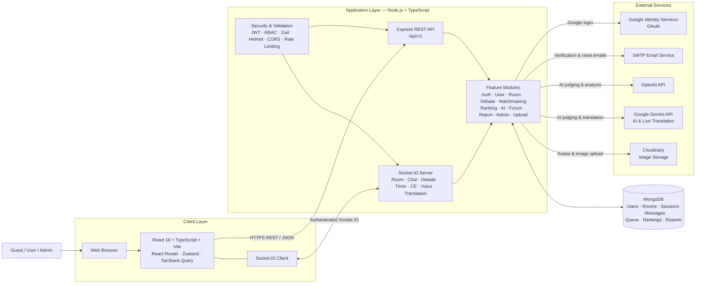

# 1. System Design

## 1.1 System Architecture

### 1.1.1 System Architecture Diagram

### 1.1.2 System Architecture Explanation

The AI Debate Platform follows a feature-based MERN architecture. The React client presents the user interface; Express and Socket.IO provide standard and real-time application services; MongoDB stores persistent data; and external providers supply AI, identity, email, and media capabilities. This separation lets the platform run real-time debates while retaining server-authoritative control of rooms, timers, and results.

#### React 18 and TypeScript

React 18 forms the core client framework for the AI Debate Platform. Its component-based architecture is used to build reusable pages and interface elements for registration, profiles, leaderboard, live matches, room lobby, debate room, results, forum, and administration. TypeScript supplies static typing for room state, user roles, API data, and Socket.IO events, reducing errors when the client processes complex debate data.

#### Vite, React Router, Zustand, and TanStack Query

Vite builds and serves the frontend application with fast development feedback and optimized production bundles. React Router manages public, protected, and administrator-only routes. Zustand maintains lightweight client state, such as the authenticated user and current debate state, while TanStack Query retrieves, caches, and refreshes server data for profiles, rankings, rooms, and administrative lists. Together, these tools keep navigation responsive and reduce unnecessary API requests.

#### React Bootstrap and Bootstrap

React Bootstrap and Bootstrap provide the responsive layout and user-interface components used throughout the platform. Cards, forms, buttons, alerts, modals, navigation elements, and tables support consistent experiences across authentication, room management, debate controls, and the Admin Dashboard. The component library also helps maintain accessible form labels, validation feedback, and responsive layouts without requiring each page to implement these patterns from scratch.

#### Node.js and Express.js

Node.js runs the backend application, while Express.js exposes versioned REST endpoints under `/api/v1`. The API handles authentication, profiles, rooms, matchmaking, debates, AI functions, rankings, uploads, forum activities, reports, and administration. Express middleware applies JSON parsing, request logging, security headers, CORS, rate limiting, validation, and standard error handling before requests reach the feature modules.

#### Socket.IO

Socket.IO provides the real-time communication layer required for live debate sessions. It authenticates clients with JWT during the Socket.IO handshake, organizes participants into room channels, and broadcasts participant changes, messages, debate phases, synchronized timers, cross-examination state, scores, and results. Socket.IO also supports reconnect state restoration so a reconnecting participant can retrieve the latest server-side room state rather than relying on an outdated browser state.

#### Feature Modules and Debate Engine

The backend is organized by feature modules, including Auth, User, Room, Matchmaking, Debate, Ranking, AI, Forum, Report, Admin, and Upload. Room and Matchmaking manage custom rooms and ranked queues; Debate and its Socket.IO handlers enforce phases, timers, speaking turns, and cross-examination; and Ranking applies ELO changes after eligible ranked debates. This modular design keeps each business domain focused, testable, and easier to extend.

#### MongoDB and Mongoose

MongoDB is the primary database, and Mongoose manages database schemas and access. The database stores user accounts and profiles, debate rooms, sessions, messages, matchmaking entries, rankings, reports, and forum data. By persisting room and debate changes before broadcasting the completed state, the backend maintains a consistent history and allows clients to restore state after reconnection.

#### OpenAI API

The OpenAI API is integrated through the backend AI service to support AI-powered debate functions, including argument analysis, scoring, feedback, fallacy detection, summaries, and final verdict generation. The backend prepares debate context and validates returned AI data before exposing it to the client. If an AI request fails, the debate session remains available and the platform can show an AI-status error instead of interrupting the match.

#### Google Gemini API

Google Gemini is used as an additional AI provider for AI generation and Gemini Live translation. The backend can use the configured AI provider for debate analysis and opens authenticated server-side Gemini Live connections to process live translation audio and return captions. This integration improves accessibility for multilingual debate participants without exposing the Gemini API key to the browser.

#### Google Identity Services

Google Identity Services enables Login by Google. The frontend obtains a Google ID credential, which is sent to the backend for validation against the configured Google Client ID. The backend matches an existing account or creates a new Google-authenticated account, then returns the platform's own JWT access and refresh tokens for subsequent API and Socket.IO access.

#### SMTP Email Service

An SMTP-compatible email service, implemented through Nodemailer, sends verification and password-reset emails. The backend creates time-limited tokens, stores only their hashes, and sends links that direct users to the Verify Email or Reset Password screens. This enables account verification and recovery without storing credentials or security tokens in the browser.

#### Cloudinary

Cloudinary provides cloud media storage for user avatars and general image uploads. The backend receives the upload request, validates the file, sends it to Cloudinary, and stores the resulting image reference for use in the profile or other supported platform content. Cloudinary removes the need for the frontend to manage file-storage infrastructure and supports optimized image delivery.

#### RESTful API and Security Layer

The RESTful API is the standard request-response interface between the React client and backend. It uses JSON payloads over HTTPS in production and separates client concerns from server-side business logic. JWT authentication, platform and room-level authorization, Zod validation, Helmet headers, CORS configuration, and rate limiting protect sensitive operations such as authentication, room management, scoring, uploads, and administrative moderation.

# 2. User Requirements

## 2.1 Actors

| # | Actor | Description |
|---:|---|---|
| 1 | Guest | A visitor who accesses the AI Debate Platform without signing in. Guests can browse public information, including the landing page, public debate rooms, live matches, public user profiles, and the leaderboard. They can register a new account or sign in with email/password or Google. Guests cannot create rooms, join matchmaking, participate in a debate, or access account-specific features until they authenticate. |
| 2 | Registered User | An authenticated platform user who can manage their profile, view personal statistics and debate history, create or join custom debate rooms, join ranked matchmaking, participate in debates, watch live matches, and receive platform notifications. A registered user may receive a room-level role such as Room Owner, Debater, Host, Judge, or Viewer after creating or joining a room. |
| 3 | Room Owner | A registered user who creates a custom debate room. The Room Owner configures the room before the match starts, including the debate format, visibility, password, host type, judge type, and participant slots. They can manage the lobby, assign room roles, and start the debate. This is a room-level role and does not automatically grant Host or Judge permissions during an active debate. |
| 4 | Debater | A registered user assigned to the Proposition or Opposition team in a debate room. Debaters prepare arguments, deliver speeches during their allocated turns, take part in cross-examination, communicate with their team where enabled, and receive scores and feedback after the debate. |
| 5 | Host | A registered user assigned to coordinate a debate. The Host manages debate phases and timers, starts and ends permitted stages, manages cross-examination flow, and performs moderation actions such as pausing the debate, muting participants, or removing users according to room policy. |
| 6 | Judge | A registered user assigned to evaluate a debate when the room uses a human judge. The Judge reviews arguments and rebuttals, gives feedback after speaking rounds, scores the teams using the configured criteria, and submits the final decision. When an AI Judge is selected, these actions are performed by the platform's AI integration instead. |
| 7 | Viewer | A registered user who joins a debate room as a spectator. Viewers can watch the debate in real time, including the motion, speakers, current phase, timer, and results when available. Their ability to use chat or reactions depends on the room configuration; they cannot debate, control the match, or access private team rooms. |
| 8 | Administrator | An authenticated user with administrator privileges. Administrators access the admin dashboard to monitor platform activity, manage user accounts and roles, ban or unban users, moderate rooms and participants, review reports, and view platform statistics. |

> **Note:** Room Owner, Debater, Host, Judge, and Viewer are room-level roles that can be assigned to a Registered User. The AI Judge is a supporting system capability, not a human user actor.

## 2.2 Use Case Descriptions

| ID | Use Case | Actors | Use Case Description |
|---:|---|---|---|
| 01 | Register | Guest | Allows a guest to create a new account by providing the required personal and account information. |
| 02 | Login | Guest | Allows a guest to sign in to the platform using a registered email address and password. |
| 03 | Login by Google | Guest | Allows a guest to sign in with a Google account. This use case extends the Login use case. |
| 04 | Reset Password | Guest | Allows a guest to reset a forgotten password through a reset link sent to their registered email address. |
| 05 | View Public Profile | Guest | Allows a guest to view a user's publicly available profile information, such as display name, ranking, and basic debate statistics. |
| 06 | View Platform Information | Guest, User, Admin | Allows users to view general information about the AI Debate Platform, its features, and debate rules. |
| 07 | View Public Matches | Guest, User, Admin | Allows users to browse public debate rooms and matches that are available to watch. |
| 08 | View Leaderboard | Guest, User, Admin | Allows users to view the global leaderboard, including debaters' rankings, ELO scores, and rank tiers. |
| 09 | Logout | User, Admin | Allows an authenticated user to end the current session and securely leave the platform. |
| 10 | Change Password | User, Admin | Allows an authenticated user to change the password for their own account. |
| 11 | Update Profile | User, Admin | Allows an authenticated user to update their own profile information, such as display name, avatar, biography, school, or club. |
| 12 | View Own Profile | User, Admin | Allows an authenticated user to view their own profile, account information, and debate statistics. |
| 13 | Create Custom Room | User | Allows a user to create a custom debate room and configure its initial settings. |
| 14 | Join Room | User | Allows a user to join an available debate room as an assigned participant or viewer. |
| 15 | Rejoin Room | User | Allows a user who was disconnected or left temporarily to return to a debate room they previously joined. |
| 16 | Leave Room | User, Admin | Allows a user to leave the current debate room when permitted by the room and debate status. |
| 17 | Join Ranked Queue | User | Allows a user to enter the ranked matchmaking queue and wait for suitable opponents. |
| 18 | View Results | User, Admin | Allows users to view the final result of a completed debate, including the winner, score, and feedback. |
| 19 | View Debate History | User | Allows a user to view their completed debates and their associated results. |
| 20 | Receive Notification | User, Admin | Allows an authenticated user to receive notifications about relevant events, such as room changes, match updates, and results. |
| 21 | Watch Live Match | User, Admin | Allows a user to watch an active debate match in real time as a spectator. |
| 22 | Create Topic | User | Allows a user to create a new discussion topic related to debating or the platform community. |
| 23 | View Topic | User | Allows a user to open and read a selected discussion topic and its posts. |
| 24 | Create Post | User | Allows a user to publish a post within a discussion topic. |
| 25 | Comment Post | User | Allows a user to add a comment or reply to an existing discussion post. |
| 26 | View User List | Admin | Allows an administrator to view and search the list of platform users. |
| 27 | Penalize User | Admin | Allows an administrator to apply a moderation action to a user, such as a warning, mute, suspension, or ban, according to platform policy. |

> **Relationship:** **Login by Google** `<<extend>>` **Login**, because it is an alternative sign-in method.

# 3. System Interface Requirements

## 3.1 User Interface

### 3.1.2 Screen Descriptions

| # | Feature | Screen | Description |
|---:|---|---|---|
| 1 | Landing and Discovery | Home Page | The public landing screen introduces the AI Debate Platform and provides entry points to registration, login, live matches, rankings, and other public content. |
| 2 | Authentication | Register | Allows a guest to create a new platform account by entering the required account and personal information. |
| 3 | Authentication | Login | Allows an existing user to sign in with their email address and password, with an option to sign in through Google. |
| 4 | Authentication | Verify Email | Confirms a newly registered user's email address by validating the verification token. |
| 5 | Authentication | Forgot Password | Allows a user to submit their email address and request a password-reset link. |
| 6 | Authentication | Reset Password | Allows a user to set a new password after opening a valid password-reset link. |
| 7 | Authentication | Change Password | Allows an authenticated user to change their current account password. |
| 8 | User Profile | Profile | Displays a user's public profile, including profile details, rank, ELO, and debate statistics. The profile owner can update their own information. |
| 9 | User Profile | Debate History | Displays a user's completed debate records, including the debate motion, role, result, score, and ELO change when available. |
| 10 | Ranking | Leaderboard | Displays the global ranking of debaters, including rank tiers, ELO scores, and win-loss statistics. |
| 11 | Room Discovery | Live Matches | Lists public debate rooms and live matches. Users can filter rooms and select an eligible room to join or watch. |
| 12 | Room Management | Create Debate Room | Allows an authenticated user to create a custom room by configuring its title, debate format, host and judge settings, privacy, and password. |
| 13 | Room Management | Room Lobby | Displays the room participants and configuration before the debate starts. The Room Owner can assign roles, configure available options, and start the debate when it is ready. |
| 14 | Matchmaking | Ranked Queue | Allows an authenticated user to choose a ranked debate format, join or leave the matchmaking queue, and wait for a matched room. |
| 15 | Debate | Debate Room | The main real-time debate screen. It displays the current phase, timer, speakers, messages, scores, and role-specific controls for debaters, hosts, judges, and viewers. |
| 16 | Debate | Debate Rules | Displays the rules, format, phases, speaker positions, and judging criteria for the selected debate room. |
| 17 | Debate | Team Private Room | Provides a private preparation space for a debate team when the current debate phase permits team discussion. |
| 18 | Debate Result | Result | Displays the completed debate result, including the winner, team scores, judge feedback, and available AI analysis. |
| 19 | Community Forum | Forum | Displays discussion topics related to debating and the platform community. Authenticated users can create topics or posts where permitted. |
| 20 | Community Forum | Forum Topic | Displays the content and discussion posts for one selected forum topic, allowing authenticated users to participate in the conversation where permitted. |
| 21 | Administration | Admin Dashboard | Provides administrators with platform overview data and management tools for users, rooms, and reports. |
| 22 | System | Not Found | Displays an error page when the user opens a route that does not exist. |

### 3.1.3 Screen Authorization

`X` indicates that the actor is authorized to access the screen.

| Screen | Guest | User | Admin |
|---|:---:|:---:|:---:|
| Home Page | X | X | X |
| Register | X |  |  |
| Login | X |  |  |
| Verify Email | X |  |  |
| Forgot Password | X |  |  |
| Reset Password | X |  |  |
| Change Password |  | X | X |
| Profile | X | X | X |
| Debate History | X | X | X |
| Leaderboard | X | X | X |
| Live Matches | X | X | X |
| Create Debate Room |  | X |  |
| Room Lobby |  | X | X |
| Ranked Queue |  | X |  |
| Debate Room |  | X | X |
| Debate Rules |  | X | X |
| Team Private Room |  | X |  |
| Result | X | X | X |
| Forum | X | X | X |
| Forum Topic | X | X | X |
| Admin Dashboard |  |  | X |
| Not Found | X | X | X |

> **Note:** Access to a screen does not grant every action on that screen. For example, only a room participant can enter the Debate Room; only a Debater can enter a Team Private Room; and only a Room Owner, Host, or Judge can access their role-specific controls.

### 3.1.4 Non-Screen Functions

| # | Feature | System Function | Description |
|---:|---|---|---|
| 1 | User Account Verification | Email Verification Automation | Automatically sends an email verification link to a newly registered user and validates the link before the account email is marked as verified. |
| 2 | Authentication | JWT Session Management | Generates, validates, refreshes, and revokes authentication tokens so protected APIs and real-time connections can identify the current user securely. |
| 3 | Authentication | Google OAuth Login | Validates a Google sign-in credential, matches or creates the corresponding platform account, and returns an authenticated platform session. |
| 4 | Password Recovery | Password Reset Email Automation | Generates a time-limited password-reset token and sends the reset link to the user's registered email address. |
| 5 | Matchmaking | Ranked Queue Matching | Monitors ranked queues by debate format, groups suitable users into a match, creates a ranked debate room, and notifies the matched participants. |
| 6 | Real-Time Debate | Server-Side Timer and Socket Events | Controls debate phases and timers on the server, then broadcasts real-time room, chat, timer, and debate-status updates through Socket.IO. |
| 7 | AI Evaluation | AI Judge and Debate Analysis | Sends debate context to the configured AI service to generate scoring, feedback, fallacy analysis, summaries, and final verdicts when AI evaluation is enabled. |
| 8 | Ranking | ELO Ranking Calculation | Updates a user's ranking data after an eligible ranked debate is completed and makes the updated results available to the leaderboard. |
| 9 | Notifications | Match and Room Notifications | Delivers notifications for important events, such as a match being found, room changes, role changes, debate status updates, and results. |
| 10 | Moderation | Report and User Moderation Processing | Stores user reports and supports administrative moderation actions, including warnings, muting, suspending, or banning accounts according to platform policy. |

## 3.2 Authentication

### 3.2.1 Registration

- **Function trigger:** A Guest selects **Register** from the Home Page or the **Create account** link on the Login screen.
- **Function description:** Allows a Guest to create a local AI Debate Platform account. The system creates the account, sends an email-verification link, and returns an authenticated session.
- **Screen layout:** The registration screen contains a centered form with Username, Email, Password, and Confirm Password fields; a **Register** button; inline validation messages; and a link to the Login screen for users who already have an account.
- **Function details:**
  - **Data:**
    - `username` — required, 3–20 characters.
    - `email` — required, valid email address.
    - `password` — required, at least 6 characters.
    - `confirmPassword` — required and must match Password.
  - **Validation:**
    - Username is trimmed and must contain 3–20 characters.
    - Email is trimmed, converted to lowercase, and must use a valid email format.
    - Password must contain at least 6 characters.
    - Confirm Password must match Password.
    - Username and email must not already be registered.
  - **Business rules:**
    - **BR-01:** Each username and email address can belong to only one account.
    - **BR-06:** A locally registered account is created with an unverified email address. Its verification link is valid for 24 hours and can be resent by the authenticated user.
    - **BR-12:** The registration endpoint is rate-limited to reduce automated or abusive requests.
  - **Functionality:**
    - **Normal case:** When all data is valid and unique, the system creates the account, sends a verification email, returns access and refresh tokens, and displays a registration-success message.
    - **Abnormal cases:** If a field is invalid, passwords do not match, the username or email already exists, or the request is rate-limited, the system displays an error message and does not create the account.

### 3.2.2 Login

- **Function trigger:** A Guest selects **Login** from the Home Page, opens a protected feature that requires authentication, or follows the Login link from the Registration, Verify Email, or Password Reset screens.
- **Function description:** Allows an existing local account holder to sign in using email and password. The screen also provides **Login by Google** when Google OAuth is configured.
- **Screen layout:** The login screen contains Email and Password fields, a **Login** button, a **Forgot Password?** link, an optional Google sign-in button, inline validation messages, and a link to the Registration screen.
- **Function details:**
  - **Data:**
    - `email` — required, valid email address.
    - `password` — required, at least 6 characters in the client form.
    - `idToken` — required only when the user selects Login by Google.
  - **Validation:**
    - Email is trimmed, converted to lowercase, and must use a valid email format.
    - Password is required for local login.
    - The entered email must belong to a local account and the password must match the stored password.
    - Banned accounts cannot sign in.
    - Google login requires a valid Google ID token for the configured Google Client ID.
  - **Business rules:**
    - **BR-09:** Email/password login is available only for accounts whose authentication provider is `local`.
    - **BR-10:** Google accounts use Google login; a successful Google login creates or matches a platform account and marks its email as verified.
    - **BR-25:** The system returns a generic invalid-credentials message when the email or password is incorrect.
    - **BR-12:** Login and Google-login endpoints are rate-limited to protect account security.
  - **Functionality:**
    - **Normal case:** When credentials are valid, the system creates access and refresh tokens, stores the authenticated user session, and redirects the user to the requested page or Home Page.
    - **Google login case:** When the Google credential is valid, the system signs in the matching account or creates a new Google account, then redirects the user to the requested page or Home Page.
    - **Abnormal cases:** If the email format is invalid, the password is missing or incorrect, the account is banned, Google OAuth is unavailable, or the request is rate-limited, the system displays an appropriate error message and does not create a session.

### 3.2.3 Login by Google

- **Function trigger:** A Guest selects the Google sign-in button on the Login screen.
- **Function description:** Authenticates the user with Google and creates or matches a platform account using the verified Google identity.
- **Function details:**
  - **Data:** Google ID token supplied by Google Identity Services.
  - **Validation:** The token must be valid for the configured Google Client ID and must contain a Google subject and email address.
  - **Business rules:** **BR-01, BR-10, BR-11, and BR-12** apply. A new Google account is created with a unique username and a verified email; an existing account with the same Google ID or email is matched to the Google identity.
  - **Functionality:** On success, the system creates an authenticated token pair and redirects the user to the requested page or Home Page. An invalid token, an unavailable Google configuration, or a banned account returns an error without creating a session.

### 3.2.4 Verify Email

- **Function trigger:** A user opens the email-verification link sent after registration.
- **Function description:** Verifies the email address of a locally registered account.
- **Screen layout:** A status screen shows loading, success, or error feedback and provides a link back to Login.
- **Function details:**
  - **Data:** Verification token supplied in the `token` query parameter.
  - **Validation:** The token must exist, match the stored hashed token, and not be expired.
  - **Business rules:** **BR-06 and BR-12** apply. A verification token is valid for 24 hours and is removed after successful use.
  - **Functionality:** A valid token marks the account email as verified. A missing, invalid, or expired token displays an error message.

### 3.2.5 Resend Verification Email

- **Function trigger:** An authenticated user requests a new verification email from an account action.
- **Function description:** Replaces the current verification token and sends a new email-verification link.
- **Function details:**
  - **Data:** The authenticated user identity from the access token.
  - **Validation:** The requester must be authenticated and the account must exist.
  - **Business rules:** **BR-06, BR-12, and BR-13** apply. The function is available only to the current account. If the email is already verified, no new verification requirement is created.
  - **Functionality:** The system generates a new token valid for 24 hours and sends a verification email. Authentication, request validation, and rate limiting protect this action.

### 3.2.6 Forgot Password

- **Function trigger:** A Guest selects **Forgot Password?** on the Login screen.
- **Function description:** Requests a password-reset email for a local account.
- **Screen layout:** The screen contains an Email field, a submit button, inline validation feedback, a success or error message, and a link back to Login.
- **Function details:**
  - **Data:** Email address.
  - **Validation:** The email must use a valid format and is normalized to lowercase.
  - **Business rules:** **BR-03, BR-08, BR-09, and BR-12** apply. For privacy, the system responds with the same success message whether or not the email exists. A reset email is sent only for an existing local account.
  - **Functionality:** The system creates a hashed reset token valid for one hour and sends a reset link. The endpoint is rate-limited.

### 3.2.7 Reset Password

- **Function trigger:** A user opens the password-reset link received by email and submits a new password.
- **Function description:** Replaces a forgotten password using a valid reset token.
- **Screen layout:** The screen contains New Password and Confirm Password fields, a submit button, validation feedback, and a link back to Login.
- **Function details:**
  - **Data:** Reset token, new password, and confirm password.
  - **Validation:** The token must be valid and unexpired; the new password must contain at least 6 characters; confirmation must match.
  - **Business rules:** **BR-04, BR-07, and BR-12** apply. A reset token is valid for one hour and is cleared immediately after the password is changed.
  - **Functionality:** On success, the system updates the password and confirms completion. Invalid, expired, or reused tokens display an error.

### 3.2.8 Change Password

- **Function trigger:** An authenticated User or Admin opens **Change Password** from their account area.
- **Function description:** Changes the password of the current local account.
- **Screen layout:** The screen contains Current Password, New Password, and Confirm Password fields, validation messages, and a link back to the user's profile.
- **Function details:**
  - **Data:** Current password, new password, and confirm password.
  - **Validation:** Current password is required and must be correct; new password must contain at least 6 characters; confirmation must match.
  - **Business rules:** **BR-04, BR-09, BR-13, and BR-24** apply. Only accounts using the `local` authentication provider can change a password through this function.
  - **Functionality:** The system updates the password when all checks pass. Incorrect current passwords, mismatched confirmation, and Google-only accounts receive an error message.

### 3.2.9 Refresh Token

- **Function trigger:** The client needs a new access token after the current one expires.
- **Function description:** A background API function that exchanges a valid refresh token for a new access-token and refresh-token pair.
- **Function details:**
  - **Data:** Refresh token.
  - **Validation:** The refresh token must be valid and the referenced account must still exist and not be banned.
  - **Business rules:** **BR-11 and BR-13** apply. This function has no separate screen; the client calls it automatically when needed.
  - **Functionality:** A valid refresh token produces a new token pair. Invalid, expired, deleted-account, or banned-account tokens cause the client to end the session.

### 3.2.10 Get Current User Session

- **Function trigger:** The application initializes or needs to restore the current user's data.
- **Function description:** A background API function that retrieves the authenticated user's current profile and session identity.
- **Function details:**
  - **Data:** Access token in the authenticated request.
  - **Validation:** The access token must be valid; the account must exist and not be banned.
  - **Business rules:** **BR-11, BR-13, and BR-16** apply. This function has no separate screen and returns only the current user, never another user's private account data.
  - **Functionality:** The client stores the returned user data to restore the authenticated application state. Invalid authentication clears the local session.

### 3.2.11 Logout

- **Function trigger:** A User or Admin selects **Logout** from the navigation bar or account controls.
- **Function description:** Ends the current client session.
- **Function details:**
  - **Data:** The current authenticated session.
  - **Validation:** The logout request requires authentication.
  - **Business rules:** **BR-13** applies. The backend confirms logout; the frontend removes locally stored user and token data.
  - **Functionality:** The user is returned to the public state. If the API request fails, the client still clears local authentication state to avoid leaving a stale session.

## 3.3 User Profile and Account

### 3.3.1 View Public Profile

- **Function trigger:** A Guest, User, or Admin selects a user from the Leaderboard, Live Matches, or another public profile link.
- **Function description:** Displays the selected user's public identity, ranking, and visible debate information.
- **Screen layout:** The profile screen presents profile details, avatar, rank, ELO, statistics, and links to the user's debate history.
- **Function details:**
  - **Data:** Target user ID.
  - **Validation:** The target user must exist.
  - **Business rules:** **BR-14, BR-15, BR-16, and BR-23** apply. This is a public read-only view; only the profile owner can perform personal profile updates.
  - **Functionality:** The system loads the selected profile or displays an error when the profile cannot be found.

### 3.3.2 View Own Profile

- **Function trigger:** An authenticated User or Admin opens their own profile from the navigation bar or account link.
- **Function description:** Displays the current user's profile and enables owner-only account actions.
- **Screen layout:** The profile screen includes the same public information as a public profile plus edit-profile, avatar-upload, and change-password actions for the profile owner.
- **Function details:**
  - **Data:** Current authenticated user ID.
  - **Validation:** The requester must be authenticated.
  - **Business rules:** **BR-13, BR-15, and BR-16** apply. Owner-only actions are available only when the viewed profile belongs to the current account.
  - **Functionality:** The system loads the user's current profile, statistics, and permitted account actions.

### 3.3.3 Update Profile

- **Function trigger:** A profile owner selects the profile-edit action and submits updated details.
- **Function description:** Updates the current user's editable public profile information.
- **Function details:**
  - **Data:** Display name, biography, school, club, and other supported profile fields.
  - **Validation:** The requester must be authenticated and must own the target profile; request data is validated before saving.
  - **Business rules:** **BR-13, BR-15, and BR-24** apply. A User or Admin may edit only their own profile, not another user's profile.
  - **Functionality:** Valid changes are saved and returned to the profile screen. Invalid input or unauthorized profile IDs produce an error.

### 3.3.4 Upload Avatar

- **Function trigger:** A profile owner selects an image file from the avatar-upload control.
- **Function description:** Uploads a new avatar image and assigns it to the current user's profile.
- **Function details:**
  - **Data:** Image file and authenticated user identity.
  - **Validation:** The request must be authenticated and the upload must satisfy the configured image-upload restrictions.
  - **Business rules:** **BR-13, BR-15, and BR-24** apply. A user can update only their own avatar. Replacing an avatar updates the profile with the new image URL.
  - **Functionality:** The system uploads the image, stores its reference, and refreshes the displayed profile. Upload failures show an error without changing the existing avatar.

### 3.3.5 View User Statistics

- **Function trigger:** A visitor opens a profile or ranking entry.
- **Function description:** Displays the selected user's debate performance statistics.
- **Function details:**
  - **Data:** Target user ID.
  - **Validation:** The target user must exist.
  - **Business rules:** **BR-14, BR-16, and BR-23** apply. Statistics are public and include the user's ranking information, such as ELO, tier, wins, losses, and available aggregate data.
  - **Functionality:** The system retrieves the latest stored statistics and displays them in the profile view.

### 3.3.6 View Debate History

- **Function trigger:** A visitor selects **Debate History** from a user profile.
- **Function description:** Displays completed debate records for the selected user.
- **Screen layout:** The history screen shows paginated debate entries with motion, format, role, side, result, score, ELO change, and a result or replay link when available.
- **Function details:**
  - **Data:** Target user ID and optional pagination parameters.
  - **Validation:** The target user must exist; pagination inputs must be valid.
  - **Business rules:** **BR-14, BR-16, and BR-23** apply. Only completed debates are shown as history records.
  - **Functionality:** The system loads records page by page and allows users to open the corresponding completed-debate result.

## 3.4 Ranking

### 3.4.1 View Global Leaderboard

- **Function trigger:** A Guest, User, or Admin opens **Leaderboard** from Home Page or navigation.
- **Function description:** Displays the global ordering of users by ranking performance.
- **Screen layout:** The Leaderboard screen presents ranked users with ELO, rank tier, wins, losses, and links to public profiles.
- **Function details:**
  - **Data:** Optional page and limit parameters.
  - **Validation:** Pagination values are validated by the API.
  - **Business rules:** **BR-14, BR-16, and BR-17** apply. The leaderboard is publicly accessible and is ordered by stored ELO/ranking data.
  - **Functionality:** The system retrieves the current leaderboard and lets the visitor open a user's public profile.

### 3.4.2 View User Ranking Summary

- **Function trigger:** A visitor opens a user's profile or selects a ranking entry.
- **Function description:** Shows the selected user's individual ranking summary.
- **Function details:**
  - **Data:** Target user ID.
  - **Validation:** The target user must exist.
  - **Business rules:** **BR-16 and BR-23** apply. The public summary contains ELO, rank tier, and rank position, without exposing private account information.
  - **Functionality:** The system retrieves and displays the selected user's current ranking summary.

## 3.5 Match Discovery

### 3.5.1 View Live Match List

- **Function trigger:** A Guest, User, or Admin opens **Live Matches** from Home Page or navigation.
- **Function description:** Displays the available debate rooms and currently active matches.
- **Screen layout:** The screen contains a featured live match, filter controls, a room-card list, and a statistics panel. Authenticated users can use Join, Watch, Rejoin, or View Result actions as appropriate.
- **Function details:**
  - **Data:** Optional format, room-type, status, page, and limit query parameters.
  - **Validation:** Query values are validated before the room list is retrieved.
  - **Business rules:** **BR-14 and BR-18** apply. The list is public and refreshes periodically; only authenticated users can join or watch a room.
  - **Functionality:** The system lists rooms in waiting, ready, active, paused, or completed states and updates the display after relevant real-time room events.

### 3.5.2 Filter Matches by Format, Type, and Status

- **Function trigger:** A visitor changes a filter control on the Live Matches screen.
- **Function description:** Narrows the live-match list using debate format, room type, or current room status.
- **Function details:**
  - **Data:** Format (`1v1` or `3v3`), room type (rank or custom), and status filter.
  - **Validation:** Each filter value must be one of the supported query values; an empty or `all` status means no status restriction.
  - **Business rules:** **BR-18** applies. Filtering changes only the displayed room list and does not alter the room data.
  - **Functionality:** The screen requests matching rooms and displays an empty-state message when no room satisfies the selected filters.

### 3.5.3 View Room Detail

- **Function trigger:** A visitor selects a room card or opens a room from an administration or navigation link.
- **Function description:** Retrieves the current public room information needed to decide whether to join, watch, or manage the room.
- **Function details:**
  - **Data:** Room ID.
  - **Validation:** The room must exist and be accessible to the requester.
  - **Business rules:** **BR-14, BR-23, and BR-24** apply. Public room information can be viewed by Guests, Users, and Admins. Participant-specific controls are available only after authentication and authorization.
  - **Functionality:** The system shows room title, format, status, visibility, participant information, and applicable next actions; invalid room IDs display an error.

### 3.5.4 Join Waiting or Ready Room

- **Function trigger:** An authenticated User selects **Join** on a waiting or ready room in Live Matches.
- **Function description:** Adds the user to a selected room and takes them to the Room Lobby.
- **Function details:**
  - **Data:** Room ID and password when the room is private.
  - **Validation:** The requester must be authenticated; the room must be joinable; a private-room password must be correct when required.
  - **Business rules:** **BR-19, BR-20, and BR-24** apply. Guests are redirected to Login. A successful join adds the user as a room participant; role assignment occurs in the lobby according to room policy.
  - **Functionality:** The system confirms the join and navigates the user to `/rooms/:roomId/lobby`. Invalid passwords, full or unavailable rooms, and unauthorized joins show an error.

### 3.5.5 Join Active Room as Viewer

- **Function trigger:** An authenticated User selects **Watch** or confirms the Join as Viewer popup for an active or paused room.
- **Function description:** Adds or confirms the user as a viewer and opens the real-time Debate Room in spectator mode.
- **Function details:**
  - **Data:** Room ID and password when the active room is private.
  - **Validation:** The requester must be authenticated; the room must allow viewer entry; private-room access requires a valid password.
  - **Business rules:** **BR-21, BR-22, and BR-24** apply. Viewers can observe the debate and may use viewer chat only when it is enabled. They cannot debate, control phases, or access team private rooms.
  - **Functionality:** The system joins the user to the room when necessary and navigates to `/debate/:roomId?mode=viewer`. A user who is already a participant can enter spectator view directly; denied access displays an error.

# 4. External Interfaces and Quality Attributes

## 4.1 External Interfaces

### 4.1.1 Software Interfaces

- **Web browsers:** The frontend shall support the current and previous major versions of Google Chrome, Microsoft Edge, Mozilla Firefox, and Safari. JavaScript, cookies/local storage, and WebSocket-capable networking must be enabled.
- **Frontend application:** The browser client is a React and TypeScript single-page application built with Vite. It uses React Router for navigation, TanStack Query for server data, and Socket.IO Client for real-time features.
- **Backend API:** The frontend communicates with the backend through versioned Express REST endpoints under `/api/v1` using JSON request and response bodies.
- **Real-time service:** The frontend connects to the Socket.IO server using WebSocket when available, with polling fallback. The interface supports room state, chat, timer, debate, score, voice-signaling, and notification events.
- **Database:** The backend uses MongoDB through Mongoose to store users, rooms, debate sessions, messages, matchmaking entries, reports, and ranking data.
- **AI services:** The backend integrates with OpenAI and Google Gemini services for AI judging, speech analysis, summaries, fallacy detection, and live translation when the relevant service is configured and available.
- **Identity and email services:** Google Identity Services provides Google login. An SMTP-compatible email service sends email-verification and password-reset links.

### 4.1.2 User Interfaces

- The system shall provide a responsive web interface that remains usable on desktop, tablet, and mobile-width screens.
- Authentication and profile forms shall provide clear labels, required-field indicators, inline validation messages, loading states, and success or error feedback.
- The Debate Room shall visibly show the current phase, active speaker, synchronized timer, room participants, chat state, and score/result updates appropriate to the current role.
- The platform shall use non-disruptive feedback mechanisms, such as inline alerts, toast notifications, modal confirmations, and Socket.IO status events, without unexpectedly interrupting an active debate.
- Role-specific controls shall be visible only when the user has the required platform or room permission; unavailable actions shall provide an understandable message when attempted.

### 4.1.3 Communication Interfaces

- REST API requests shall use HTTPS in production and JSON payloads with UTF-8 text encoding.
- Socket.IO connections shall authenticate with the user's access token during the connection handshake.
- The client shall reconnect to the real-time service when the connection is restored and request the latest room state for rooms it has joined.
- External AI, Google, and SMTP credentials shall be stored only in server-side environment configuration and shall never be exposed in browser source code or API responses.

## 4.2 Quality Attributes

### 4.2.1 Usability

- **Training time:**
  - A new Guest should be able to register, verify email, and sign in without external training in one short session.
  - An authenticated User should be able to find a live match, join a room, or enter the ranked queue using clear navigation and a small number of actions.
  - Room Owners, Hosts, and Judges should be able to learn their role-specific controls by using visible labels, status guidance, and the Debate Rules screen.
- **Operation completion time:**
  - Registration and login should normally be completed in a few minutes, excluding email-delivery time.
  - Finding a public match or leaderboard entry should require no more than a small number of navigation and filter actions.
  - Joining a waiting room, joining as a viewer, or leaving the ranked queue should provide immediate confirmation of the request outcome.
  - Critical debate information—phase, active speaker, and timer—should be readable at a glance during an active match.
- **Accessibility and clarity:** The interface should use readable text, sufficient color contrast, keyboard-accessible form controls, meaningful error messages, and icons accompanied by labels or tooltips where needed.

### 4.2.2 Reliability

- **Service continuity:** The platform should target at least 99.5% monthly availability, excluding planned maintenance and outages of required third-party providers.
- **State consistency:** The server is authoritative for room membership, debate phase, timer, and score state. Clients must receive current state from the server rather than independently deciding match outcomes.
- **Reconnect recovery:** When a participant reconnects, the system should restore the latest available room state, including phase, timer, participants, messages, and relevant score information.
- **Fault tolerance:** If an AI provider is unavailable or returns an invalid response, the platform shall preserve the debate session and show a recoverable AI-status error rather than ending the debate unexpectedly.
- **Data integrity:** Critical room, session, score, and ranking updates shall be persisted before being treated as completed. Failed operations shall return an error without applying a partial user-visible update.

### 4.2.3 Performance

- **Response time:** Under normal operating conditions, standard REST API requests that do not depend on an external AI provider should target a 95th-percentile response time of 500 ms or less.
- **Page loading:** Primary public screens, including Home Page, Leaderboard, and Live Matches, should display usable content within 3 seconds on a typical broadband connection, excluding unusually slow client devices or network conditions.
- **Real-time latency:** Room state, phase, timer, chat, and score events should normally reach connected clients within 1 second after the server processes the event.
- **AI response time:** AI judging, analysis, and summary requests should provide a result or clear failure status within 15 seconds under normal third-party service conditions. The debate flow must remain usable while AI processing is pending.
- **Capacity:** The initial deployment target is at least 100 concurrent connected users and multiple simultaneous active rooms without material degradation of core REST and Socket.IO functions. Capacity shall be monitored and scaled when real usage exceeds this target.
- **Resource utilization:** The system should use paginated list APIs, client caching where appropriate, server-side filtering, and efficient Socket.IO room broadcasts to avoid unnecessary database queries, network traffic, and browser re-rendering.

### 4.2.4 Security

- **Transport security:** Production deployments shall use HTTPS for REST traffic and secure WebSocket connections for Socket.IO traffic.
- **Credential protection:** Local passwords shall be hashed before storage. Access and refresh tokens, email-verification tokens, password-reset tokens, API keys, SMTP credentials, and database connection strings shall not be exposed in logs, browser code, or API responses.
- **Authentication and authorization:** Protected REST endpoints and Socket.IO connections shall validate JWT authentication. Platform-admin actions require the admin role, and room actions require the appropriate participant role or room ownership/host authority.
- **Input protection:** API request bodies and query parameters shall be validated with schemas before processing. The system shall use standard error responses and shall not trust client-provided role, score, room-state, or ranking values.
- **Abuse protection:** Authentication endpoints are rate-limited. The backend shall use security headers, CORS configuration restricted to permitted clients, and moderation controls for reports, room membership, chat, and user bans.
- **Privacy:** Only public profile, ranking, and completed-debate data may be exposed to unauthenticated visitors. Private rooms require authorized access and, where configured, a valid room password.

# 5. Requirement Appendix

## 5.1 Business Rules

| ID | Rule Definition |
|---|---|
| BR-01 | Only one platform account can use a particular email address, and only one account can use a particular username. |
| BR-02 | A username is required, is trimmed before saving, and must contain from 3 to 20 characters. |
| BR-03 | A local-account email address must use a valid email format and is normalized to lowercase before it is stored or used to sign in. |
| BR-04 | A local-account password must contain at least 6 characters, and its confirmation must exactly match the password entered by the user. |
| BR-05 | Passwords and security tokens must not be stored in plain text. Passwords are securely hashed, and verification/reset tokens are stored as hashes. |
| BR-06 | A newly registered local account starts with an unverified email address. The email-verification token expires after 24 hours and is invalidated after successful verification. |
| BR-07 | Password-reset links are valid for 1 hour and become invalid immediately after the password is successfully reset. |
| BR-08 | The Forgot Password function must return a generic success response whether or not the submitted email belongs to an account, to avoid exposing account existence. |
| BR-09 | Email/password login is permitted only for accounts whose authentication provider is `local`. Google-provider accounts use Google login. |
| BR-10 | Google login requires a valid Google ID token for the configured Google Client ID. A successful Google login creates or matches a platform account and marks the associated email as verified. |
| BR-11 | Banned accounts must not be allowed to log in, refresh a session, or use authenticated platform functions. |
| BR-12 | Authentication-sensitive functions, including registration, login, Google login, email verification, and password reset, are rate-limited. |
| BR-13 | Access and refresh tokens identify the authenticated user. A refresh token can produce a new token pair only when it is valid and the referenced account still exists and is not banned. |
| BR-14 | Guests may view public platform information, public profiles, leaderboard entries, live-match listings, debate histories, and available results, but they must authenticate before joining a room or watching an active room as a participant. |
| BR-15 | A user may update only their own profile information and avatar. Administrators do not gain permission to edit another user's personal profile through the normal profile-update function. |
| BR-16 | User statistics and ranking summaries are public only through the information exposed by the profile and ranking services; private account credentials and security tokens must never be displayed. |
| BR-17 | The global leaderboard is publicly accessible and is ordered using the platform's stored ranking data, including ELO and rank tier. |
| BR-18 | The Live Matches list is public and may be filtered only by supported room format, room type, and room status values. Filtering must not modify any room data. |
| BR-19 | Only authenticated users can join a waiting or ready room. If a room is private, the user must provide the correct password before joining. |
| BR-20 | A successful join to a waiting or ready room sends the user to the Room Lobby. Room role assignment and debate participation remain subject to room configuration and authorization rules. |
| BR-21 | Only authenticated users can join an active or paused room as viewers. Viewer access to a private room requires the correct password. |
| BR-22 | A Viewer may observe the Debate Room and use viewer chat only when it is enabled. A Viewer cannot debate, control debate phases, submit judge scores, or enter a team private room. |
| BR-23 | A room, user profile, or ranking record requested by identifier must exist before the system displays its detail. Invalid or unavailable identifiers must return an error response. |
| BR-24 | Request data must be validated before business processing. Invalid data, unauthorized actions, and failed system operations must return a standard error response without applying a partial update. |
| BR-25 | The system must use a generic invalid-credentials response when a local-login email or password is incorrect, so it does not disclose which credential failed. |
